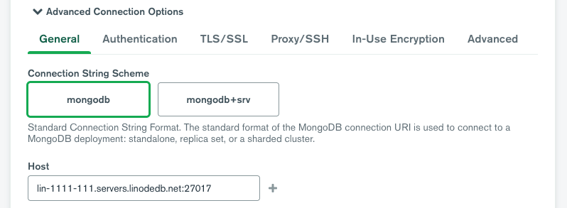
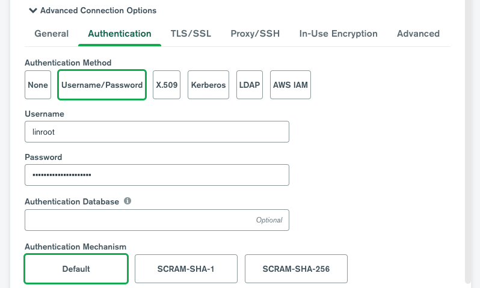
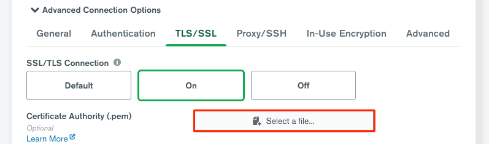
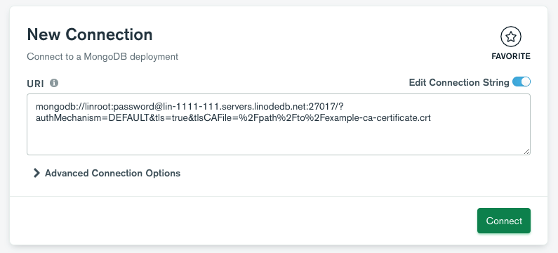
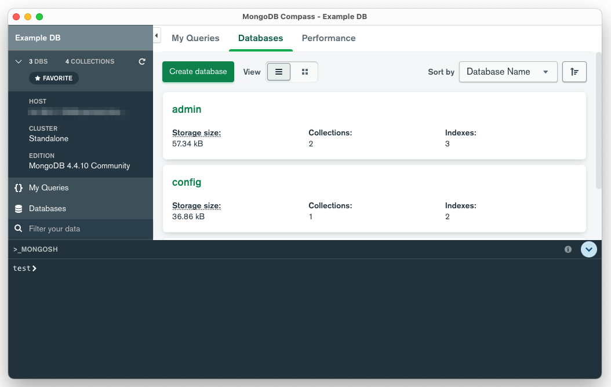

---
author:
  name: Linode
  email: docs@linode.com
title: "Connect to a MongoDB Database"
description: "Learn how to connect to a MongoDB Managed Databse through the command line or Compass"
published: 2022-06-06
---



To connect to a MongoDB Managed Database, you need to know a few important details, such as the username, password, and host (or IP). You'll also need a MySQL client. This guide details how to access your database using popular tools.

## View Connection Details

1. Log in to the [Cloud Manager](https://cloud.linode.com/) and select **Databases** from the left navigation menu.

1. Select your Managed Database from the list. This opens the detail page for that database cluster.

The *Connection Details* section contains information and credentials needed for you to connect to your database.

- **Username:** The default user for all MongoDB Managed Databases is `linroot`, which has superuser admin privileges. This replaces the `root` user, which is not accessible.
- **Password:** The randomly generated password for your database cluster. See [Reset Root Password](/docs/products/databases/managed-databases/guides/reset-root-password/) if you wish to change it.
- **Host(s):** The fully qualified domain name you can use to reach your database cluster through the public network. For high availability clusters, multiple hosts are displayed.
- **Port:** The default port for your database is `27017`.
- **Replica set:** The name of the replica set. This is only relevant for multi-node high availability clusters and does not appear for standalone (single node) databases.
- **SSL:** This field is set to `ENABLED`, which means that it is required to use an encrypted TLS/SSL connection.

Under the *Connection Details* section, there is a **Download CA Certificate** link, which allows you to download the CA (Certificate Authority) certificate. This certificate file can be used if you wish to verify the CA certificate when connecting to the database.

## Connect Using the MongoDB Shell (CLI)

To connect direct to the database from a command-line, you can use the [MongoDB Shell](https://www.mongodb.com/products/shell) tool through the command `mongosh`.

1.  Make sure the IP address assigned to your system is included within your database's access controls. If not, add it now. See [Manage Access Controls](/docs/products/databases/managed-databases/guides/manage-access-controls/).

1.  Verify that the `mongosh` command is installed on your system by running the following command:

        mongosh --version

    If it is not installed, follow the steps for your operating system under [Install the MongoDB Shell](#install-the-mongodb-shell).

1.  Use the `mongosh` command below to connect to your database, replacing `[username]` and `[host]` with the corresponding values in the [Connection Details](#view-connection-details) section. You must also download the CA certificate file for the database and replace `[certificate]` with the path and filename of that certificate.

    -   **Standalone cluster (single node)**

            mongosh "mongodb://[username]@[host]:27017" --password --tls --tlsCAFile=[certificate]

    -   **High availability cluster (3 nodes)**

        When connecting to a high availability cluster, input each host (along with the port) separated by a comma. You must also replace `[replica-set]` with the replica set defined in your connection details.

            mongosh "mongodb://[username]@[host1]:27017,[host2]:27017,[host3]:27017?replicaSet=[replica-set]" --password --tls --tlsCAFile=[certificate]

1.  Enter your password at the prompt.

Once you are connected successfully, the MongoDB Shell prompt appears and you can enter queries and commands. See [mongosh Usage](https://www.mongodb.com/docs/mongodb-shell/run-commands/) for examples.

### Install the MongoDB Shell

If you do not currently have the MongoDB Shell installed on your system, the application can be download directly from the [MongoDB Shell Download](https://www.mongodb.com/try/download/shell) page by selecting your platform and clicking the **Download** button. The latest installation instructions can be found on the [Install mongosh](https://www.mongodb.com/docs/mongodb-shell/install/) guide.

-   **Windows:**

    Follow the instructions above to download the appropriate package directly from MongoDB's website.

-   **macOS:**

    It is recommended to install the MongoDB Shell through [Homebrew](https://brew.sh/]) though you can also install it by downloading the application from MongoDB's website.

        brew install mongosh

-   **Linux:**

    MongoDB Shell is available as a .deb (for Ubuntu 20.04 and 18.04), .rpm (for CentOS/RHEL), or as a compressed tarball for nearly any Linux distribution.

    1.  On the MongoDB Shell Download page, select *Linux Tarball 64-bit* as the platform and click the **Copy Link** text.

    1.  Run the following command in your Linux terminal, replacing *[download-url]* with the link you just copied.

            curl [download-url] --output mongodb-shell.tgz

    1.  Extract the compressed tarball. If you do not have the [tar](https://man7.org/linux/man-pages/man1/tar.1.html) command on your system, you will need to install that first.

            tar -zxvf mongodb-shell.tgz

    1.  Navigate into the `bin` folder within the unzipped directory. Your folder may vary from the one in the example command below.

            cd mongosh-1.5.0-linux-x64/bin

    1.  Make the mongosh file executable.

            chmod +x mongosh

    1.  Copy the files into your local bin directory or any directory already in your PATH variable.

            sudo cp mongosh /usr/local/bin/
            sudo cp mongosh_crypt_v1.so /usr/local/lib/

## Connect Using MongoDB Compass (GUI)

The Compass tool provides a graphical interface for connecting to MongoDB databases. Using this tool, you can visualize your database and the data it contains.

1. Install the MongoDB Compass software from the [MongoDB website](https://www.mongodb.com/products/compass). Be sure to select the operating system you're using locally.

1. Open the software. You may need to continue through an initial walkthrough and set your privacy settings before you can use Compass.

1. The default page should be the **New Connection** form. If you do not see this, click **Connect** > **New Connection** in the main menu.

1. To connect to a your MongoDB database, you can either enter a connection string or click **Advanced Connection Option** and build a connection string manually. Since these instructions cover the latter option, click **Advanced Connection Option**.

1. Under the *General* tab, enter the host url of your Managed Database followed by the port number *27017* (in the format `host:27017`). For high availability clusters, click the plus (+) icon and add each host that appears in your connection details.

    

1. Under the *Authentication* tab, select **Username/Password** and enter the username and password for your database.

    

1. Under the *TLS/SSL* tab, set the **SSL/TLS Connection** to *On*. Then, click the **Select a file** button under the **Certificate Authority** field and select the CA certificate file for your database. If you haven't downloaded the certificate file, do so now. See [View Connection Details](#view-connection-details).

    

1. For high availability clusters, go to the *Advanced* tab and enter the replica set under **Replica Set Name**.

1. Review the URI connection string and click **Connect** to test your connection and connect to the database.

    

1. Once the connection is successful, a new window appears where you can view your database and run queries.

    

For instructions on using MongoDB Compass to interact with your database, see the [MongoDB Compass documentation](https://www.mongodb.com/docs/compass/current/).