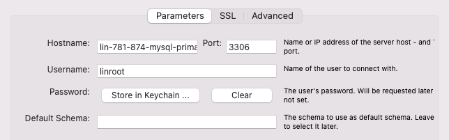
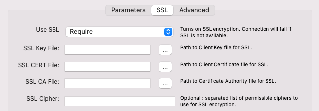
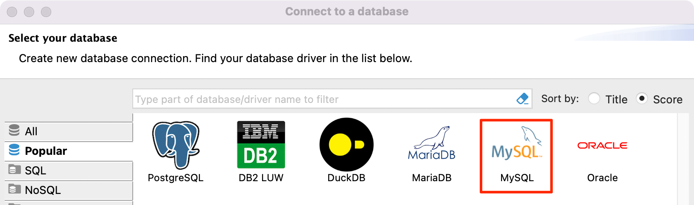
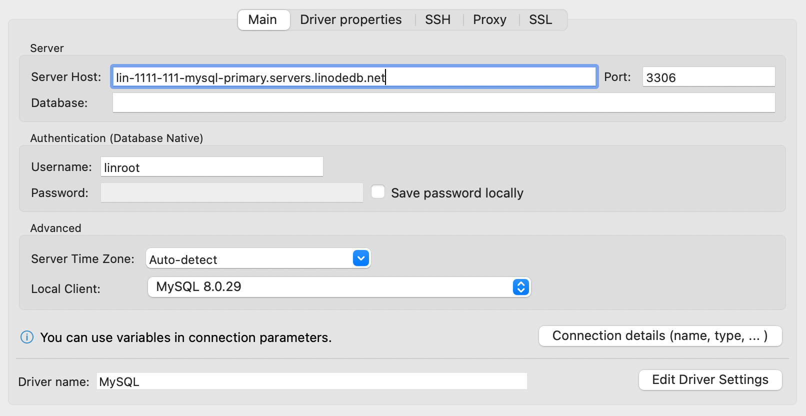
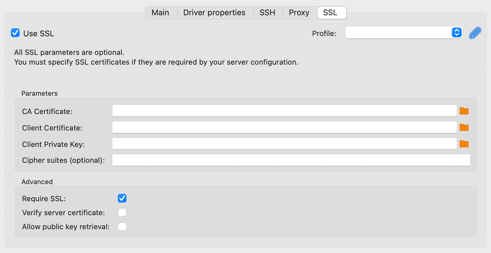

---
author:
  name: Linode
  email: docs@linode.com
title: "Connect to a MySQL Managed Database"
description: "Learn how to connect to a MySQL Managed Databse through the command line or MySQL Workbench."
published: 2022-02-23
modified: 2022-07-22
---

To connect to a MySQL Managed Database, you need to know a few important details, such as the username, password, and host (or IP). You'll also need a MySQL client. This guide details how to access your database using popular tools.

## View Connection Details

1. Log in to the [Cloud Manager](https://cloud.linode.com/) and select **Databases** from the left navigation menu.

1. Select your Managed Database from the list. This opens the detail page for that database cluster.

The *Connection Details* section contains information and credentials needed for you to connect to your database.

- **Username:** The default user for all MySQL Managed Databases is `linroot`, which has superuser admin privileges. This replaces the `root` user, which is not accessible.
- **Password:** The randomly generated password for your database cluster. See [Reset Root Password](/docs/products/databases/managed-databases/guides/reset-root-password/) if you wish to change it.
- **Host:** The fully qualified domain name you can use to reach your database cluster through the public network.
- **Private network host:** The fully qualified domain name you can use to reach your database cluster through the data center's private network (not a VLAN). Communicating with a Database Cluster over the private network avoids network transfer fees, so it's recommended to use this host string when possible.
- **Port:** The default port for your database is `3306`.
- **SSL:** This field is set to `ENABLED`, which means that it is required to use an encrypted TLS/SSL connection.

Under the *Connection Details* section, there is a **Download CA Certificate** link, which allows you to download the CA (Certificate Authority) certificate. This certificate file can be used if you wish to verify the CA certificate when connecting to the database.

## Connect Using MySQL (CLI)

To connect direct to the database from a command-line, you can use the `mysql` tool. This tool is typically not available by default on most operating systems, but is included along with many MySQL clients (and servers)

1.  Make sure the IP address assigned to your system is included within your database's access controls. If not, add it now. See [Manage Access Controls](/docs/products/databases/managed-databases/guides/manage-access-controls/).

1.  Verify that the `mysql` tool is installed on your system by running the following command:

        mysql --version

    If it is not installed, follow the steps for your operating system in the [Installing MySQL](/docs/guides/install-mysql/) guide.

1.  Use the `mysql` command below to connect to your database, replacing `[host]` and `[username]` with the corresponding values in the [Connection Details](#view-connection-details) section.

        mysql --host=[host] --user=[username] --password --ssl-mode=required

    If your system is using MariaDB instead of MySQL (such as when using the default packages in Debian's own repository), replace the `--ssl-mode=required` parameter with `--ssl=true`.

    
If you are connecting to the *private network host*, ensure your Compute Instance is located within that same data center and you have added a Private IPv4 address to that instance. See [Managing IP Addresses](/docs/guides/managing-ip-addresses/#adding-an-ip-address).


1.  Enter your password at the prompt.

Once you are connected successfully, the MySQL prompt appears and you can enter SQL queries. See [An Overview of MySQL](/docs/guides/an-overview-of-mysql/#the-sql-language) for examples.

See [Using the MySQL Command Line Client](/docs/guides/mysql-command-line-client/) for more information or reference [Connecting to the MySQL Server Using Command Options](https://dev.mysql.com/doc/refman/8.0/en/connecting.html) within MySQL's own documentation.

## Connect Using MySQL Workbench (GUI)

The MySQL Workbench provides a graphical interface for connecting to MySQL databases. Using this tool, you can visualize your database, its structure, and the data it contains.

1.  Make sure the IP address assigned to your system is included within your database's access controls. If not, add it now. See [Manage Access Controls](/docs/products/databases/managed-databases/guides/manage-access-controls/).

1. Install the MySQL Workbench software from the [MySQL Community Downloads](https://dev.mysql.com/downloads/workbench/) page. Be sure to select the operating system you're using locally.

1. Open the software and select **Database > Manage Connections** from the menu. This displays the **Manage Server Connections** window.

1. Enter a **Connection Name** for this new connection.

1. Under the *Parameters* tab, enter the details for your connection, including the **Hostname**, **Username**, and **Port**. You can optionally store your password by clicking the **Store in Keychain...** button and entering your password. If you do not store your password, you must enter it manually each time you connect. For security reasons, it's typically recommended *not* to store your password.

    

1. Under the *SSL* tab, set **Use SSL** to *Require*. You may also use *Required and Verify CA* if you wish to verify the CA (Certificate Authority) certificate each time you connect. If you choose this option, download the CA certificate from the Cloud Manager and set the **SSL CA File** field to point to that downloaded file.

    

1. Click **Test Connection** to verify you can successfully connect to the database and then click **Close** to store the connection settings and return to the main screen.

1. To connect to the database, select **Database > Connect to Database** from the main menu. In the following screen, select the stored connection you just created and click **OK**.

For instructions on using MySQL Workbench to interact with your database, see [Install MySQL Workbench for Database Administration](/docs/guides/deploy-mysql-workbench-for-database-administration/#creating-and-populating-databases) or look through the [MySQL Workbench Manual](https://dev.mysql.com/doc/workbench/en/).

## Connect Using DBeaver

[DBeaver](https://dbeaver.io/) is free and open source universal database tool for developers and database administrators. DBeaver provides a powerful SQL-editor, administration features, ability to migrate data and schema, monitor database connection sessions, and others.

1.  Make sure the IP address assigned to your system is included within your database's access controls. If not, add it now. See [Manage Access Controls](/docs/products/databases/managed-databases/guides/manage-access-controls/).

1. Install the DBeaver Community (or Pro) software from the [DBeaver Downloads](https://dbeaver.io/download/) page. Be sure to select the operating system you're using locally.

1. Open DBeaver, click the **Database** menu dropdown, and select **New Connection**.

1. The **Connect to a database** window appears. Select **MySQL** and click **Next** to continue.

    

1. Within the *Main* tab, enter the details for your connection, including the **Server Host** (hostname) **Port**, and **Username**. You can optionally store your password by entering your password and clicking the **Save password locally** button. If you do not store your password, you must enter it manually each time you connect. For security reasons, it's typically recommended *not* to store your password.

    

1. In the *SSL* tab, check **Use SSL**, check **Require SSL**, and uncheck **Verify server certificate**.

    

1. Click the **Test Connection** button to check if the connection is successful.
