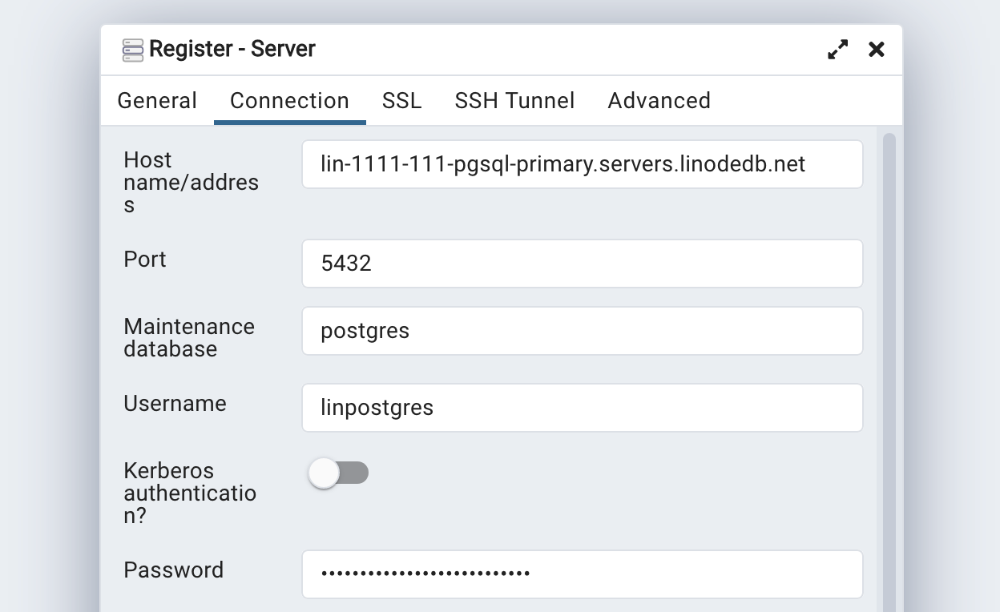
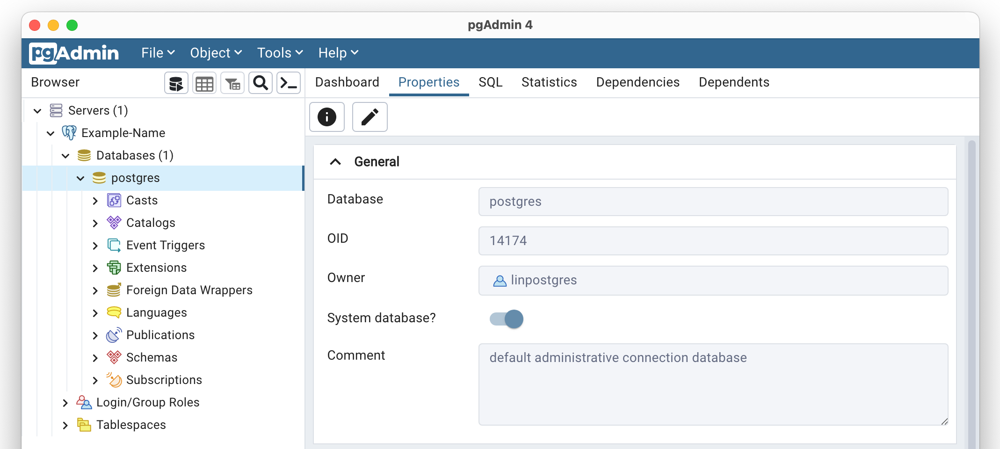
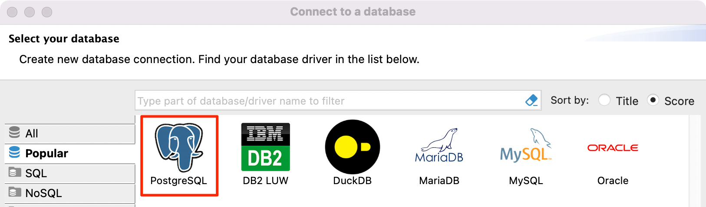
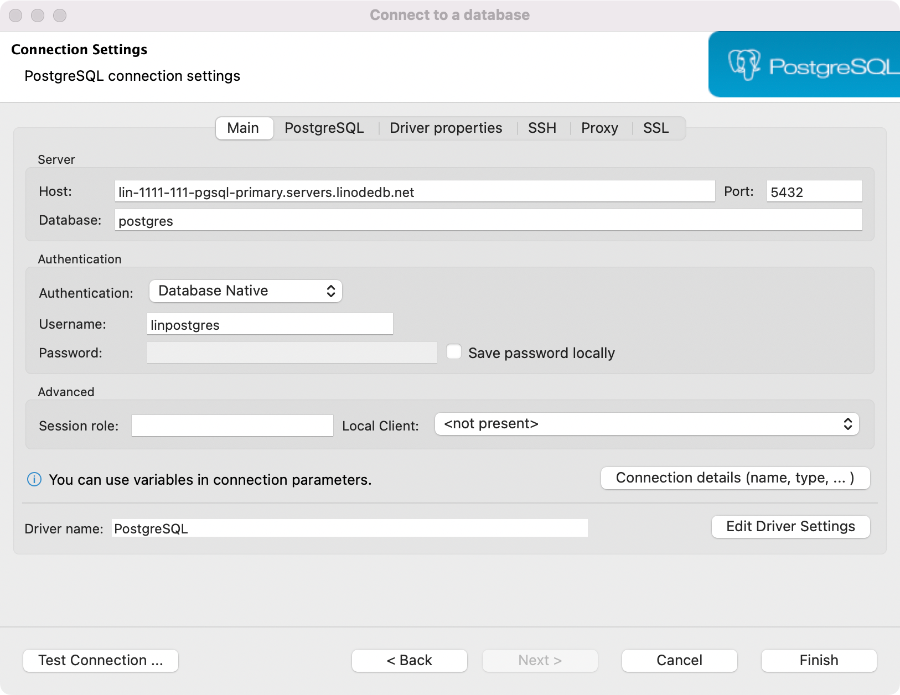

---
author:
  name: Linode
  email: docs@linode.com
title: "Connect to a PostgreSQL Database"
description: "Learn how to connect to a PostgreSQL Managed Databse through the command line or pgAdmin."
published: 2022-06-06
modified: 2022-07-28
---

To connect to a PostgreSQL Managed Database, you need to know a few important details, such as the username, password, and host (or IP). You'll also need a PostgreSQL client. This guide details how to access your database using popular tools.

## View Connection Details

1. Log in to the [Cloud Manager](https://cloud.linode.com/) and select **Databases** from the left navigation menu.

1. Select your PostgreSQL Managed Database from the list. This opens the detail page for that database cluster.

The *Connection Details* section contains information and credentials needed for you to connect to your database.

- **Username:** The default user for all PostgreSQL Managed Databases is `linpostgres`. This replaces the `root` user, which is not accessible. Superuser access is not available.
- **Password:** The randomly generated password for your database cluster. See [Reset Root Password](/docs/products/databases/managed-databases/guides/reset-root-password/) if you wish to change it.
- **Host:** The fully qualified domain name you can use to reach your database cluster through the public network.
- **Private network host:** The fully qualified domain name you can use to reach your database cluster through the data center's private network (not a VLAN). Communicating with a Database Cluster over the private network avoids network transfer fees, so it's recommended to use this host string when possible.
- **Port:** The default port for your database is `5432`.
- **SSL:** This field is set to `ENABLED`, which means that it is required to use an encrypted TLS/SSL connection.

Under the *Connection Details* section, there is a **Download CA Certificate** link, which allows you to download the CA (Certificate Authority) certificate. This certificate file can be used if you wish to verify the CA certificate when connecting to the database.

## Connect Using psql (CLI)

To connect direct to the database from the command-line, you can use the `psql` tool. This tool is included as part of most PostgreSQL server installations, though you can also install it separately on most operating systems.

1.  Make sure the IP address assigned to your system is included within your database's access controls. If not, add it now. See [Manage Access Controls](/docs/products/databases/managed-databases/guides/manage-access-controls/).

1.  Verify that the `psql` tool is installed on your system by running the following command:

        psql --version

    If it is not installed, follow the steps for your operating system under [Install psql](#install-psql).

1.  Use the `psql` command below to connect to your database, replacing `[host]` and `[username]` with the corresponding values in the [Connection Details](#view-connection-details) section.

        psql --host=[host] --username=[username] --password --dbname=postgres

    
If you are connecting to the *private network host*, ensure your Compute Instance is located within that same data center and you have added a Private IPv4 address to that instance. See [Managing IP Addresses](/docs/guides/managing-ip-addresses/#adding-an-ip-address).


1.  Enter your password at the prompt.

Once you are connected successfully, the PostgreSQL prompt appears and you can enter commands to interact with the database. See the [psql documentation](https://www.postgresql.org/docs/13/app-psql.html) to learn more about the command and the options available to you.

### Install psql

If you do not currently have the psql command-line client installed on your system, follow the instructions in this section to install it through your distribution's repositories.


If you require a specific version of the PostgreSQL client, it's recommended to use the official PostgreSQL repositories instead of your distribution's. Visit [PostgreSQL Downloads](https://www.postgresql.org/download/), select your operating system (and distribution), and follow the corresponding installation instructions.


-   **CentOS Stream 9 (and 8), CentOS/RHEL 8 (including AlmaLinux 8 and RockyLinux 8):**

        sudo dnf install postgresql

-   **CentOS/RHEL 7:**

        sudo yum install postgresql

-   **Fedora:**

        sudo dnf install postgresql

-   **Ubuntu and Debian:**

        sudo apt update
        sudo apt install postgresql-client

## Connect Using pgAdmin (GUI)

pgAdmin is an open-source application that provides you with a graphical interface for interacting with your PostgreSQL database. It can be used on a server (through a web browser) or as a stand-alone desktop application. These instructions cover installing and using the desktop application.

1. Download and install pgAdmin from the [pgAdmin Downloads](https://www.pgadmin.org/download/) page, making sure to select the appropriate file for your local operating system.

1. The first time the application runs, you are prompted to configure a master password that is used to unlock any saved passwords for database servers you may configure.

1. Next, you are prompted to register a server (configuring a connection to a server). If you do not see this screen, click Object > Register > Server from the main menu.

1. Under the *General* tab, set a name for your server.

    

1. Under the *Connection* tab, configure the connection details for this server. To obtain this information, see [View Connection Details](#view-connection-details).

    

1. Under the *SSL* tab, you can leave **SSL Mode** as *Prefer* or explicitly set it to *Require*. You may also set it to *Verify-CA* if you wish to verify the CA (Certificate Authority) certificate each time you connect. If you choose this option, download the CA certificate from the Cloud Manager and set the **Root Certificate** field to point to that downloaded file.

1. Once all the settings have been appropriately configured, click the **Save** button to save the settings and attempt to connect.

    

## Connect Using DBeaver

[DBeaver](https://dbeaver.io/) is free and open source universal database tool for developers and database administrators. DBeaver provides a powerful SQL-editor, administration features, ability to migrate data and schema, monitor database connection sessions, and others.

1.  Make sure the IP address assigned to your system is included within your database's access controls. If not, add it now. See [Manage Access Controls](/docs/products/databases/managed-databases/guides/manage-access-controls/).

1. Install the DBeaver Community (or Pro) software from the [DBeaver Downloads](https://dbeaver.io/download/) page. Be sure to select the operating system you're using locally.

1. Open DBeaver, click the **Database** menu dropdown, and select **New Connection**.

1. The **Connect to a database** window appears. Select **PostgeSQL** and click **Next** to continue.

    

1. In the *Main* tab, enter the details for your connection, including the **Server Host** (hostname) **Port**, and **Username**. You can optionally store your password by entering your password and clicking the **Save password locally** button. If you do not store your password, you must enter it manually each time you connect. For security reasons, it's typically recommended *not* to store your password.

    

1. Click the **Test Connection** button to check if the connection is successful.