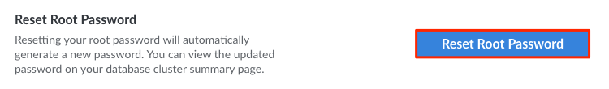

If you need to reset the root password on your Managed Database, you can do so through the Cloud Manager. This process assigns a new randomly generated password to the `linroot` user. This is helpful when someone should no longer have access to that user or if you believe your password may have been compromised.


Resetting the root password will prevent you from restoring all previously taken backups. Ensure that you have offsite backups available if needed.


1. Log in to the [Cloud Manager](https://cloud.linode.com/) and select **Databases** from the left navigation menu.

1. Select your Managed Database from the list. This opens the detail page for that database cluster.

1. Navigate to the **Settings** tab.

1. In the *Reset Root Password* section, click the **Reset Root Password** button. A confirmation dialog appears.

    

1. Click **Reset Password** to confirm. A new password will automatically be generated for this database cluster within a few minutes. To view the new password, navigate to the **Summary** tab and click the **Show** button next to the *password* field within the *Connection Details* section.