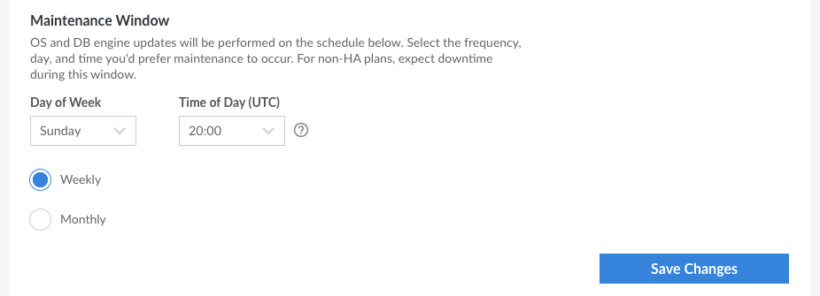

As part of the Managed Database service, the database cluster is updated regularly. This includes security updates and patches for the underlying operating system. These updates occur on a user-configurable *maintenance window*. By default, the maintenance window is set to start *every week* on *Sunday* at *20:00 UTC* and lasts for 3 hours.


If your database cluster is configured with a single node, the cluster will experience downtime during this maintenance window when any updates occur. It's recommended that you adjust this window to match a time that is the least disruptive for your application and users. You may also want to consider upgrading to a high availability plan, which provides additional nodes and enables automatic failover between them. While the cluster may still experience a momentary loss of connectivity when a failover occurs, downtime is greatly reduced.



**The database software is not updated automatically.** To upgrade to a new version (such as from MySQL 5.7.30 or 8.0.25 to 8.0.26), consider deploying a new Managed Database with the version you wish to use. You can then [migrate your databases](/docs/products/databases/managed-databases/guides/migrate-mysql/) from the original Managed Database cluster to the new one.


## View and Modify the Maintenance Window

1. Log in to the [Cloud Manager](https://cloud.linode.com/) and select **Databases** from the left navigation menu.

1. Select your Managed Database from the list. This opens the detail page for that database cluster.

1. Navigate to the **Settings** tab.

1. In the *Maintenance Window* section, you can view the day of the week the maintenance occurs, the time of day it starts, and if maintenance is performed on a weekly or monthly basis.

    

    - **Day of Week:** The day of the week that the maintenance will occur. The default is *Sunday*.
    - **Time of Day (UTC):** The time of day (in UTC) the maintenance window will start. The default is *20:00 UTC (8 PM)*. The maintenance window lasts for 3 hours.
    - **Weekly or Monthly:** Defines if the maintenance occurs once per week or once per month. The default is *Weekly*. If *Monthly* is selected, you can select if the maintenance should occur during the first, second, third, or fourth week of each month.

1. To modify the maintenance window, make any changes you wish and click the **Save Changes** button.