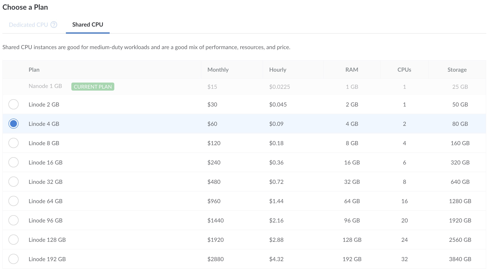



You can upscale database clusters to adapt them to your needs. Clusters can’t be downscaled.


This operation causes downtime for the resized node clusters.



1. Log in to the [Cloud Manager](https://cloud.linode.com/) and select **Databases** from the left navigation menu.

1. Select a database cluster from the list. 

1. Navigate to the **Resize** tab.

1. In the *Choose a plan* section, select a new plan for your database cluster. 

    

1. In the *Summary* section, verify the changes. Click **Resize Database Cluster**.

1. Follow the on-screen instructions and click **Resize Cluster** to confirm. The cluster will be upscaled within two hours.