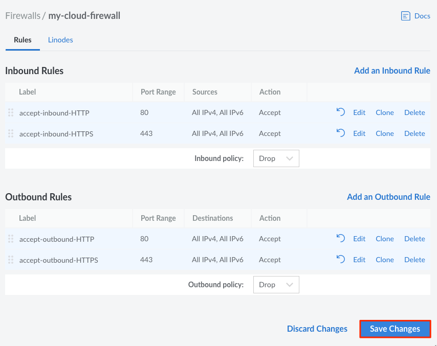

1. Log in to the [Cloud Manager](https://cloud.linode.com/) and select **Firewalls** from the navigation menu.

1. From the **Firewalls** listing page, click on the Firewall that you would like to add new rules to. This takes you to the Firewall's **Rules** page.

1. On the **Rules** page, select the default behavior for both inbound and outbound traffic using the **Inbound Policy** and **Outbound Policy** dropdown menus. **Accept** will allow all traffic except for those defined in the listed rules, and **Drop** will drop or deny all traffic except for those defined in the rules.

    

1. Click on the **Add an Inbound/Outbound Rule** link (click on the appropriate link for the type of Rule you would like to add).

    

    The **Add an Inbound/Outbound Rule** drawer appears.

1. Provide the following Rule configurations:

    | **Configuration** | **Description** |
    | --------------- | --------------- |
    | **Preset** | Select from a list of optional predefined Firewall rules. Selecting a predefined rule fills in the remaining Rule configuration values, however, they can all be edited. *Optional*|
    | **Label** | A label for the rule being created. This is used only as an identifier for the Linode Account holder, and does not have any impact on firewall performance. *Optional*
    | **Description** | A Description of the rule being created. This is used only as an identifier for the Linode Account holder, and does not have any impact on firewall performance. *Optional*|
    | **Protocol** | Select the Transport Layer protocol to use for this Firewall rule. *Required*|
    | **Ports** | Select from a list of common port numbers, or select **Custom** to open the **Custom Port Range** configuration option. Up to 15 ports (and port ranges) can be added to a single Cloud Firewall rule. Port numbers must be within 1 and 65535 and they cannot contain leading zeroes. *Required for TCP and UDP protocols but not allowed for the ICMP protocol.* |
    | **Custom Port Range** | Provide a port number or a range of ports on which to take action. Multiple ports or ranges can be added by separating each port or range with a comma (`,`). To configure a **Port Range**, enter the starting port and ending port numbers separated by a dash (`-`). For example, here is an example value that applies the rule to ports 21, 993, 995, and 2000-3000: `21,993,995,2000-3000`.  *Optional* |
    | **Sources** | **Required for Inbound rules only.** Select from a list of **Sources** that limit incoming connections to the chosen internet protocol, netmask, or specific IP address(es). |
    | **Destinations** | **Required for Outbound rules only.** Select from a list of **Destinations** that limit the outgoing connections to the chosen internet protocol, netmask, or specific IP address(es). |
    | **Action** | Choose whether this rule will be to allow or drop traffic. The action defined in specific rules will take precedence over the default inbound and outbound traffic policy. *Required* |

1. Click on **Add Rule** to add the new rule to this Firewall. If you would like to add any additional rules, repeat the process outlined in this section.

    

1. When you are done adding new Firewall rules, review them on the **Rules** page you are redirected to by default. Firewall rules are applied in order from top to bottom as they appear on this page. If you would like to re-order these rules, drag and drop any row into their desired position.

1. When you are done reviewing the new Firewall rules, click on the **Save Changes** button on the **Rules** page.

    
Any newly added rules do not take effect until you **Save Changes** to the Firewall.


    