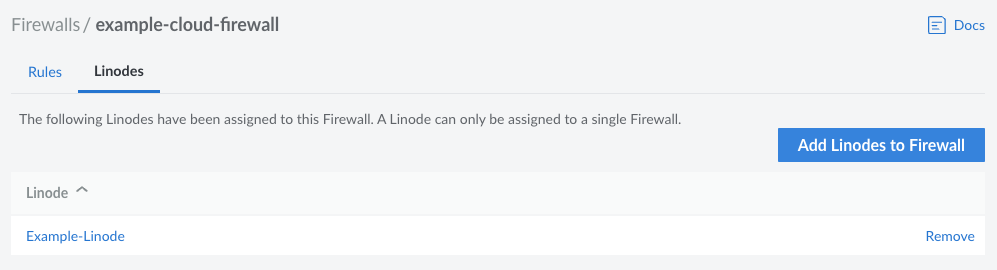

---
author:
  name: Linode
  email: docs@linode.com
title: "Apply Firewall Rules to a Compute Instance"
description: "Learn how to add and remove Compute Instances from Cloud Firewalls."
aliases: ['/products/networking/cloud-firewall/guides/assign-firewall/']
---

Each Cloud Firewall can be applied to one or more Compute Instances. Use the steps below to view and modify the Compute Instances using this firewall.

1. Log into your [Cloud Manager](https://cloud.linode.com/) and select **Firewalls** from the navigation menu.

1. From the **Firewalls** listing page, click on the Cloud Firewall that you would like to use. This takes you to the **Rules** page for that firewall.

1. Click on the **Linodes** tab to see a list of all Compute Instances that are currently using this Cloud Firewall.

## Add Compute Instances

To add a Compute Instance to this firewall, click on the **Add Linodes to Firewall** button. In the form that appears, select the desired Compute Instance from the dropdown menu and click **Add**. Once added, all rules configured on this Cloud Firewall are applied to this Compute Instance.


You can apply the Cloud Firewall to more than one Linode service at a time. Repeat this process to add additional Compute Instances.



If [Network Helper](/docs/guides/network-helper/) has been disabled on this Compute Instance and the internal networking configuration uses DHCP for IPv4 address assignment, some additional firewall rules are necessary. You must edit the Cloud Firewall to allow DHCP traffic through port 67 and 68. If needed, a full list of IP addresses for our DHCP servers can be found in our [DHCP IP Address Reference Guide](/docs/guides/dhcp-ip-address-reference/).


## Remove Compute Instances

To remove a Compute Instance, locate the instance within the list and click the **Remove** link. The rules configured on this Cloud Firewall are no longer applied to this Compute Instance and, as such, the instance may be less protected against malicious traffic or attacks.