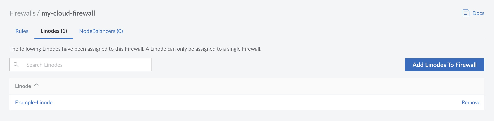

Each Cloud Firewall can be applied to multiple services (Compute Instances or NodeBalancers). Use the steps below to view and modify the services utilizing a Cloud Firewall.

1. Log into your [Cloud Manager](https://cloud.linode.com/) and select **Firewalls** from the navigation menu.

1. From the **Firewalls** listing page, click on the Cloud Firewall that you would like to use. This takes you to the **Rules** page for that Firewall.

1. Click either the **Linodes** or **NodeBalancers** tab to see a list of the respective services currently using the Cloud Firewall.

## Add a Service

To add a service to this firewall, select either the **Linodes** or **NodeBalancers** tab, and click on the **Add Linodes/NodeBalancers to Firewall** button. In the form that appears, select the desired service from the dropdown menu and click **Add**. Once added, all rules configured on the Cloud Firewall are applied to the selected service. Note that only inbound rules are applied to NodeBalancers.


You can apply the Cloud Firewall to more than one Linode service at a time. Repeat this process to add additional Compute Instances or NodeBalancers.



If [Network Helper](/docs/products/compute/compute-instances/guides/network-helper/) has been disabled on your Compute Instance and the internal networking configuration uses DHCP for IPv4 address assignment, some additional firewall rules are necessary. You must edit the Cloud Firewall to allow DHCP traffic through port 67 and 68. If needed, a full list of IP addresses for our DHCP servers can be found in our [DHCP IP Address Reference Guide](/docs/guides/dhcp-ip-address-reference/).


## Remove a Service

To remove a Compute Instance or NodeBalancer, locate the service within the list and click the **Remove** link. Once removed, the rules configured on the Cloud Firewall are no longer applied to the service and, as such, the service may be less protected against malicious traffic or attacks.