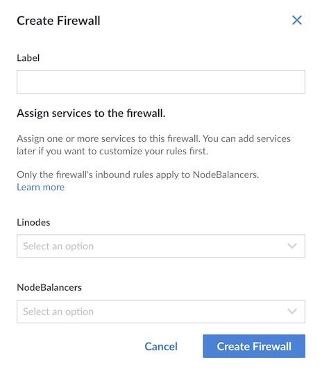

1. Log in to the [Cloud Manager](https://cloud.linode.com/) and select **Firewalls** from the navigation menu.

1. From the **Firewalls** listing page, click on the **Create Firewall** link.

1. The **Create Firewall** drawer appears with the configuration options needed to add a Firewall. Configure your Firewall with at minimum the required fields:

    | **Configuration** | **Description** |
    | --------------- | --------------- |
    | **Label** | The label is used as an identifier for this Cloud Firewall. *Required*. |
    | **Linodes**| The Linode(s) on which to apply the Firewall. A list of all Linodes on your account are visible. You can skip this configuration if you do not yet wish to apply the Firewall to a Linode. |
    | **NodeBalancers** | The NodeBalancer(s) on which to apply the Firewall. A list of all NodeBalancers on your account are visible. You may skip this configuration if you do not yet wish to apply the Firewall to a NodeBalancer. Note that outbound firewall rules do not apply to NodeBalancers. |

1. Click on the ****Create Firewall**** button to finish creating your Cloud Firewall. By default, a new Cloud Firewall accepts all inbound and outbound connections. Custom rules can be added as needed. See [Add New Cloud Firewall Rules](/docs/products/networking/cloud-firewall/guides/manage-firewall-rules/).

    


If you add a Cloud Firewall to a NodeBalancer, the inbound rules only apply to NodeBalancer’s public IP address and not the IPs of the backend nodes (Compute Instances) assigned to the NodeBalancer. This means that the IPs of the backend nodes may still be exposed to the public internet. As a best practice, you can protect the IPs of the individual Compute Instances by:
- Adding the individual instances to the same Cloud Firewall as the NodeBalancer
- Adding the individual instances to a new Cloud Firewall
- Manually configuring internal firewall rules on the instances

See [Comparing Cloud Firewalls to Linux Firewall Software](/docs/products/networking/cloud-firewall/guides/comparing-firewalls/) to help determine which solution is best for your use case.

