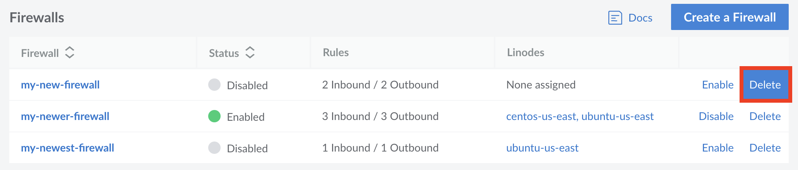

---
author:
  name: Linode
  email: docs@linode.com
title: Delete a Cloud Firewall
description: "How to delete a Linode Cloud Firewall."
---

1. Log into your [Linode Cloud Manager](https://cloud.linode.com/) and select **Firewalls** from the navigation menu. This takes you to the **Firewalls** listing page.

1. Click on the **Delete** button next to the corresponding Firewall you would like to delete. You are prompted to confirm deletion of the Firewall. Click **Delete** to proceed.

    

    The Firewall is deleted and any services that the Firewall was applied to no longer have their network traffic filtered by the Firewall.