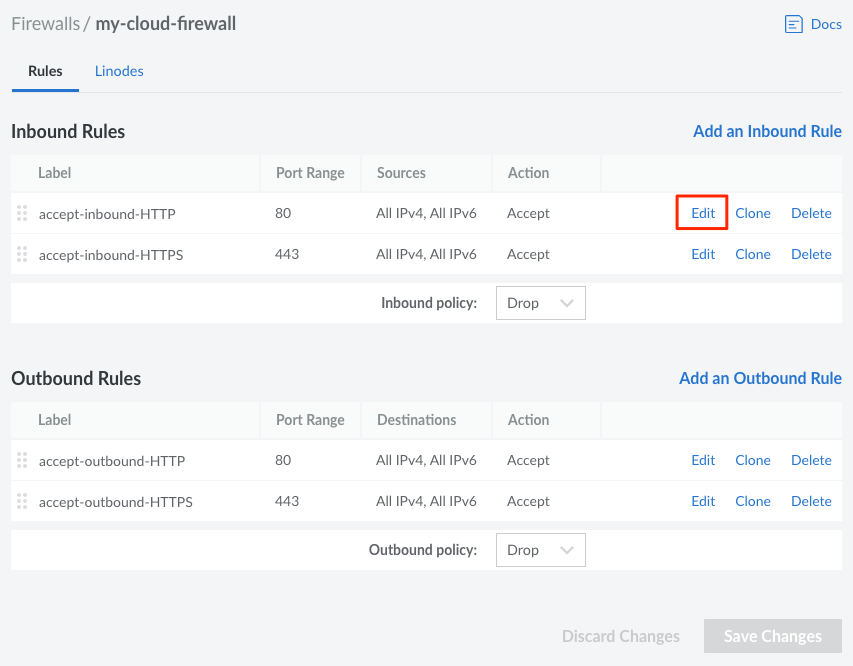
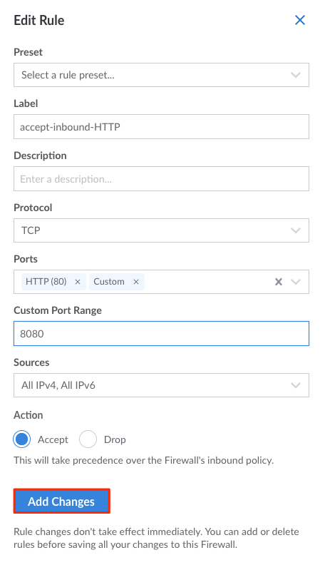
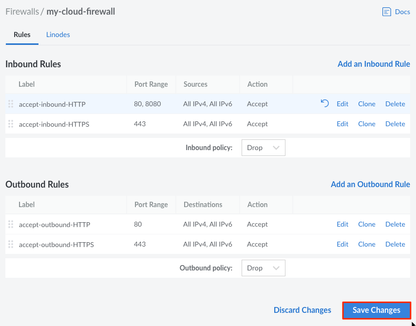

---
author:
  name: Linode
  email: docs@linode.com
title: Edit Cloud Firewall Rules
description: "How to edit your Linode Cloud Firewall rules."
---

Follow the steps in this section to edit predefined and custom Firewall Rules.

1. Log into your [Linode Cloud Manager](https://cloud.linode.com/) and select **Firewalls** from the navigation menu.

1. From the **Firewalls** listing page, click on the Firewall whose rules you'd like to edit. This takes you to the Firewall's **Rules** page.

1. Click on the **Edit** button corresponding to the rule you'd like to edit.

    

1. From the **Edit Rule** drawer, update the rule's configurations as needed.

1. Click on the **Add Changes** button to save your changes and apply them to the rule. If you would like to edit any additional rules, repeat the process outlined in this section.

    

1. When you are done editing your Firewall rules, click on the **Save Changes** button on the **Rules** page for those changes to take effect.

    