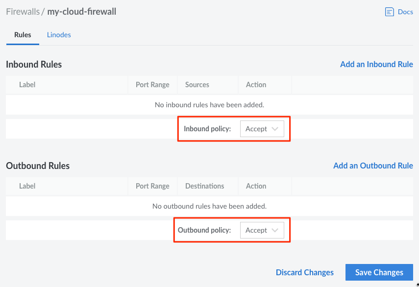
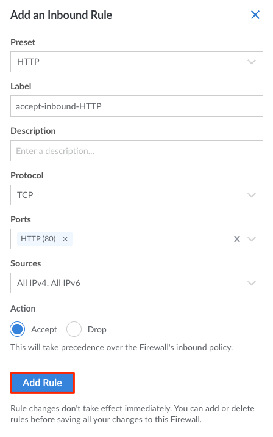
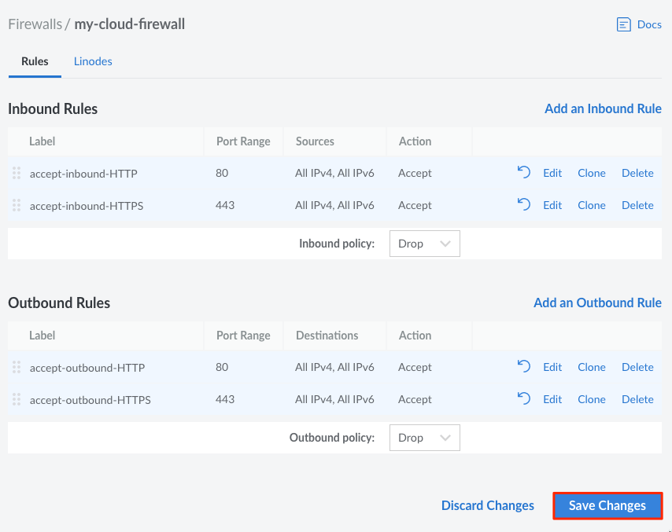
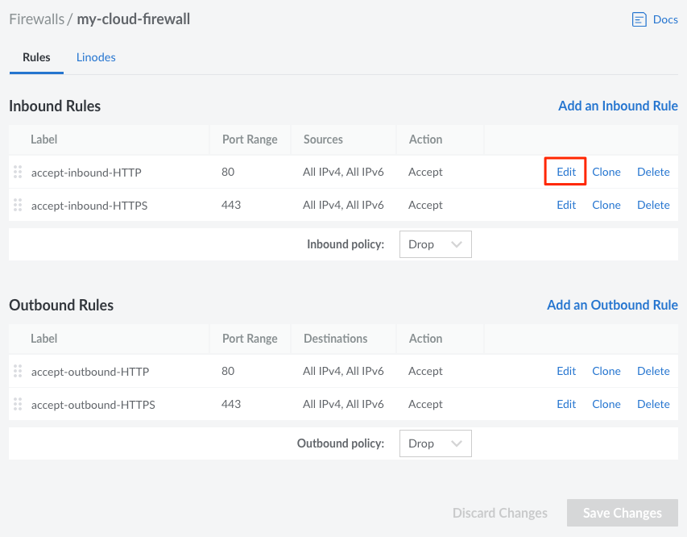
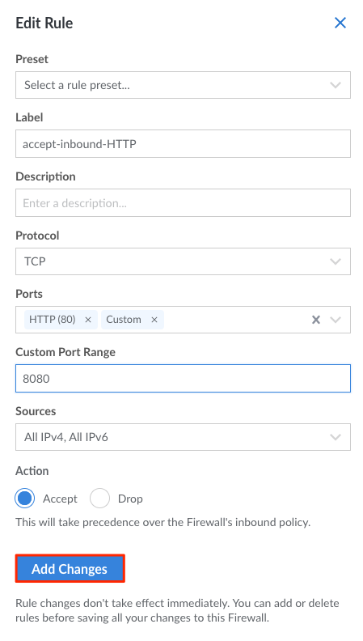

---
author:
  name: Linode
  email: docs@linode.com
title: "Manage Firewall Rules"
description: "How to add rules to a Linode Cloud Firewall."
aliases: ['/products/networking/cloud-firewall/guides/add-rules/','/products/networking/cloud-firewall/guides/edit-rules/','/products/networking/cloud-firewall/guides/delete-rules/']
published: 2020-11-10
modified: 2022-08-11
---

A Cloud Firewall can be configured with both *Inbound* and *Outbound* rules.

- **Inbound rules** limit incoming network connections to a Linode service based on the port(s) and sources you configure.

- **Outbound rules** limit the outgoing network connections coming from a Linode service based on the port(s) and destinations you configure.

## Predefined Rules

The Linode Cloud Manager provides a list of *predefined rules* that you can add to your Cloud Firewall. The predefined rules support common networking use cases and provide an easy foundation to get started with Cloud Firewalls. Since you can edit any rule applied to a Cloud Firewall, you can modify a predefine rule to accommodate your own applications and requirements.

## View Rules

1. Log in to the [Cloud Manager](https://cloud.linode.com/) and select **Firewalls** from the navigation menu.

1. From the **Firewalls** listing page, click on the Cloud Firewall that you would like to view or modify.

Rules are separated into *inbound* and *outbound* sections.

## Add a Rule

1. Log in to the [Cloud Manager](https://cloud.linode.com/) and select **Firewalls** from the navigation menu.

1. From the **Firewalls** listing page, click on the Firewall that you would like to add new rules to. This takes you to the Firewall's **Rules** page.

1. On the **Rules** page, select the default behavior for both inbound and outbound traffic using the **Inbound Policy** and **Outbound Policy** dropdown menus. **Accept** will allow all traffic except for those defined in the listed rules, and **Drop** will drop or deny all traffic except for those defined in the rules.

    

1. Click on the **Add an Inbound/Outbound Rule** link (click on the appropriate link for the type of Rule you would like to add).

    

    The **Add an Inbound/Outbound Rule** drawer appears.

1. Provide the following Rule configurations:

    | **Configuration** | **Description** |
    | --------------- | --------------- |
    | **Preset** | Select from a list of optional predefined Firewall rules. Selecting a predefined rule fills in the remaining Rule configuration values, however, they can all be edited. *Optional*|
    | **Label** | A label for the rule being created. This is used only as an identifier for the Linode Account holder, and does not have any impact on firewall performance. *Optional*
    | **Description** | A Description of the rule being created. This is used only as an identifier for the Linode Account holder, and does not have any impact on firewall performance. *Optional*|
    | **Protocol** | Select the Transport Layer protocol to use for this Firewall rule. *Required*|
    | **Ports** | Select from a list of common port numbers, or select **Custom** to open the **Custom Port Range** configuration option. Up to 15 ports (and port ranges) can be added to a single Cloud Firewall rule. Port ranges are considered to be 2 total ports towards the total of 15 maximum ports. Port numbers must be within 1 and 65535 and they cannot contain leading zeroes. *Required for TCP and UDP protocols but not allowed for the ICMP protocol.* |
    | **Custom Port Range** | Provide a port number or a range of ports on which to take action. Multiple ports or ranges can be added by separating each port or range with a comma (`,`). To configure a **Port Range**, enter the starting port and ending port numbers separated by a dash (`-`). The port range string can contain up to 15 pieces, where a single port is treated as one piece, and a port range is treated as two pieces. For example, here is an example value that applies the rule to ports 21, 993, 995, and 2000-3000, considered a total of 5 pieces: `21,993,995,2000-3000`.  *Optional* |
    | **Sources** | **Required for Inbound rules only.** Select from a list of **Sources** that limit incoming connections to the chosen internet protocol, netmask, or specific IP address(es) and ranges. |
    | **Destinations** | **Required for Outbound rules only.** Select from a list of **Destinations** that limit the outgoing connections to the chosen internet protocol, netmask, or specific IP address(es) and ranges. |
    | **Action** | Choose whether this rule will be to allow or drop traffic. The action defined in specific rules will take precedence over the default inbound and outbound traffic policy. *Required* |

    
When applying individual IP addresses or IP ranges to either the `source` or `destination` field, the addresses must always be valid and formatted correctly. IP address ranges are formatted differently than port number ranges. Instead of using a hyphenated range of numbers, [CIDR notation](https://en.wikipedia.org/wiki/Classless_Inter-Domain_Routing) is used to designate the network prefix and the number of bits in the prefix. The following are examples of valid IPv4 and IPv6 ranges:

- `192.0.2.0/24`
- `198.51.0.0/16`
- `2001:db8:1234::/48`

In the first example above, using a range of `192.0.2.0/24` applies the rule to all IP addresses from 192.0.2.1 through 192.0.2.254.


    
As of the time of this writing, if an IP address or range is invalid, users will be unable to **Save Changes** after reviewing new firewall rules, and no error message will appear. Users should ensure that all IP addresses and ranges are valid and formatted correctly should they encounter this issue.


1. Click on **Add Rule** to add the new rule to this Firewall. If you would like to add any additional rules, repeat the process outlined in this section.

    

1. When you are done adding new Firewall rules, review them on the **Rules** page you are redirected to by default. Firewall rules are applied in order from top to bottom as they appear on this page. If you would like to re-order these rules, drag and drop any row into their desired position.

1. When you are done reviewing the new Firewall rules, click on the **Save Changes** button on the **Rules** page.

    
Any newly added rules do not take effect until you **Save Changes** to the Firewall.


    

## Edit a Rule

Follow the steps in this section to edit predefined and custom Firewall Rules.

1. Log into your [Linode Cloud Manager](https://cloud.linode.com/) and select **Firewalls** from the navigation menu.

1. From the **Firewalls** listing page, click on the Firewall whose rules you'd like to edit. This takes you to the Firewall's **Rules** page.

1. Click on the **Edit** button corresponding to the rule you'd like to edit.

    

1. From the **Edit Rule** drawer, update the rule's configurations as needed.

1. Click on the **Add Changes** button to save your changes and apply them to the rule. If you would like to edit any additional rules, repeat the process outlined in this section.

    

1. When you are done editing your Firewall rules, click on the **Save Changes** button on the **Rules** page for those changes to take effect.

    

## Delete a Rule

1. Log into your [Linode Cloud Manager](https://cloud.linode.com/) and select **Firewalls** from the navigation menu.

1. From the **Firewalls** listing page, click on the Firewall whose rule(s) you'd like to delete. This takes you to the Firewall's **Rules** page.

1. Click on the **Delete** corresponding to the rule that you would like to delete. If you would like to delete any additional rules, repeat the process outlined in this section.

1. When you are done, click on the **Apply Changes** button on the **Rules** page.

    
Any rule deletion(s) does not take effect until you **Apply Changes** to the Firewall.
    