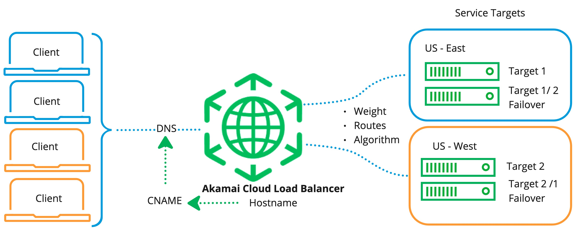

**Akamai Cloud Load Balancer** offers global, configurable, scalable, distributed compute traffic management across physical, virtual, and cloud-hosted applications. It can automatically detect load conditions and levels and route traffic to the optimal target while maintaining custom routing policies and consistent visitor session behavior.

## How Cloud Load Balancer Works

Here's how Cloud Load Balancer works:

- The load balancer receives incoming requests on ports that you configure.

- Configurations, routes, and algorithms define how the load balancer should distribute requests across service targets.

- Health checks detect if a target is down and routes traffic to an available target or a failover target.

- Session stickiness routes subsequent requests to the same target as long as it remains healthy.

- TLS Certificates are used by the load balancer to terminate the connection and decrypt request from clients.

- Service Target CA Certificates are used by the load balancer to accept responses from your service target endpoints.

- CNAME records in your DNS maps the targets to the load balancer.

## Selecting a Load Balancer
Use the following table to help select the load balancer to meet your requirements.

| Feature               | Cloud Load Balancer         | NodeBalancer           |
| ----------------------| -----------------------------|------------------------|
|Load Balancer Location |Supports both regional and global load balancing. The Load Balancer does not need to be situated in the same data center as your target endpoints.                  |Must be situated in the same data center as your target endpoints IPs.|
|Services targets | Any combination of targets from different Cloud providers, Akamai Delivery Properties and Cloud Compute Instances can be added to Cloud Load Balancer. |Cloud Compute Instance|
|PCI  Compliance |Compliant for LA/GA|Compliant|
|Layer 7 (Application Layer) |HTTP/1.1 and HTTP/2 Supported            |HTTP/1.1 Supported    |
|Layer 4 (Network Layer/Transport)|TCP Supported                |TCP Supported               |
|Load Balancing Methods |Weighted, Routes, Algorithm|Performance, Weighted|
|Health Checks          |Liveness and Load-based|Liveness|
|Session Stickiness     |Supported                     |Supported               |
|Metrics, Logs and Traces|Supported                    |-                       |
|Pricing                |Beta is offered free of charge for the duration of the Beta trial and includes; 4 Gbps of outbound from the Load Balancer to end-users. Up to 50 000 concurrent connections (with a limit of 4000 requests-per-second). Load balancing in up to 5 regions. |Each NodeBalancer on an account costs $10/mo ($0.015/hr).|

## Accelerate Distributed Compute
This OSI layer 7 and layer 4 Load Balancer manages your distributed application architectures across multiple regions and multiple clouds.

- **Layer 7:** load balancing routes HTTP and HTTPS (layer 7) traffic through the HTTP/1.1 and HTTP/2 protocols. Layer 7 load balancers look at content such as the url path to make load‑balancing decisions. It then makes a new TCP connection or reuses an existing connection to select and write the request to the target.
- **Layer 4:** TCP load balancing forwards network packets to and from the upstream server without inspecting the content of the packets.

## Integration With Akamai Products
Cloud Load Balancer can be used with or without Akamai delivery properties or cloud compute instances.

## Operationally Simple
You can create and enable Cloud Load Balancer using Cloud Manager or APIv4. Once Cloud Load Balancer is configured, you can start balancing requests to service targets across multiple regions or globally. Cloud Load Balancer requires no infrastructure management and is designed to be maintenance free after initial configuration.

## Load Balancing Configurations
The load balancer routes your clients' requests to one of your service target endpoints using one or a combination of the following: Algorithm, Weight, and Match-Conditions.

- **Algorithm:** decides how the load balancer allocates new connections across your service targets.

    - **Round Robin:** Service targets are selected one after another in a repeating order. If unequal weights are assigned, service targets with a greater weight appear more frequently in the round robin rotation.
    - **Least Request:** The load balancer selects the service target with the fewest number of active requests. If unequal weights are assigned, weighted round robin rotation is applied.
    - **Ring Hash:** Each service target is mapped into a circle (ring) by hashing its address. Each request is then routed clockwise around the ring to the nearest service target.
    - **Random:** The load balancer selects a random available service target.
    - **Maglev:** The Maglev load balancer implements consistent hashing to upstream hosts.

- **Weight:** routes requests in the proportion (%) configured.

- **Match Conditions:** routes HTTP/S requests to a service target based on matches with:
    - Query string
    - Path Prefix
    - Path Regex
    - Hostname
    - HTTP Header
    - HTTP Method

- **Sticky Sessions:** routes subsequent requests to the same service target with failover to an alternate target if the sticky region fails or degrades.

## High-Availability, Geo-proximity, and Scalability

**High Availabilty:** Akamai Cloud Load Balancer has built-in failover and customizable failover preferences. It's designed to manage high request volumes without any degradation to user experience.

**Geo-proximity:** Based on load and distance, Akamai Cloud identifies and selects the fastest routing for best performance. Cloud Load Balancer offloads connections closer to the end user so that round-trip time and time to first byte is improved when compared to not using Load Balancer.

**Scalability:** Load balancers scale applications and add flexibility by allowing you to add or remove services that are identically configured to serve your application or perform a task. Load balancers route incoming requests to one of the identically configured services based on the settings that you have configured. Large tier Cloud Load Balancers can support up to 1,000,000 concurrent connections.

## Health Checks
Requests are only routed to healthy targets. Passive health checks happen on every request. If the target becomes unfit, the load balancer moves traffic away from the unhealthy target. When a new target is added, Cloud Load Balancer tests the fitness of the target to verify the target is active, and ready to support large traffic spikes.


Endpoint health status is displayed in Cloud Manager and updated periodically. Updates can take approximately 5 minutes to be displayed.


## Certificate Management
Cloud Load Balancer uses a bring-you-own certificate model. Your certificate and its private key are directly uploaded to a vault using Cloud Manager or APIv4.

## Observability (NA for Beta)
Cloud Load Balancer provides real-time metrics, logs, and traces through third party observability tools and providers.

**HTTP/S and TCP Metrics:** real time aggregated statistics that summarize usage, performance and health including;
- HTTP/S:
    - Number of HTTP/S requests.
    - Number of responses by status code.
- TCP:
    - Currently open connections.
    - New connections per second.
    - Packets per second.
    - Bandwidth usage.

**Logs and Traces:** low latency feed of per-request data in a standard OpenTelemetry format.

**Traces:** low latency feed of per-request trace data in the OpenTelemetry format.

## Recommended Workloads

- Enterprise applications
- Distributed application across multiple regions and multiple clouds
- High traffic and e-commerce websites
- Applications that require extreme reliability and uptime
- Applications that need to dynamically scale without any downtime
- A/B testing and blue/green deployments
- PCI compliant load balancing (NA for Internal Beta)

## Availability (NA for Beta)

Akamai Cloud Load Balancers are available in all DV5 Data Centers and across [all regions](https://www.linode.com/global-infrastructure/).

## Pricing
Billing for each Cloud Load Balancer starts once it is created. You can get a summary of your charges from Cloud Manager.

Pricing is based on outbound traffic monthly usage and a base fee. Outbound traffic is the traffic from the load balancer to the client and to the service target. 1 TB/month of outbound traffic is included with the base fee. If 1 TB/month of outbound traffic is exceeded, an overage charge of $0.01/GB is added to your bill. The base fee is determined by the number of global connections.

| Plan  |# of Concurrent Connections|Requests/Second Globally| Price/Hour|Price/Month|
| -----------------| -----------------| -------| ----------| ---|
| Extra Small     | up to 50 000     |48,000| $0.14   | $93.50  |
| Small           | up to 100 000    |96,000| $0.26   |  $173.50 |
| Medium          | up to 500 000    |480,000| $1.02  | $677.92  |
| Large           | up to 1 000 000  |960,000| 2.02 |  $1344.58 |

**Beta Pricing:** Beta is offered free of charge for the duration of the Beta trial.

**30 Day Free Trial:** Free trials include;
- up to 100 000 connections globally
- up to 1 TB of outbound traffic.

Processed traffic is denied if either of these limits are exceeded during the 30-day free trial.

## Technical Specifications

- Managed cloud-based load balancing service
- Service Targets can be any combination of targets from different Cloud providers, Akamai Delivery Properties and Cloud Compute Instances.
- Dynamically routes requests over any ports to configurable service targets.
- Highly available with built-in redundancy
- Up to 1,000,000 concurrent connections for large tiers
- Supports TCP-based (layer 4) load balancing (UDP traffic is not supported)
- Supports HTTP and HTTPS (layer 7) load balancing through the HTTP/1.1 and HTTP/2 protocols.
- Supports service targets with public IPv4 and IPv6 addresses.
- Configurable to targets within a VPC.
- Configurable to targets in a dedicated subnet and VLAN.
- Private connections can be configured between the Cloud Load Balancer and targets.
- Fully customizable health checks to ensure traffic lands on a functioning service target.
- Free inbound network transfer
- Outbound network transfer usage is counted towards the account-wide [monthly network transfer pool](/docs/products/platform/get-started/guides/network-transfer/)
- Provisioning and management through the [Cloud Manager](https://cloud.linode.com/), [CLI](https://www.linode.com/products/cli/), or programmatically through the [API](https://www.linode.com/products/linode-api/)

## Limits and Considerations

- **Maximum number of concurrent connections:** Akamai Cloud Load Balancers each support up to 1,000,000 concurrent connections. If your application needs to support more than that, [contact support](https://www.linode.com/support/) to determine additional options or consider using multiple Akamai Cloud Load Balancers behind a DNS load balancing solution such as [Round-Robin DNS](/docs/guides/setting-up-round-robin-dns/).
- **Connections per second:** There are defined rate limits for the number of connections over a given time period.
- **IP addresses:** A public IPv4 address and IPv6 address are configured on each Akamai Cloud Load Balancer. Additional addresses are not available.
- **HTTP support:** HTTP/1.1 and HTTP/2.
- **Network transfer:** *Outbound transfer* usage is 1 TB. Both *Incoming transfer* and transfer over the private network are provided at no cost.
