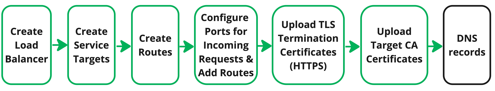

**Akamai Cloud Load Balancer**  offers global, configurable, scalable, distributed compute traffic management across physical, virtual, and cloud-hosted applications. It can automatically detect load conditions and route traffic to the optimal target while maintaining custom routing policies and consistent visitor session behavior.

## About Akamai Cloud Load Balancer

Nearly every production application can benefit from a load balancing solution like Akamai's Cloud Load Balancer. This guide covers how to get started with Load Balancer, including how to configure the Load Balancer, and update the DNS.

## Prepare the Application

To start using and benefiting from load balancing, your application should be available on at least two service targets. Each service target should be able to fully serve the needs of your users, including being able to respond to web requests, access all necessary files, and query any databases.

To sign up for an account and to start deploying your service targets from Compute Instances, see [Compute Instances - Get Started](/docs/products/compute/compute-instances/get-started/). If your service targets are not deployed from compute instances, you will need the public IP addresses for your service targets.

To redirect web connections over port 443/HTTPS, generate TLS certificates for your domains.

## Create the Akamai Cloud Load Balancer

Once your application has been deployed on at least two service targets, you are ready to create the Akamai Cloud Load Balancer which includes configuring and uploading the following components.

### Label the Load Balancer and Select Regions
1. Log in to the [Cloud Manager](https://cloud.linode.com), select Cloud Load Balancers from the left menu, and click the **Create Load Balancer** button. This displays the *Cloud Load Balancers Create* form.

1. Enter a **Load Balancer Label** that uniquely identifies it from other load balancers. Consider using a name that indicates the load balancer's purpose.

1. Optionally, create tags to help organize and group your load balancers.

    
    `Tags` are not available for Beta.
    

1. Select the **Regions** where this load balancer processes requests. If your client traffic and targets are limited to a particular geography, select that region. You can also select multiple regions or `All` for global coverage. The number of regions selected, is one of the factors that determines the [Pricing](/docs/products/networking/cloud-load-balancer/#pricing) for this Load Balancer.

    
    Select regions are automatically provisioned for Beta.
    

1. Click the **Create Load Balancer** button.

    The newly created load balancer is added.

### Upload Service Target CA and TLS Termination Certificates

TLS termination certificates are required for load balancer ports using the HTTPS protocol. TLS termination certificates create an encrypted link between your clients and Cloud Load Balancer and terminate incoming requests on the load balancer. Once the load balancing policy is applied, requests are forwarded to your service targets endpoints over encrypted TLS connections. Responses from your service targets to your clients are also encrypted.

Service target CA certificates are applied to your endpoints. Cloud Load Balancer uses these certificates to verify responses from your service targets to your clients.

1. Click on the [Cloud Load Balancer](https://cloud.linode.com/loadbalancers/) that you are setting up. The Cloud Load Balancer **Summary** tab is displayed.

1. Select the **Certificates** tab. Then select the **TLS Certificates** or **Service Target Certificates** tab.

1. Refer to the following table for information on uploading certificates.

| **Field**   | **Description** |
| :----------------| ----------------|
| **TLS Certificates**                           ||
|Label          |  Certificate name.|
|TLS Certificate| Paste the PEM-formatted contents of your TLS certificate. If you have linked multiple segments of a chained certificate, be sure to copy all of its contents into the text field, appearing one after another. The certificate must be signed using the RSA algorithm, which is the default in most cases.|
Private Key|Paste the PEM-formatted contents of your private key. Your private key must not have a passphrase.|
|**Service Target Certificates**||
|Label          |  Certificate name.|
|Server Certificate| Paste the PEM-formatted contents of your TLS certificate. If you have linked multiple segments of a chained certificate, be sure to copy all of its contents into the text field, appearing one after another. The certificate must be signed using the RSA algorithm, which is the default in most cases.||

4. After entering each certificate, click **Upload Certificate**.

    An ID is assigned to each certificate you add.

### Create Service Targets
A service target is a cluster of endpoints that the load balancer directs incoming requests to. You can add different service targets and endpoints for different types of requests.


For BETA, when creating a new service target, add at least one endpoint. If at service target was created without an endpoint, delete the service target and re-add it with an endpoint.


1. Select the **Service Targets** tab.

1. Click the **Create Service Target** button.

1. Refer to the following tables for information on configuring service targets.

| **Field**   | **Description** |
| :----------------| ----------------|
| **Add A Service Target**                            ||
|  Service Target Label          | Service Target name. |
|Service Target Protocol | TCP, HTTP or HTTPs. The protocol this service target is configured to serve. The service target protocol must match the port configuration protocol and the route protocols.||
|**Algorithm**                   | Select a load balancing policy that decides how new connections are allocated across your service targets. Cloud Load Balancer also has a built-in geo-proximity feature for selecting the optimum endpoint. <li> **Round Robin:** Service targets are selected one after another in a repeating order. If unequal weights are assigned, service targets with a greater weight appear more frequently in the round robin rotation. </li><li> **Least Request:** The load balancer selects the service target with the fewest number of active requests. If unequal weights are assigned, weighted round robin rotation is applied.</li><li> **Ring Hash:** Each service target is mapped into a circle (ring) by hashing its address. Each request is then routed clockwise around the ring to the nearest service target.</li><li> **Random:** The load balancer selects a random available service target.</li><li> **Maglev:** The Maglev load balancer implements consistent hashing to upstream hosts. </li>    |
| **Endpoints** (Required)|At least one endpoint is required. Endpoints for a service target must be unique. The port, IP or compute instance must differ. Capacity and health status are taken into consideration in the endpoint selection process.|
|Linode or Public IP Address          | Select the Compute Instance (Linode). For non-Linode endpoints, enter the public IPv4 or IPv6 address. Do not use the localhost (127.0.0.0/8) or any IP address used internally by this load balancer for the endpoint IP address.|
|Port| Enter the service target port that the load balancer directs incoming requests to. This is the port that the application is listening on.|
|Host Header (optional)   | The host header for HTTP/S requests to the endpoint. The host header is not used to look up the IP address in the DNS.|
|Rate Capacity (Requests per second)|The maximum number of requests/second that can be directed to this endpoint. If the actual number of requests/second exceeds the configured capacity value, requests are distributed to the other endpoints. The total requests per second allowed on each Load Balancer is defined in [Pricing](/docs/products/networking/cloud-load-balancer/#pricing). |
|**Service Target CA Certificate**|The certificate installed on your endpoints that is used by the load balancer to accept responses from this Service Target.|
|Certificate (required for HTTPS applications)| Select the CA certificate to use for this service target. See [Service Target CA Certificates](/docs/products/networking/cloud-load-balancer/get-started/#upload-service-target-ca-and-tls-termination-certificates) for information on uploading certificates.|
|**Health Checks**|Health checks are configured at the service target level and apply to all of the endpoints. For TCP, a service target is considered healthy (Up) and able to accept incoming requests when there is a successful TCP handshake with the service target. When HTTP/S is used to validate health status, the service target is considered healthy when requests to its path or host return a 2xx or 3xx status code response.|
|Protocol| HTTP or TCP.  You can select TCP or HTTP health checks when the service target is HTTP or HTTPS. For TCP service targets, the health check protocol must be TCP.
Interval (seconds) | The number of seconds between health checks for this service target. Minimum value is 1. |
|Timeout| How long to wait (in seconds) before canceling a health check because a connection could not be established with the service target. Minimum value is 1|
|Healthy Thresholds | The number of consecutive health checks that must be successful before marking a service target as healthy. Minimum value is 1.|
|Unhealthy Threshold| The number of consecutive health checks that must fail before marking a service target as unhealthy. Minimum value is 1. |
|Health Check Path (optional)|When **Protocol** is set to `HTTP`, enter the request url path for the health check. **Health Check Path** is not applicable when the health check **Protocol** is set to `TCP`.|
|Health Check Host Header (optional)| When **Protocol** is set to `HTTP`, enter the request host header for the health check. **Health Check Host Header** is not applicable when the health check protocol is set to `TCP`.||

4. Click the **Create and Add Service Target** button.

    The new service target is added and listed in the *Service Targets* table.

1. Add another service target, or if you have  finished adding your service targets, continue with the next steps to add routes.

### Create Routes and Rules
Routes define how the load balancer directs incoming requests to service targets. After a route is created, you add rules to set match conditions that are used for target selection.

You can reuse routes across multiple load balancer ports.

1. Select the **Routes** tab.

1. Click the **Create Route** button.

1. Enter a **Route Label** for this route that uniquely identifies it from other routes.

1. Select the **Protocol**.

    
    The route protocol must match the port configuration protocol and the service targets protocol. Select `HTTP` for the route protocol when the service target and port configuration protocol is `HTTP` or `HTTPS`.
    

1. Click **Create Route**.

    The route is assigned an **ID** and listed in the *Routes* table.

1. Once at least one route is added, add rules to the route.

    Select the specific steps for adding rules to TCP or HTTP routes;
    - [Rules - TCP Load Balancer Configuration](/docs/products/networking/cloud-load-balancer/get-started/#rules---tcp-load-balancer-configuration)
    - [Rules - HTTP and HTTPs Load Balancer Configuration](/docs/products/networking/cloud-load-balancer/get-started/#rules---http-and-https-load-balancer-configuration)

#### Rules - TCP Load Balancer Configuration
For TCP load balancers, rules include allocating the percentage of request that should be directed to specific service targets. You can also enable session stickiness.

1. In the *Routes* table, click **Add Rule**.

    The *Add Rule* drawer opens.

1. Select a service target from the **Service Target** pull down lists and assign the **Percent** of requests that you want routed to that target.

1. Continue to add more service targets and percentages by clicking **Add Service Target**.

    All percentages must total 100.

1. When you have added all of the service targets for this route rule, click **Add Rule**.

1. Create additional rules if required. Once all rules are added, go to [Create Configurations](/docs/products/networking/cloud-load-balancer/get-started/#create-configurations).

#### Rules - HTTP and HTTPs Load Balancer Configuration
 For HTTP and HTTPS load balancers, in addition to setting the percentage of incoming requests to each target, other match conditions such as `Hostname`, `Path Prefix`, `Query String`, `HTTP Header`, `HTTP Method` and `Path Regex` can be added to the route rules.  HTTP and HTTPS load balancers also support session stickiness.

1. In the *Routes* table, click **Add Rule**.

    The *Add Rule* drawer opens.

1. If this match rule applies to a specific target, enter the **Hostname** of the target. If a hostname is not specified, the rule applies to all targets.

1. Add match conditions for each route. A match condition consists of a **Match Type**, and a **Match Value** pattern to match. Rules are evaluated in order, with the first match winning. Each rule can specify only one field/pattern pair (AND/OR logic is not supported). Match values are case sensitive and only Path Regex supports wildcards.

    Supported **Match Types** and examples are available in the following table.

| Match Type     | Description |Match Value Examples       |
|----------------|-------------|--------------|
|**HTTP Header**       | Exact match based on both the name of a request header and its value. If no value is entered, any request containing the header name produces a match.|X-route-header=images|
|**HTTP Method**       |Match based the type of request method.|GET, HEAD, DELETE, POST, PUT |
|**Path Prefix**  | A URL path prefix. The format of the path entry is as follows: /pathprefix1/pathprefix2. The initial slash is required, the trailing slash is not.| /images |
|**Path Regex**           | Match is on a path using regular expression RE2 syntax. The initial slash is required.| For any jpg file in the /path/ directory, match value would be /path/.*[.]jpg.|
|**Query String**        | Exact match based on both the name of the query and the single URL query value to match on. If there is no value, the match is to any request that contains the parameter.|?svc=images|

4. Select a service target from the **Service Target** pull down lists and assign the **Percent** of requests that you want routed to that target.

1. Continue to add more service targets and percentages by clicking **Add Service Target**.

    All percentages must total 100.


Add a service target to use if no rules match. Without a default target, non-matching requests are rejected.


#### Configure Session Stickiness
Session stickiness controls how subsequent requests from the same user are routed. When enabled, subsequent requests by the same user to the same load balancer are sent to the same service target for the duration of the cookie, and as long as the target remains healthy. If the target is unhealthy, a different target is selected. When session stickiness is disabled, no session information is saved, and requests are routed in accordance with the algorithm and rules. Cloud Load Balancer supports session stickiness using load balancer generated cookies, or cookies from the origin.

If you are not using session stickiness, click **Add Rule**, to add this rule to the route.
Create or select additional rules. Once all rules are added, go to [Configurations - Entry Point Protocol and Port](/docs/products/networking/cloud-load-balancer/get-started/#create-configurations---entry-point-protocol-and-port).

If you are using session stickiness, complete the following steps.

6. Enable **Use Session Stickiness** if you want to route subsequent requests from the same client to the same service target whenever possible.

    
    The client must have cookies enabled. If the client has disabled cookies or deletes cookies, session stickiness is not preserved, and each new request is routed in accordance with the selected algorithm.
    

1. Select the **Cookie Type**, `Load Balancer Generated` or `Origin`.
    - If the **Cookie Type** is `Origin`, enter the `Cookie Key`. The `Cookie Key` is the cookie name used to obtain the cookie value from the downstream HTTP application.
    - If the **Cookie Type** is `Load Balancer Generated`, enter the **Stickiness TTL**. If the TTL is set to zero, the generated cookie is a session cookie only.

1. Click **Add Rule**. Create additional rules if required. Once all rules are added, continue with the next section.

### Create Configurations

Configurations define the port the load balancer listens on, and the protocol used for routing requests to the service targets.

A Cloud Load Balancer can have multiple configurations. Each configuration allows the load balancer to accept traffic on a new port. For example, if you wanted to accept standard HTTP traffic, you could create a configuration listening on port 80.

Configurations use routes to direct requests to service targets. A load balancer can have a mix of TCP, HTTP and HTTPS port configurations. However, the route protocols and the port configuration protocol must match. If they do not match, the operation will be rejected. If the protocol is HTTPs, a TLS termination certificate is required.

1. Select the **Configurations** tab.

1. Click **Add Another Configuration**.

1. Enter a unique name for this entry point in the **Configuration Label** field.

1. Select the **Protocol**. The protocol can be set to either TCP, HTTP, or HTTPS. See [Guides - Available Protocols](/docs/products/networking/cloud-load-balancer/guides/protocols/).

1. Enter the **Port** number Cloud Load Balancer listens on. The port can have a value from 1 - 65535, though it should be set to whichever port the client software connects to. For instance, web browsers use port 80 for HTTP traffic and port 443 for HTTPS traffic, though a client can change the port by specifying it as part of the URL.

1. If the Load Balancer protocol is HTTPS, click **Add Certificate**.

    
    If the protocol used by this Load Balancer is TCP or HTTP, a TLS termination certificate is not applicable, and you can go to the next step.
    

    -  Select **Add Existing Certificates** if the TLS certificate for this load balancer has been uploaded already.

        - Select the certificate from the **Certificate** pull down.
        - Enter the request host header sent by the client in the **Server Name Indication (SNI) Hostname** field. This host header tells the load balancer which certificate to use when responding back to the client.
        - Click **Add** to apply the TLS termination certificate.

    - Select **Create New Certificate** if the TLS certificate for this load balancer hasn't been uploaded yet.

        - In the **Certificate Label** field, enter a unique name for the certificate.
        - In the **Certificate** field, paste the PEM-formatted contents of your TLS certificate. If you have linked multiple segments of a chained certificate, be sure to copy all of its contents into the text field, appearing one after another. The certificate must be signed using the RSA algorithm, which is the default in most cases.
        - In the **Private Key** field, paste the PEM-formatted contents of your private key. Your private key must not have a passphrase.
        - Enter the request host header sent by the client in the **Server Name Indication (SNI) Hostname** field. This host header tells the load balancer which certificate to use when responding back to the client.
        - Click **Create And Add** to apply the TLS termination certificate.

    7. Click **Add Route**.

        - Select **Add Existing Route** if the route has already been added.

            - Select the route from the **Route** pull down.
            - Click **Add Route**.

        - Select **Create New TCP/HTTP Route** to create a new route.

            - In the **Route Label** field, enter a unique name for the Route.
            - Click **Create And Add** to add the route.
            - After the route is added to the routes table, you can add route rules.
            Select the specific steps for adding rules to TCP or HTTP routes;
                - [Rules - TCP Load Balancer Configuration](/docs/products/networking/cloud-load-balancer/get-started/#rules---tcp-load-balancer-configuration)
                - [Rules - HTTP and HTTPs Load Balancer Configuration](/docs/products/networking/cloud-load-balancer/get-started/#rules---http-and-https-load-balancer-configuration)
    1. Click the **Create Configuration** button.

## Review the Cloud Load Balancer

You can review and edit any of the load balancer components using the Summary, Configurations, Routes, Service Targets, Certificates and Settings tabs.

## Update the DNS

After deploying Cloud Load Balancer and putting your application behind the load balancer, the application can now be accessed using the load balancer's hostname. The load balancers hostname is available from the Summary tab. For help changing the DNS records, consult your DNS provider's documentation. If you are using Linode's DNS Manager, see [Edit DNS Records](/docs/products/networking/dns-manager/guides/manage-dns-records/). Keep in mind that DNS changes can take up to 24 hours to fully propagate, though that typically happens much faster.