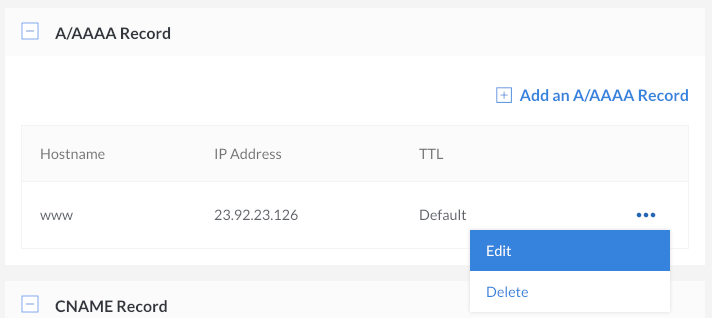

To modify a Domain's existing DNS records:

1.  From the **Domains** section of the Cloud Manager, select the domain whose DNS records you'd like to edit. The DNS records for the selected domain zone will appear.

1.  Next to the DNS record you would like to edit, click on the **more options ellipsis**.

1.  Select **Edit** from the menu.

    

1.  Edit the DNS record by modifying the existing values in the fields that appear.

1.  Click **Save**. It will only take a few minutes for the record to be updated.
