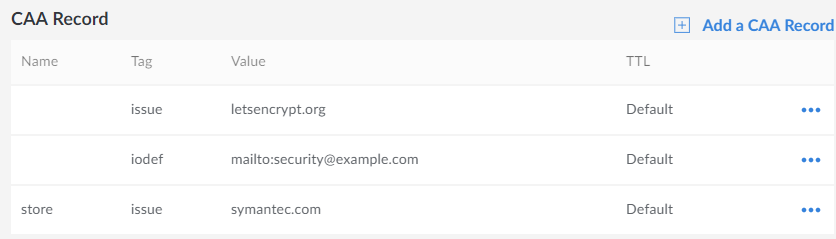

## CAA Overview

A **CAA** (*Certification Authority Authorization*) record allows the owner of a domain to specify which certificate authority (or authorities) are allowed to issue TLS/SSL certificates for their domain.

## Properties

- **Name**: The subdomain you want the CAA record to cover. To apply it to your entire website (for example: `example.com`), leave this field blank. To limit the record's application to a subdomain on your site, (for example: `subdomain.example.com`), enter the subdomain's name into the form field (for example: `subdomain`).

- **Tag**:

    -  **issue** - Authorize the certificate authority entered in the *Value* field further below to issue TLS certificates for your site.

    -  **issuewild** - Same as above, with the exception that you were issued a wildcard certificate.

    -  **iodef** - URL where your CA can report security policy violations to you concerning certificate issue requests.

- **Value**: If the **issue** or **issuewild** tag was selected above, then the **Value** field takes the domain of your certificate issuer (for example: `letsencrypt.org`). If the **iodef** tag was selected, the **Value** field takes a contact or submission URL (`http` or `mailto`).

- **TTL** (*Time To Live*): The length of time that DNS resolvers should store the DNS record *before* revalidating it with Linode's name servers. Setting the TTL to **5 minutes** is recommended for many use cases. If **Default** is selected, the TTL is set to **24 hours**.

## Add Multiple CAA Records

Multiple CAA records must be added individually. If your site `example.com` was issued a TLS certificate by Let's Encrypt, but your subdomain `store.example.com` uses a Symantec certificate, you would need two different CAA records. A reporting URL for the *iodef* tag would also need its own record. Those three would look something like this:

