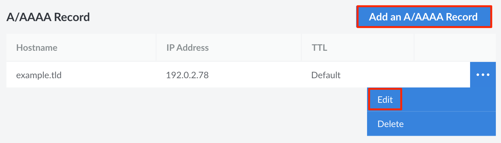
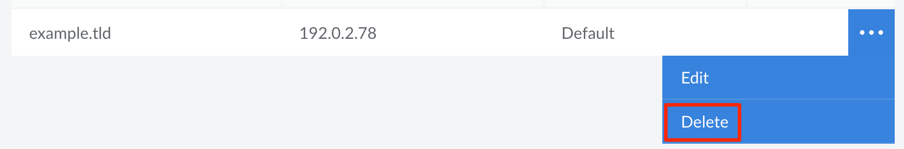

## View DNS Records

Log in to the [Cloud Manager](https://cloud.linode.com), select *Domains* from the left menu, and click on the domain you wish to view.

This opens up a page that lists all DNS records for the domain. Records for each record type are sorted into their own separate sections. From here, you can add, edit, or delete DNS records.

## Add or Edit a DNS Record

After a domain has been created, you're able to add DNS records. Each type of DNS record is used for a different purpose. The applications that utilize your domain determine which DNS records you need to add.

1. View the DNS Records for your domain in the Cloud Manager. See [View DNS Records](#view-dns-records).

1. Locate the section for the record type you want to add or edit. To add a new record, click corresponding **Add a Record** button. To edit a record, locate the record in the list and click the corresponding **Edit** button. Both of these actions open up a similar form.

    

1. The form displays all parameters that are available for your chosen record type. For instance, an *A record* has fields for the **Hostname**, **IP Address**, and **TTL**. An *MX record* has fields for the **Mail Server**, **Preference**, **Subdomain**, and **TTL**. To learn more about the parameters for each record type, see the corresponding guides:

    - [A and AAAA Records](/docs/products/networking/dns-manager/guides/a-record/)

    - [CNAME Records](/docs/products/networking/dns-manager/guides/cname-record/)

    - [MX Records](/docs/products/networking/dns-manager/guides/mx-record/)

    - [TXT Records](/docs/products/networking/dns-manager/guides/txt-record/)

    - [NS Records](/docs/products/networking/dns-manager/guides/ns-record/)

    - [SOA Record](/docs/products/networking/dns-manager/guides/soa-record/)

    - [SRV Records](/docs/products/networking/dns-manager/guides/srv-record/)

    - [CAA Records](/docs/products/networking/dns-manager/guides/caa-record/)

1. Once you have completed the form, click the **Save** button to create the DNS record or save the changes to an existing record.


New DNS records may take up to 24 hours to propagate throughout the internet, although they are usually visible within several hours.


## Delete a DNS Record

1. View the DNS Records for your domain in the Cloud Manager. See [View DNS Records](#view-dns-records).

1. Locate the section for the record type you want to remove, find the record in the list, and click the corresponding **Delete** button.

    

## Special Cases

### Wildcards

A [wildcard DNS record](https://en.wikipedia.org/wiki/Wildcard_DNS_record) matches all requests for subdomains that do not yet exist. Wildcards are often used to point all non-existing subdomains to an existing top level domain. For example, if a queried first-level subdomain does not exist, the IP address specified in the wildcard DNS record will respond. Wildcard records are formatted using an asterisk (`*`) in the field that designates the domain name of the record. For A records and CNAME records, this field is called **Hostname**.


A wildcard must always be the furthest subdomain from the TLD (top level domain), i.e. `*.example.com`. If you would like to add a wildcard as a subdomain for a subdomain (what is also called a *second-level* subdomain or *fourth-level* domain), you will need to add a new domain zone for that subdomain and then add the wildcard record to it. For example, to create `*.subdomain.example.com`, you must add a separate domain zone for `subdomain.example.com` first, then add an A/AAAA DNS record to that zone as indicated above.


### Second-level Subdomains

Linode's DNS Manager only supports subdomains one-level deep. It does not support second-level subdomains, such as *second.first.example.com*. To do this, you need to create a *separate* domain zone in the DNS Manager for the *first-level* subdomain (such as *first.example.com*), add NS records on the original root domain pointing to that subdomain zone, and then add your desired second-level subdomain records.
