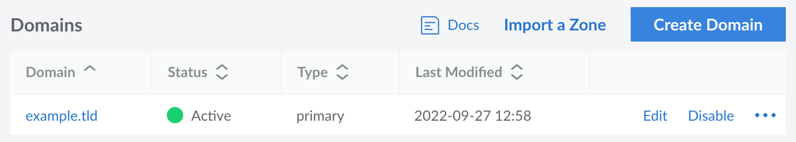
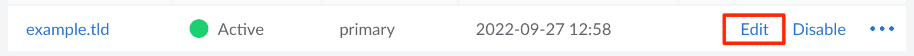
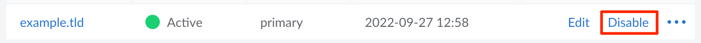
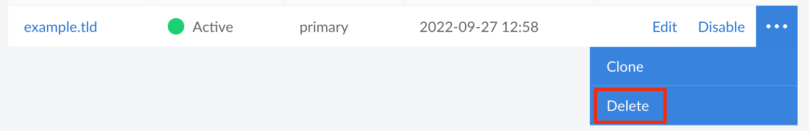

## View Domains

Log in to the [Cloud Manager](https://cloud.linode.com) and select *Domains* from the left menu. If any domains have already been added, they are listed on this page.

Each domain in your account is displayed along with its status, the type of domain zone (*primary* or *secondary*), and when it was last modified.

## Add a Domain

To add a domain to your account, follow the instructions within the [Create a Domain](/docs/products/networking/dns-manager/guides/create-domain/) guide.

## Review and Edit a Domain


This section covers viewing and editing the details of the domain itself. If you wish to view and edit DNS records, see [Manage DNS Records](/docs/products/networking/dns-manager/guides/manage-dns-records/).


1. Navigate to the **Domains** page in the Cloud Manager. See [View Domains](#view-domains).

1. Locate the domain you wish to view or edit. Click on the corresponding **Edit** link.

    

1. The **Edit Domain** panel appears. This displays the following fields along with their current values:

    - **Domain zone type:** This designates if the domain zone should operate as a *primary* or *secondary* name server. The value can't be changed after the domain has been created.
    - **Domain:** The domain name for the domain. This is typically the bare domain (such as *example.com*) but could also include a subdomain (such as *web.example.com*).
    - **SOA Email Address:** The email address to use as the domain administrator. Ideally the SOA email should not be on the domain it's administering, as it should be accessible if there are any issues with the domain or the infrastructure hosting the domain.
    - **Tags:** Tags can help identify and group related Linode services.

1. To save the changes, click the **Save Changes** button.

## Clone a Domain

The *Clone* feature allows you to copy DNS records from an existing domain in your Linode account to a new domain. If you've already set up DNS records for one of the services you host on your Linode account, this is a good way to quickly assign another domain to that same service.

Here's how to clone DNS records for an existing domain:

1. Navigate to the **Domains** page in the Cloud Manager. See [View Domains](#view-domains).

1.  Click on the **more options ellipsis** corresponding to the domain whose DNS records you would like to clone and select **Clone** from the menu.

1.  Enter the name of the new domain in the **New Domain** field.

1.  Click **Create**. The DNS records will then be copied from the existing domain to the new domain.

## Disable (and Enable) a Domain

When a domain is added to your account, it is *enabled* by default. This means that the domain is active and accessible through Linode's name servers. Disabling a domain causes it to no longer be accessible on our name servers. To change this setting, follow the instructions below.

1. Navigate to the **Domains** page in the Cloud Manager. See [View Domains](#view-domains).

1. Locate the domain you wish to disable or enable. Click on the corresponding **Disable** (or **Enable**) link.

    

    Once you have changed the setting, its status will change to either *Active* (which means it is enabled) or *Disabled*.

## Delete a Domain

If one of your domain names has expired or if you want to start using a different DNS provider, you can remove the domain from the Linode platform. This deletes all of the associated DNS records and makes it so that they are no longer hosted on Linode's name servers.


Before deleting your domain from Linode, consider if you wish to continue using the domain (or not) and take the appropriate action.

- **If you intend to use another DNS provider:** Recreate all of your DNS records on your other DNS provider and update the name servers on your domain's registrar to point to this new provider. Once theses changes are made and have taken affect, you can delete the domain from Linode without any resolution errors.

- **If you no longer wish to use this domain:** Remove Linode's name servers from your domain's registrar. *If the entries are not deleted, someone could use your domain on Linode's DNS Manager without your permission.*


1. Navigate to the **Domains** page in the Cloud Manager. See [View Domains](#view-domains).

1. Locate the domain you wish to remove and click on the corresponding **Delete** button. To see this option, you may need to select the *ellipsis* menu.

    

    This permanently delete the domain and all of its DNS records from Linode's name servers. It only takes a few minutes for the changes to take effect.