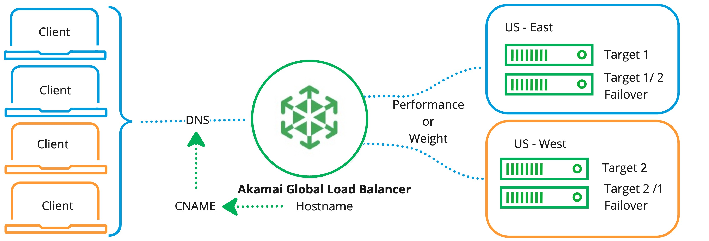

**Akamai Global Load Balancer**  offers global, configurable, scalable, distributed compute traffic management across physical, virtual, and cloud-hosted applications. It can automatically detect load conditions and route traffic to the optimal target while maintaining custom routing policies and consistent visitor session behavior.

## Global Load Balancer Workflow

Here's how Global Load Balancer works:

1. Create Compute Instances (targets) and add them to the Global Load Balancer configuration.

1. Create a CNAME record in your DNS that maps the Compute Instance targets to the load balancer.

1. Configure the load balancing policy to distribute traffic across targets.

Health checks detect if a target is down and routes traffic to an available target or a failover target. Session stickiness routes subsequent requests to the same target as long as it remains healthy.

## Selecting a Load Balancer

| Feature               | Global Load Balancer         | NodeBalancer           |
| ----------------------| -----------------------------|------------------------|
|Load Balancer Location |Supports both regional and global load balancing. The load balancer does not need to be situated in the same data center as your target endpoints.                  |Must be situated in the same data center as your target endpoints IPs.|
|Hosting Environments for End Points/Service Targets|Cloud (Google Cloud Platform (GCP), Microsoft Azure, or Amazon Web Services (AWS)), Akamai Delivery Property, Cloud Compute Instance|Cloud Compute Instance|
|Layer 7 Application Layer/Path based (HTTP/HTTPS) Load Balancing|Supported            |Partially Supported     |
|Layer 4 Network Layer/Transport (TCP/SSL) Load Balancing|Supported                |Supported               |
|Load Balancing Methods |Performance, Weighted, Content-based|Performance, Weighted|
|Health Checks          |Liveness and Load-based|Liveness|
|Session Stickiness     |Supported                     |Supported               |
|Metrics, Logs and Traces|Supported                    |-                       |
|Interops with...       |                              |                        |
|Pricing                |TBD                           |Each NodeBalancer on an account costs $10/mo ($0.015/hr).                                                             |

## Migration

## Accelerate Distributed Compute
This OSI layer 7 and layer 4 load balancer manages your distributed application architectures across multiple regions and multiple clouds.

- **Layer 7:** load balancing routes HTTP and HTTPS (layer 7) traffic through the HTTP/1.1 and HTTP/2 protocols. Layer 7 load balancers look at content such as the url path to make load‑balancing decisions. It then makes a new TCP connection or reuses an existing connection to select and write the request to the target.
- **Layer 4:** load balancing forwards network packets to and from the upstream server without inspecting the content of the packets.

## Integration With Akamai Products
The Akamai Global Load Balancer can be used with or without an Akamai delivery property. Akamai cloud compute offers seamless integration with Akamai’s suite of security, and compute products.

## Operationally Simple
You can create and enable the Akamai Global Load Balancer using Cloud Manager or APIs. Once Akamai Global Load Balancer is configured, you can start balancing traffic across multiple regions or globally within seconds. Akamai Global Load Balancer requires no infrastructure management and is designed to be maintenance free after initial configuration.

## Load Balancing Methods
You can select to route your clients traffic to one of your backends using one or a combination of the following load balancing methods; performance, weighted and content-based.

- **Performance:** determines which route to use based on real-time load feedback and the shortest geographic route to the backend target. Default method.

- **Weighted:** routes requests in the proportion (%) configured.

- **Content-based:** routes traffic to a backend based on matches with:
    - Query string
    - Path
    - Host
    - HTTP Header
    - HTTP method
    - HTTP body
    - Custom

- **Sticky Sessions:** routes subsequent requests to the same backend with failover to an alternate target if the sticky region fails or degrades.

## High-Availability, Performance and Scalability

**High Availabilty:** Akamai Global Load Balancer has built-in failover and customizable failover preferences.

**Performance:** Based on load and distance, Akamai Cloud identifies and selects the fastest routing for best performance. The Layer 7 Akamai Global Load Balancer offloads connections closer to the end user so that round-trip time and time to first byte is improved when compared to not using the load balancer.

**Scalability:** Load balancers scale applications and add flexibility by allowing you to add or remove machines that are identically configured to serve your application or perform a task. The load balancer routes your traffic to one of the identically configured machines based on the settings that you have configured. Each Layer 7 Akamai Global Load Balancer route up to 1,000,000 concurrent connections

## Health Checks
Traffic is only routed to healthy backends. Passive health checks happen on every request. You can configure active health checks based on your application or service. If the target becomes unfit, the load balancer moves traffic away from the unhealthy target. When a new target is added, Akamai Global Load Balancer tests the fitness of the target to verify the target is active, and ready to support large traffic spikes.

## Certificate Management
Global Load Balancer uses a bring-you-own certificate model. Your certificate and it's private key are directly uploaded to a vault using Cloud Manager or APIv4.

## Observability
Akamai Global Load Balancer provides real-time metrics, logs and traces through third party observability tools and providers.

**HTTP/S and TCP Metrics:** real time aggregated statistics that summarize usage, performance and health including;
- HTTP/S:
    - Number of HTTP/S requests.
    - Number of responses by status code.
- TCP:
    - Currently open connections.
    - New connections per second.
    - Packets per second.
    - Bandwidth usage.

**Logs and Traces:** low latency feed of per-request data in a standard OpenTelemetry format.

**Traces:** low latency feed of per-request trace data in the OpenTelemetry format.

## Recommended Workloads

- Enterprise applications
- High traffic and e-commerce websites
- Applications that require extreme reliability and uptime
- Applications that need to dynamically scale without any downtime
- A/B testing and blue/green deployments

## Availability

Akamai Global Load Balancers are available across [all regions](https://www.linode.com/global-infrastructure/).

## Pricing

**Beta Pricing:** Beta is offered free of charge.

**Pricing:** Global Load Balancer pricing is based on a combination of regional coverage, number of connections and usage.

**Region and Number of Connections**

| Regions         | # of Connections| Price/Month   |
| ----------------| ----------------|---------------|
| 1-3 regions     | 25 000          |    $50 tbd    |
| 4-10 regions    | 100 000         |    $25 tbd    |
| All regions     | 1 000 000       |    $200 tbd   |

**Usage:** A fee of $0.05/hour tbd is charged for every hour that the load balancer is active and has targets.

Billing for each Global Load Balancer starts once it is created. A summary of charges is available from Cloud Manager.

## Technical Specifications

- Managed cloud-based load balancing service
- Dynamically routes traffic over any ports to configurable backend Compute Instances
- Highly available with built-in redundancy
- Up to 1,000,000 concurrent connections
- Supports TCP-based (layer 4) load balancing (UDP traffic is not supported)
- Supports HTTP and HTTPS (layer 7) load balancing through the HTTP/1.1 and HTTP/2 protocols.
- Equipped with both public IPv4 and IPv6 addresses
- Fully customizable health checks to ensure traffic lands on a functioning backend
- Free inbound network transfer
- Outbound network transfer usage is counted towards the account-wide [monthly network transfer pool](/docs/products/platform/get-started/guides/network-transfer/)
- Provisioning and management through the [Cloud Manager](https://cloud.linode.com/), [Linode CLI](https://www.linode.com/products/cli/), or programmatically through the [Linode API](https://www.linode.com/products/linode-api/)

## Limits and Considerations

- **Maximum number of concurrent connections:** Akamai Global Load Balancers each support up to 1,000,000 concurrent connections. If your application needs to support more than that, [contact support](https://www.linode.com/support/) to determine additional options or consider using multiple Akamai Global Load Balancers behind a DNS load balancing solution such as [Round-Robin DNS](/docs/guides/setting-up-round-robin-dns/).
- **Connections per second:** There are no defined rate limits for the number of connections over a given time period, though certain modes are more performant. A port configured in **TCP** mode allows for the most number of connections. A port configured in **HTTPS** mode is the most resource intensive and accommodates fewer connections.
- **IP addresses:** A public IPv4 address and IPv6 address are configured on each Akamai Global Load Balancer. Additional addresses are not available.
- **Private network:** Communication with backend Linodes occurs over a data center's private network. As such, backend Linodes must be located within the same data center as the NodeBalancer.
- **HTTP support:** HTTP/1.1 and HTTP/2.
- **Network transfer:** *Outbound transfer* usage is counted towards the account-wide [monthly network transfer pool](/docs/products/platform/get-started/guides/network-transfer/). This pool is the combined total of the network transfer allowance of each Linode on the account. Both *Incoming transfer* and transfer over the private network are provided at no cost.
- **TLS termination:** When using a NodeBalancer with an application that requires HTTPS, you can either terminate the TLS connection on the NodeBalancer (**HTTPS** mode) or on the backend Linodes (**TCP** mode). When terminating TLS connections directly on the NodeBalancer, there are a few key considerations:
    - **TLS protocols:** TLS v1.2 and v1.3 are supported in **HTTPS** mode.
    - While operating in **HTTPS** mode, internal traffic sent to the backend Linodes is unencrypted.

    For applications that require a very high connection rate or otherwise need to overcome the above considerations present in **HTTPS** mode, consider operating in **TCP** mode and terminating TLS on the backend Linodes.
