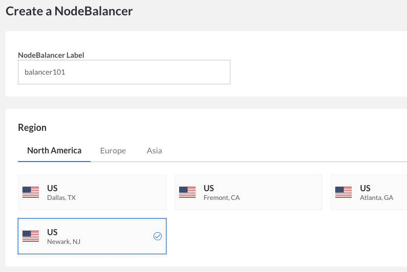
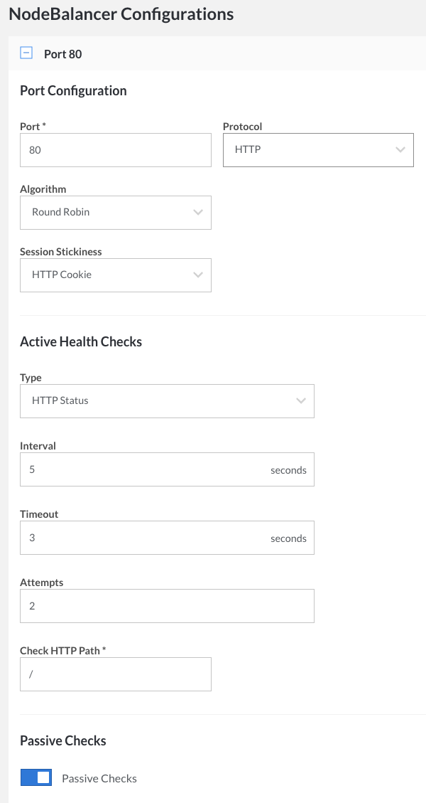
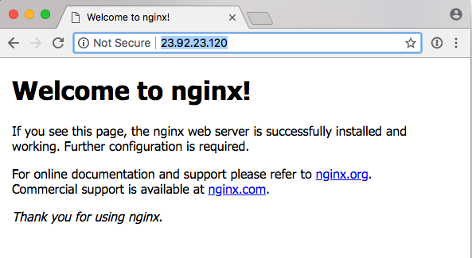

1.  Visit the NodeBalancers page in the Linode [Cloud Manager](https://cloud.linode.com) and select **Add a NodeBalancer**.

1.  For the example web application, only one NodeBalancer is needed. Add one in the same data center that your backend Linodes are located in.

    

1.  A NodeBalancer is configured using [ports](/docs/platform/nodebalancer/nodebalancer-reference-guide/#port), and in this example web application, you'll use only one, port 80 for regular HTTP traffic.

    

    **HTTP**

    For the traditional web application, the settings in the screenshot above are a good start. HTTP cookie stickiness is preferred so that the same client will always land on the same backend -- for a simple web application that keeps sessions in memory, this is necessary to avoid session errors on clients.

    **HTTPS**

    If you select the HTTPS protocol, two new fields will appear where you can add your SSL certificate, chained certificates (if applicable) and a private key (which must not have passphrase protection).

    Every ten seconds, the NodeBalancer will request the root of the web application and look for a valid response code. With this example setup, there is only one backend node (which you will add shortly); if the backend goes down, the NodeBalancer will serve a plain 503 Service Unavailable error page. This is more desirable than refusing connections or making browsers wait for a timeout.

    
The port you select for the NodeBalancer must match the port you are going to use on the backend Linode(s) in the next step. For example, if you are going to be receiving only regular HTTP traffic, it's common to use port `80`. The [NodeBalancer SSL Configuration](/docs/platform/nodebalancer/nodebalancer-ssl-configuration) guide will show you how to redirect port `443`, HTTPS traffic, to port `80` for SSL certificates.


1.  Now you will add the single backend node to the NodeBalancer's configuration. Point this at the private IP address of your web server Linode.

    

    These configuration changes will take a few moments to be reflected by your NodeBalancer. If everything is configured on your backend correctly, once the changes have gone through, the **Node Status** column will update to **1 up / 0 down**.

    

    If the backend status reports **0 up / 1 down**, check to make sure that your web application is configured to respond on the Linode's private IP address. You do this by adding the private IP address to your `/etc/hosts` file on your Linode and then reboot your Linode. There might be a virtual host mismatch as well -- check the notes in the next section.

1.  Now that the backend is up, go directly to your NodeBalancer's IP address in a browser. You should see your web application as the NodeBalancer proxies the traffic through.

    
