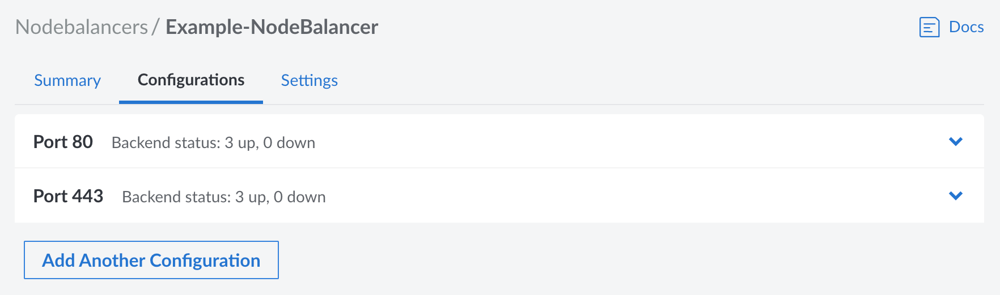

NodeBalancers, and load balancers in general, operate by taking inbound traffic over certain ports and distributing that traffic to pre-defined backend instances. For NodeBalancers, the settings that accommodate this behavior are all stored within *Configurations*. Each configuration specifies the inbound port, the protocol, the load balancing algorithm, health checks, and the backend nodes. This guide covers how to add or edit these configurations as well as the options that are available.

## Add or Edit Configurations

Each configuration is assigned a single inbound port. Follow the instructions below to add or edit a configuration. If your application requires multiple inbound ports, create one configuration for *each* port you wish to use. This provides a great amount of flexibility, allowing each port to have its own distinct configuration settings and backend nodes.

1. Log in to the [Cloud Manager](http://cloud.linode.com), click **NodeBalancers** in the left menu, and select the NodeBalancer you wish to edit. See [Manage NodeBalancers](/docs/products/networking/nodebalancers/guides/manage/).

1. Navigate to the **Configurations** tab. This displays a list of all ports that have been configured.

    

1. Open the port configuration you wish to edit or create a new one by clicking the **Add Another Configuration** button.

## Configuration Options

### Port

This is the *inbound* port that the NodeBalancer is listening on. This can be any port from 1 through 65534, though it should be set to whichever port the client software will connect to. For instance, web browsers use port 80 for HTTP traffic and port 443 for HTTPS traffic, though a client can change the port by specifying it as part of the URL.

### Protocol

The protocol can be set to either TCP, HTTP, or HTTPS. While a brief description of each is provided below, review [Available Protocols](/docs/products/networking/nodebalancers/guides/protocols/) for more complete information.

- **TCP**: Supports most application-layer protocols, including HTTP and HTTPS. This should be selected when you want to enable layer 4 load balancing, use TLS/SSL pass-through, use HTTP/2.0 or higher, balance non-HTTP services, or make use of [Proxy Protocol](#proxy-protocol). Since the NodeBalancer serves as a pass-through for these TCP packets, any encrypted traffic is preserved and must be decrypted on the backend nodes.

- **HTTP:** Unencrypted web traffic using HTTP/1.1. This terminates the HTTP request on the NodeBalancer, allowing the NodeBalancer to create a new HTTP request to the backend machines. This can be used when serving most standard web applications, especially if you intend on configuring the NodeBalancer to use HTTPS mode with TLS/SSL termination.

- **HTTPS:** Encrypted web traffic using HTTP/1.1. Since this terminates the request on the NodeBalancer, it also terminates the TLS/SSL connection to decrypt the traffic. Use this if you wish to configure TLS/SSL certificates on the NodeBalancer and not on individual backend nodes.

    
    When using the **HTTPS** protocol setting, all traffic is decrypted on the NodeBalancer. Traffic between the NodeBalancer and the backend nodes is sent over the private data center network, is not encrypted, and uses the HTTP protocol.
    

### Proxy Protocol

When selecting *TCP* as the protocol, **Proxy Protocol** can be enabled to send client information to backend nodes. Backend nodes must also have Proxy Protocol enabled on supported applications to receive this information. There are two available versions of Proxy Protocol, **v1** and **v2**:

- **v1**: Proxy Protocol v1 adds a human readable string to all requests.
- **v2**: Proxy Protocol v2 adds a more efficient binary data header to all requests.

For more information, see the [Using Proxy Protocol with NodeBalancers](/docs/products/networking/nodebalancers/guides/proxy-protocol/) guide.

### Algorithm

The *algorithm* controls how *new connections* are allocated across the backend nodes.

- **Round Robin**: Allocates connections in a weighted circular order across the backends.

- **Least Connections**: Tracks each backend's connection count and allocates new connections to the one with the least connections.

- **Source IP**: Modulates the client's IP to allocate them to the same backend on subsequent requests. This works so long as the set of backend doesn't change, however the **Session Stickiness** setting (below) does affect this behavior.

### Session Stickiness

This controls how subsequent requests from the same client are routed when selecting a backend node. It allows a NodeBalancer to maintain a client session to the same backend.

- **None**: No session information is saved and requests are routed in only accordance with the *algorithm* (see [Algorithm](#algorithm) above).

- **Table**: This preserves the initial backend selected for an IP address by the chosen algorithm. Subsequent requests by the same client are routed to that backend, when possible. This map is stored within the NodeBalancer and expires after 30 minutes from when it was added. If a backend node goes offline, entries in the table for that backend are removed. When a client sends a new request, it is then rerouted to another backend node (in accordance with the chosen algorithm) and a new entry is created in the table.

- **HTTP Cookie**: *Requires the configuration protocol be set to HTTP or HTTPS.* The NodeBalancer stores a cookie (named `NB_SRVID`) on the client that identifies the backend where the client is initially routed to. Subsequent requests by the same client are routed to that backend, when possible. If a backend node goes offline, the request is rerouted to another backend node (in accordance with the chosen algorithm) and the cookie is rewritten with the new backend identifier.

    
    The client must have cookies enabled. If the client has disabled cookies or deletes cookies, session persistence is not preserved and each new request is routed in accordance with the chosen algorithm.
    

If session persistence is required or desired for the application, it is recommended to utilize both the *Source IP* algorithm in combination with either *Table* or *HTTP Cookie* session stickiness.

### TLS/SSL Certificate and Private Key

When the *HTTPS* protocol is selected, the **Certificate** and **Private Key** fields appear and must be properly configured.

- **Certificate**: The TLS/SSL certificate (and certificate chain) that has been obtained for the application.

- **Private Key**: The passphraseless private key that is associated with the certificate file.

A certificate can be obtained for your domain by using [certbot](https://certbot.eff.org/) or by purchasing one through a trusted certificate authority. See [TLS/SSL Termination](/docs/products/networking/nodebalancers/guides/ssl-termination/) for more details on obtaining a certificate and configuring both the NodeBalancer and backend nodes.


If you wish to use TLS/SSL pass-through and terminate the HTTPS connection on the backend nodes, select the **TCP** protocol instead of **HTTPS**.


## Health Checks

NodeBalancers perform both passive and active health checks against the backend nodes. Backends that are not responsive are marked as *down* and taken out of rotation.

### Active Health Checks

*Active* health checks proactively query the backend nodes by performing TCP connections or making HTTP requests. To enable an active health check, choose from one of the following types:

- **TCP Connection**: Requires a successful TCP handshake with a backend node.
- **HTTP Valid Status**: Performs an HTTP request on the provided path and requires a 2xx or 3xx response from the backend node.
- **HTTP Body Regex**: Performs an HTTP request on the provided path and requires the provided PCRE regular expression matches against the request's result body.

Additionally, configure the following settings to adjust the frequency and number of attempts:

- **Check Interval**: Seconds between active health check probes.
- **Check Timeout**: Seconds to wait before considering the probe a failure. 1-30.
- **Check Attempts**: Number of failed probes before taking a node out of rotation. 1-30.

### Passive Health Checks

The **passive checks** setting controls if passive health checks are enabled. When enabled, the NodeBalancer monitors all requests sent to backend nodes. If the request times out, returns a 5xx response code (excluding 501 and 505), or otherwise fails to connect, the backend is marked as *down* and taken out of rotation.

## Backend Nodes (Compute Instances)

Load balancers work by distributing traffic to a pool of servers. For NodeBalancers, these servers are Linode Compute Instances and they are configured as *backend nodes*. For information on configuring backend nodes, see the [Configure Backend Nodes (Compute Instances)](/docs/products/networking/nodebalancers/guides/backends/) guide.