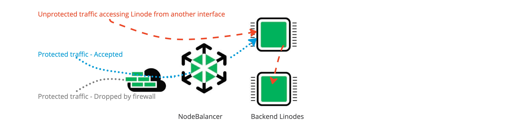

This guide walks you through creating a NodeBalancer through the Cloud Manager.

1. [Open the Create NodeBalancer Form in the Cloud Manager](#open-the-create-nodebalancer-form-in-the-cloud-manager)
1. [Set the Label](#set-the-label)
1. [Select a Region](#select-a-region)
1. [Assign a Cloud Firewall](#assign-a-cloud-firewall-optional)
1. [Add and Configure Ports](#add-and-configure-ports)
1. [Set Up Health Checks for Each Port](#set-up-health-checks-for-each-port)
1. [Add Backend Nodes to Each Port](#add-backend-nodes-to-each-port)
1. [Deploy the NodeBalancer](#deploy-the-nodebalancer)

## Open the Create NodeBalancer Form in the Cloud Manager

Log in to the [Cloud Manager](https://cloud.linode.com/) and select **NodeBalancers** from the left navigation menu. Click the **Create NodeBalancer** button. This opens the *[NodeBalancer Create](https://cloud.linode.com/nodebalancers/create)* form.

## Set the Label

Within the **Label** field, enter the label you wish to use to identify it from other NodeBalancers on your account. A good label should provide some indication as to what the NodeBalancer will be used for. The label must be alphanumeric, between 3 and 32 characters, and unique from other NodeBalancer labels on your account.

## Select a Region

Select the **region** where the NodeBalancer will reside. Regions correspond with individual data centers, each located in a different geographical area. Select the region where you've deployed the Compute Instances you intend on using with this NodeBalancer. If you haven't yet deployed Compute Instances or chosen a region, select the region closest to you and/or your customers. This helps reduce latency and can make a significant impact in connection speeds and quality.

- [Global Infrastructure](https://www.linode.com/global-infrastructure/)
- [Speed Tests for Data Centers](https://www.linode.com/speed-test/)
- [How to Choose a Data Center](/docs/products/platform/get-started/guides/choose-a-data-center/)

## Assign a Cloud Firewall (Optional)

A NodeBalancer can only be attached to one active (enabled) Cloud Firewall at a time. You can attach the same Cloud Firewall to multiple NodeBalancers or other devices.

Select the Cloud Firewall from the **Assign Firewall** pull down to use with the NodeBalancer.

If the firewall doesn't exist yet, you can create the firewall using either the Firewall application, or the NodeBalancer application. Rules for the firewall, can only be added in the Firewall application.

To create a firewall and add rules using the Firewall application, see [Create a Cloud Firewall](/docs/products/networking/cloud-firewall/guides/create-a-cloud-firewall/) and [Add Firewall Rules](/docs/products/networking/cloud-firewall/guides/manage-firewall-rules/).

To create a firewall using the NodeBalancer  application, in the *NodeBalancer Create* form click the **Create Firewall**. This displays the *Create Firewall* drawer. Configure the required field.

| **Configuration** | **Description** |
| --------------- | --------------- |
| **Label** (Required)| The label is used as an identifier for this Cloud Firewall. |
| **Additional Linodes** (Optional)| The Linode(s) on which to apply this Firewall. A list of all Linodes on your account are visible. You can leave this blank if you do not yet wish to apply the Firewall to a Linode. |
| **Additional NodeBalancers** (Optional) | The NodeBalancers on which to apply this Firewall. A list of all created NodeBalancers on your account are visible. You can leave this blank if you do not want to apply this Cloud Firewall to other NodeBalancers.|

Click on the **Create Firewall** button to finish creating the Cloud Firewall and to returned to the *NodeBalancers Create* form.


By default, a new Cloud Firewall accepts all inbound and outbound connections. Only inbound firewall rules apply to NodeBalancers. Custom rules can be added in the Firewall application as needed. See [Add New Cloud Firewall Rules](/docs/products/networking/cloud-firewall/guides/manage-firewall-rules/).


### Cloud Firewall Inbound Rules for NodeBalancer
- Inbound rules limit incoming network connections to the NodeBalancer based on the port(s) and sources you configure.
- The NodeBalancer accepts traffic and routes traffic on an internal network to backend targets. For this reason, only inbound firewall rules apply to NodeBalancer.
- Inbound firewall rules such as IPv4 and IPv6 access control lists (ACLs) can be configured to *Accept* or *Drop* ingress traffic to the NodeBalancer.
- NodeBalancers can accept TCP connections on all ports. When you add an inbound rule for a NodeBalancer in Cloud Firewall, select TCP as the transport layer protocol. UDP, ICMP, and IPENCAP are not currently supported on NodeBalancers.
- The firewall is in front of the NodeBalancer and the assigned backend nodes. When both the NodeBalancer and its backend nodes have firewalls, the NodeBalancers inbound firewall rules are applied to incoming requests first, before the requests reach the backend nodes.
- A backend node server (Linode) can have multiple IP addresses. The NodeBalancer firewall only controls inbound traffic to the backend nodes IPs that are assigned to the NodeBalancer. A service (Linode) can be accessed from any interface (not just the NodeBalancer). To filter traffic from other interfaces, backend Linodes require their own firewalls.

## Add and Configure Ports

To start load balancing traffic, you need to define which ports the NodeBalancer should listen to and how the incoming traffic should be routed to the backend nodes. These ports can be configured within the **NodeBalancer Settings** area. By default, a single port configuration is visible in this area. Additional ports can be added by clicking the **Add Another Configuration** button. See [Configuration Options](/docs/products/networking/nodebalancers/guides/configure/) for more details regarding each of these settings.

- **Port:** Enter the *inbound* port the NodeBalancer should listen to. This can be any port from 1 through 65534 and should align with the port the client connects to. See [Configuration Options > Port](/docs/products/networking/nodebalancers/guides/configure/#port).
- **Protocol:** Select *TCP*, *HTTP*, or *HTTPS*. For many applications, using *TCP* offers the most flexibility and allows for TLS pass through. Using *HTTP* and *HTTPS* offers some additional NodeBalancer options and allows for TLS termination. See [Configuration Options > Protocol](/docs/products/networking/nodebalancers/guides/configure/#protocol).
- **Proxy Protocol:** *Only visible when the *TCP* protocol is selected.* Used for sending the client IP address to the backend nodes. See [Configuration Options > Proxy Protocol](/docs/products/networking/nodebalancers/guides/configure/#proxy-protocol).
- **Algorithm:** Controls how new connections are allocated across backend nodes. See [Configuration Options > Algorithm](/docs/products/networking/nodebalancers/guides/configure/#algorithm).
- **Session Stickiness:** Controls how subsequent requests from the same client are routed when selecting a backend node. See [Configuration Options > Session Stickiness](/docs/products/networking/nodebalancers/guides/configure/#session-stickiness).


For most web applications, it's common to configure two ports: port *80* and port *443*.


## Set Up Health Checks for Each Port

Each port can optionally be configured with health checks. These health checks either proactively query the backend nodes (*active*) or monitor the existing traffic to backend nodes (*passive*). If a health check determines that the backends aren't responsive or are encountering another issue, they can be marked as *down* and taken out of rotation.

- **Active Health Checks:** Active health checks proactively query the backend nodes by performing TCP connections or making HTTP requests. See [Configuration Options > Active Health Checks](/docs/products/networking/nodebalancers/guides/configure/#active-health-checks).

- **Passive Checks:** Passive health checks monitor requests sent to the backend nodes and look for any issues. See [Configuration Options > Passive Health Checks](/docs/products/networking/nodebalancers/guides/configure/#passive-health-checks).

## Add Backend Nodes to Each Port

Load balancers work by distributing traffic to a pool of servers. For NodeBalancers, these servers are Linode Compute Instances and they are configured as *backend nodes*. Within the **Backend Nodes** area of the creation form, add each Compute Instance you intend on using with this NodeBalancer, making sure to select the correct private IP address for the NodeBalancer and the port that the application is using. For information on configuring backend nodes, see the [Configure Backend Nodes (Compute Instances)](/docs/products/networking/nodebalancers/guides/backends/) guide.

## Deploy the NodeBalancer

Once you've adjusted the settings to fit your needs, review the *NodeBalancer Summary* section and click the **Create NodeBalancer** button. The NodeBalancer should be provisioned within a few minutes.