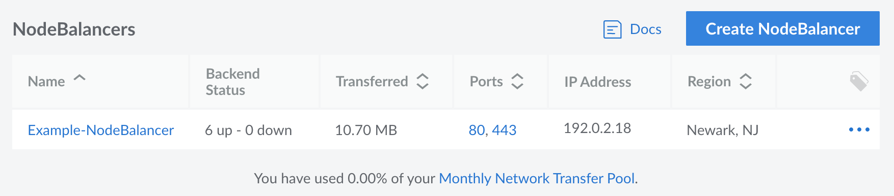
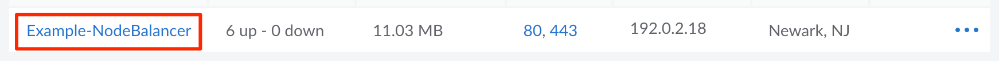
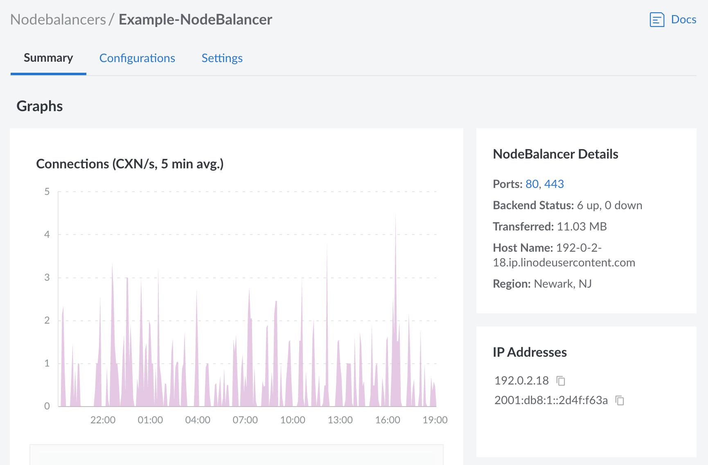
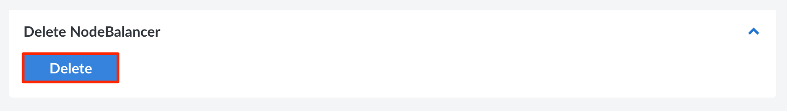
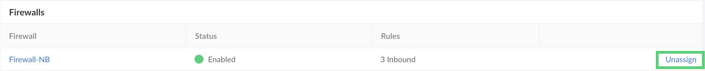

## View NodeBalancers

Log in to the [Cloud Manager](https://cloud.linode.com) and select NodeBalancers from the left menu. If any NodeBalancers exist on your account, they are listed on this page.

Each NodeBalancer in the matrix is displayed alongside the following details:

- **Backend Status:** The number of backend machines that are available and accepting connections (*up*) or have been removed from the rotation and are not accepting connections (*down*).
- **Transferred:** The amount of network transfer consumed by the inbound traffic to the NodeBalancer.
- **Ports:** A list of the ports that have been configured on the NodeBalancer.
- **IP Address:** The NodeBalancer's IPv4 address.
- **Region:** The data center where the NodeBalancer is located.

## Create a NodeBalancer

To create a NodeBalancer, follow the instructions within the [Create a NodeBalancer](/docs/products/networking/nodebalancers/guides/create/) guide.

## Review and Edit a NodeBalancer

Navigate to the **NodeBalancer** page in the Cloud Manager and select the NodeBalancer you wish to edit. See [View NodeBalancers](#view-nodebalancers).

This displays the details and settings for the selected NodeBalancer.

From here, the following pages are available:

- **Summary:** View important details and graphs. This includes viewing the IP addresses, the Cloud Firewall if a firewall is assigned, the ports, the status of the backends, and graphs for both the number of connections and network traffic.
- **Configurations:** This lists each port configured for the NodeBalancer, with the ability to edit the settings for the existing port or add a new port. See [Configuration Options](/docs/products/networking/nodebalancers/guides/configure/) for more information on each of these settings.
- **Settings:** Displays additional settings for the NodeBalancer, including the label, firewall and connection throttle setting.

## Delete a NodeBalancer

1. Navigate to the **NodeBalancer** page in the Cloud Manager and select the NodeBalancer you wish to edit.

1. Navigate to the **Settings** tab, scroll to the *Delete NodeBalancer* section, and click **Delete**.

    

1. A confirmation dialog appears. To confirm deletion, type the name of the NodeBalancer in the field and click **Delete** to proceed with removing the service from your account.


When you delete a NodeBalancer that has a firewall, the NodeBalancer is also deleted in Cloud Firewall. Firewalls are not deleted when you delete a NodeBalancer.


## Unassign, Change or Add Firewalls

After the NodeBalancer is created, you can add a firewall, select a different firewall or unassign the current firewall using the following information;

### Unassign the Firewall

1. Navigate to the **NodeBalancer** page in the Cloud Manager and select the NodeBalancer that has the firewall you wish to unassign.

1. Navigate to the **Settings** tab. In the *Firewall* section, click **Unassign**.

    

1. A confirmation dialog appears. Click **Unassign Firewall** to proceed with unassigning the firewall from the NodeBalancer.


You can also remove/unassign firewalls from a NodeBalancer using Cloud Firewalls.


### Add a Firewall to an Existing NodeBalancer

To add or create a Cloud firewall for an existing NodeBalancer, follow the instructions in [Create a Cloud Firewall](/docs/products/networking/cloud-firewall/guides/create-a-cloud-firewall/) and [Add Firewall Rules](docs/products/networking/cloud-firewall/guides/manage-firewall-rules/).

### Change the NodeBalancers Firewall

1. Complete the steps in [Unassign the Firewall](#unassign-the-firewall).

2. Follow the instructions in [Create a Cloud Firewall](/docs/products/networking/cloud-firewall/guides/create-a-cloud-firewall/) and [Add Firewall Rules](docs/products/networking/cloud-firewall/guides/manage-firewall-rules/).