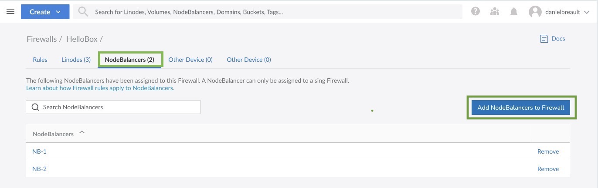

## View NodeBalancers

Log in to the [Cloud Manager](https://cloud.linode.com) and select NodeBalancers from the left menu. If any NodeBalancers exist on your account, they are listed on this page.

Each NodeBalancer in the matrix is displayed alongside the following details:

- **Backend Status:** The number of backend machines that are available and accepting connections (*up*) or have been removed from the rotation and are not accepting connections (*down*).
- **Transferred:** The amount of network transfer consumed by the inbound traffic to the NodeBalancer.
- **Ports:** A list of the ports that have been configured on the NodeBalancer.
- **IP Address:** The NodeBalancer's IPv4 address.
- **Region:** The data center where the NodeBalancer is located.

## Create a NodeBalancer

To create a NodeBalancer, follow the instructions within the [Create a NodeBalancer](/docs/products/networking/nodebalancers/guides/create/) guide.

## Review and Edit a NodeBalancer

Navigate to the **NodeBalancer** page in the Cloud Manager and select the NodeBalancer you wish to edit. See [View NodeBalancers](#view-nodebalancers).

This displays the details and settings for the selected NodeBalancer. 

From here, the following pages are available:

- **Summary:** View important details and graphs. This includes viewing the IP addresses, the ports, the status of the backends, and graphs for both the number of connections and network traffic.
- **Configurations:** This lists each port configured for the NodeBalancer, with the ability to edit the settings for the existing port or add a new port. See [Configuration Options](/docs/products/networking/nodebalancers/guides/configure/) for more information on each of these settings.
- **Settings:** Displays additional settings for the NodeBalancer, including the label, firewall and connection throttle setting.

## Delete a NodeBalancer

1. Navigate to the **NodeBalancer** page in the Cloud Manager and select the NodeBalancer you wish to edit. See [View NodeBalancers](#view-nodebalancers).

1. Navigate to the **Settings** tab, scroll to the *Delete NodeBalalancer* section, and click the **Delete** button.

    

1. A confirmation dialog appears. Click **Delete NodeBalancer** to proceed with removing the service from your account.


When you delete a NodeBalancer that has a firewall, the NodeBalancer is also removed from Cloud Firewall. The firewall that was assigned to the deleted NodeBalancer and the backend nodes are not deleted.


## Add, Change or Unassign the NodeBalancer Firewall
After the NodeBalancer is created, you can add a Cloud Firewall, select a different firewall or unassign the current firewall using the following steps;

### Unassign the NodeBalancers Firewall

1. Log in to the [Cloud Manager](https://cloud.linode.com) and select NodeBalancers from the left menu.

1. Navigate to the **Settings** tab of the NodeBalancer that has the firewall you want to unassign. Scroll to the *Firewalls* section, and click **Unassign**.

    

1. A confirmation dialog appears. Click **Unassign Firewall** to proceed with removing the firewall from the NodeBalancer.

### Add a Firewall to a NodeBalancer

1. In [Cloud Manager](https://cloud.linode.com), select **Firewalls** from the left menu.

1. Select the firewall you want to assign to the NodeBalancer. If the firewall doesn't exist yet, [Create a Cloud Firewall](/docs/products/networking/cloud-firewall/guides/create-a-cloud-firewall/) and [Add Firewall Rules](docs/products/networking/cloud-firewall/guides/manage-firewall-rules/).

1. Navigate to the **NodeBalancers** tab and click the **Add NodeBalancers to Firewall** button.

    

1. In the *Add NodeBalancers to Firewall* form, select the NodeBalancer, and click **Add**. Once the NodeBalancer is added, the firewall starts to filter incoming requests based on the firewalls inbound rules.

### Change the NodeBalancers Firewall

1. Complete the steps in [Unassign the NodeBalancers Firewall](#unassign-the-nodebalancers-firewall).

2. Complete the steps in [Add a Firewall to a NodeBalancer](#add-a-firewall-to-a-nodebalancer).