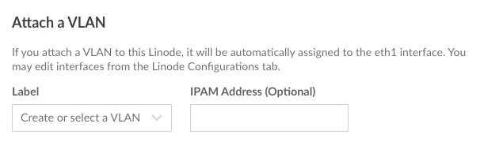
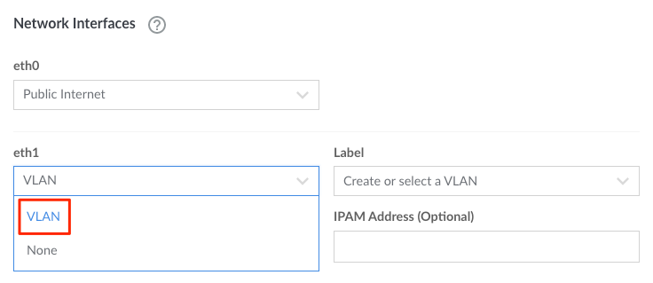

---
author:
  name: Linode
  email: docs@linode.com
title: "Attach a VLAN to a Compute Instance"
description: "Learn how to create a VLAN and attach it to a new or existing Compute Instance"
modified: 2022-08-23
---

Within the Cloud Manager, VLANs are created and managed only by attaching them to Linode Compute Instances. They are not managed independently. You can attach a VLAN when creating a new Compute Instance or when editing an existing instance.

- [Attaching a VLAN When Creating a Compute Instance](#attaching-a-vlan-when-creating-a-compute-instance)
- [Attaching a VLAN to an Existing Compute Instance](#attaching-a-vlan-to-an-existing-compute-instance)

This guide covers implementing both of these methods using the Cloud Manager. While VLANs can also be created and administered through the API and CLI, that's beyond the scope of this guide.

## Attaching a VLAN When Creating a Compute Instance

1. On the top left of the [Cloud Manager](https://cloud.linode.com/dashboard), click **Create** and select **Linode**.

    

1. Fill out all desired configuration options in the form that appears, until reaching the **Attach a VLAN** section. See the [Creating a Compute Instance](/docs/guides/creating-a-compute-instance/) guide for more information.

    
VLANs are not available in all regions. If the Attach a VLAN section isn't visible, see the Availability section on the [VLANs Overview](/docs/products/networking/vlans/) page.


1. Within the **Attach a VLAN** section, enter the *Label* of the VLAN or select from a list of the VLANs that currently exist on the account. If the VLAN does not yet exist, it is automatically created when creating the Compute Instance.

    

1. Optionally enter the IPv4 address you wish to assign to the VLAN's network interface on this machine. The IP address should be unique to avoid conflicts in the case other machines share the same address. If this field left blank, the Compute Instance will not be able to communicate with other instances on that VLAN until one of the following is true:

    - An IPAM address is added to the `eth1` interface within the instance's [Configuration Profile](/docs/guides/linode-configuration-profiles/)
    - An IP address is manually assigned to the network interface within the instance's internal configuration files.

    See the [Assigning an IPAM Address](/docs/products/networking/vlans/get-started/#assigning-an-ipam-address) section on the Get Started guide for more information about IPAM and examples of valid IPAM addresses.

1. Complete the create form with any additional add-ons and settings you'd like to use. Then click the **Create Linode** button.

By default, the public IP address (and, if added, the private IP address) of the Compute Instance is configured on the *eth0* network interface. The VLAN, if one was attached, is configured on the *eth1* network interface. These network interfaces can be removed or modified by editing the [Configuration Profile](/docs/guides/linode-configuration-profiles/#editing-a-configuration-profile).

## Attaching a VLAN to an Existing Compute Instance

1. Within the [Cloud Manager](https://www.cloud.linode.com), click the **Linodes** link in the sidebar and select a Compute Instance.

1. Navigate to the **Configurations** tab for that Compute Instance.

1. Click the **Edit** button next to the configuration profile you'd like to modify.

    

1. An **Edit Configuration** screen will appear. Scroll down to the **Network Interfaces** section.

1. Click the dropdown menu under the desired network interface and select **VLAN**. Typically `eth1` or `eth2` would be used when adding the first or second VLAN to a Compute Instance, respectively, since the instance's `eth0` network interface is typically configured to access the public internet.

    

    A secondary menu will appear next to the selected interface for entering the VLAN's label and the IP address to use.

1. Enter the *Label* of the VLAN or select an existing VLAN from the drop down menu. If a custom label is entered and the VLAN does not yet exist, it is automatically created when saving the configuration profile.

1. Optionally enter an IP (IPAM) Address. If this field is left blank, the Compute Instance will not be able to communicate with other instances on that VLAN until an IP address is manually assigned to the network interface within the instance's internal configuration files.

    See the [Assigning an IPAM Address](/docs/products/networking/vlans/get-started/#assigning-an-ipam-address) section of the Get Started guide for more information about IPAM and examples of valid IPAM addresses.

1. Click on the **Save Changes** button towards the bottom of this form to save the changes.

1. Once the configuration profile has been updated, select the **Boot** or **Reboot** button next to the edited configuration profile on the following page. This will reboot using the edited configuration profile and apply the new VLAN configuration to the Compute Instance.

    

## Testing connectivity

Once a VLAN has been attached to more than one Compute Instance, verify that you can communicate between those instances over the VLAN's private network.

1. If the Compute Instance has a public network configured, connect to it via SSH. See [Setting Up and Securing a Compute Instance > Connect to the Instance](/docs/guides/set-up-and-secure/#connect-to-the-instance).

        ssh username@192.0.2.1

    If the Compute Instance does not have a public network configured, connect to it via Lish by following the steps in the [Using the Lish Console](/docs/guides/using-the-lish-console/) guide.

1. Ping another Compute Instance within the VLAN's private network using the IPAM address assigned to it.

        ping 10.0.0.1

    The output should display ICMP packets successfully transmitted and received from this instance to the secondary instance in the private network.

    
PING 10.0.0.1 (10.0.0.1) 56(84) bytes of data.
64 bytes from 10.0.0.1: icmp_seq=1 ttl=64 time=0.733 ms
64 bytes from 10.0.0.1: icmp_seq=2 ttl=64 time=0.294 ms
^C
--- 10.0.0.1 ping statistics ---
2 packets transmitted, 2 received, 0% packet loss, time 18ms
rtt min/avg/max/mdev = 0.294/0.513/0.733/0.220 ms
    