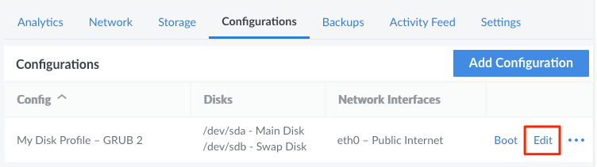

---
author:
  name: Linode
  email: docs@linode.com
title: Detach a VLAN from a Compute Instance
description: "If a Compute Instance no longer requires access a VLAN's private network, the VLAN can be detached by editing the Configuration Profile."
aliases: ['/products/networking/vlans/guides/detach-a-linode-from-your-vlan/']
---

If you no longer wish to include a particular Compute Instance within a VLAN's private network, the VLAN can be detached by editing that instance's [Configuration Profile](/docs/guides/linode-configuration-profiles/#editing-a-configuration-profile).

1. Within the [Cloud Manager](https://www.cloud.linode.com), click the **Linodes** link in the sidebar and select a Compute Instance.

1. Navigate to the **Configurations** tab for that Compute Instance.

1. Click the **Edit** button next to the configuration profile you'd like to modify.

    

1. An **Edit Configuration** screen will appear. Scroll down to the **Network Interfaces** section.

1. Click the dropdown menu under the network interface for that VLAN and select **None**. This detaches the VLAN.

1. Click on the **Save Changes** button to confirm the changes to the configuration profile.

1. Reboot the Compute Instance to save your changes and completely detach the VLAN.

   
If a VLAN is not attached to a Linode service, it will automatically be deleted.
