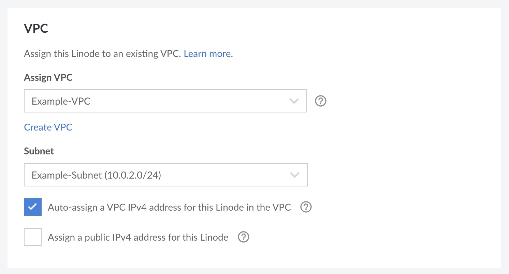

VPCs enable private communication between Compute Instances within a data center and are a critical component of many application architectures. Follow the instructions within this guide to add both new and existing Compute Instances to a VPC.

There are three main ways to assign a Compute Instance to a VPC:

- [Assign a new Compute Instance to a VPC through the Compute Instance creation workflow](#assign-a-new-instance)
- [Use the VPC management workflows to assign an existing Compute Instance](#assign-existing-instance-with-vpc-management-workflows)
- [Manually edit a Compute Instance's network interfaces to assign a VPC](#manually-edit-network-interfaces)

## Considerations

- VPCs, along with VLANs and the public internet, are configured as network interfaces within a Compute Instance's configuration profile. These network interfaces are configured automatically when creating a Compute Instance with a VPC or when interacting with the VPC directly to assign and remove existing Compute Instances. You can also edit the Configuration Profile directly to manually configure these network interfaces to suit specific use cases. Manually editing a Configuration Profile on a Compute Instance is typically the preferred way to assign a VPC to an existing instance.

- VPC resources requiring public internet access should be configured as a 1:1 NAT or use a [forward proxy](/docs/guides/forward-proxy-for-vpc/). It is not recommended to configure a separate network interface with public internet access (in addition to the VPC interface).

- Compute Instances can only be assigned to a single subnet of a single VPC, though they can communicate with other instances on any subnet within the same VPC. Multiple VPC interfaces on an instance are not allowed.

- If an existing Compute Instance is added or removed from a VPC, the instance needs to be rebooted for the changes to go into effect.

## Configuration Options

When assigning both new and existing Compute Instances to a VPC, the following settings can be configured:

-   **VPC:** Multiple VPCs can be configured in a data center, but each Compute Instance can only be assigned to a single VPC.

-   **Subnet:** When a Compute Instance is assigned to a VPC, it also needs to be assigned a subnet. A subnet defines a collection of related instances and has its own RFC1918 IPv4 range (in CIDR format).

-   **VPC IPv4 address:** This is the IPv4 address of the Compute Instance within the private network of the subnet. It must be within the CIDR range defined in the subnet. The address can be automatically generated or manually entered.

    When manually entering the IP address, do not use the first two or last two IP addresses within the subnet's defined IPv4 range. These are non-host IP addresses and are set aside for routing and other features.

-   **Public internet connectivity:** By default, Compute Instances with a VPC cannot communicate over the public internet. To facilitate internet access, enable the *Assign a public IPv4 address for this Linode* option, which configures a 1:1 NAT on the VPC interface. This enables routing internet traffic over your Compute Instance's public IP addresses.

-   **Additional IPv4 ranges:** You can assign additional IPv4 ranges that can be used to reach this Compute Instance and/or the services running on it. For example, you may wish to assign additional IPv4 ranges to directly expose Docker containers to the VPC.

These settings are referenced in the workflows below.

## Assign a New Compute Instance to a VPC {#assign-a-new-instance}

When creating a new Compute Instance, you have the option to assign it to an existing VPC. For complete instructions, review the **Assign to a VPC** section of the [Create a Compute Instance](/docs/products/compute/compute-instances/guides/create/) guide for instructions.

If a Compute Instance is created with a VPC, the VPC is automatically enabled on the `eth0` network interface. No other network interfaces are configured. An exception to that is if the Compute Instance is also configured with a **Private IP** address (which is not recommended). In this case, the `eth1` network interface is configured as _Public Internet_.

## Use the VPC Management Workflows to Assign an Existing Compute Instance {#assign-existing-instance-with-vpc-management-workflows}

VPCs have their own Cloud Manager workflows and API endpoints that allow you to manage the Compute Instances that are assigned to each subnet on a VPC.

1.  Navigate to the **Subnets** section of a VPC. See [View Subnets](/docs/products/networking/vpc/guides/subnets/#view-subnets).

1.  Locate the subnet you wish to use, expand the corresponding ellipsis menu, and click **Assign Linodes**. This opens the **Assign Linodes to subnet** panel.

1.  Within the **Linodes** dropdown menu, select the instance you would like to add to the VPC on the selected subnet.

1.  By default, an IPv4 address will be automatically generated for the instance on the subnet's defined CIDR range. If you want to manually assign an IP address, uncheck the **Auto-assign a VPC IPv4 address for this Linode** option and enter your custom IPv4 address. This address must still be within the subnet's IP range.

1.  Click the **Assign Linode** button to add the instance to the subnet.

1.  You can review and change the list of all instances assigned to that subnet. You can also assign additional IPv4 ranges. Once you are satisfied with your changes, click the **Done** button.

1.  Restart each added Compute Instance to automatically configure the VPC interface on the system.

When assigning a Compute Instance to a VPC in this way, the VPC network is automatically configured on the `eth0` network interface. In addition, `eth1` is configured to access the public internet. Using a VPC network interface alongside the public internet network interface is not recommended. Consider editing your instance's configuration profile to remove this interface.

## Manually Edit a Compute Instance's Network Interfaces to Assign a VPC {#manually-edit-network-interfaces}

Every Compute Instance can have up to three network interfaces (Public, VPC, and VLAN), which are configurable within the instance's [Configuration Profile](/docs/products/compute/compute-instances/guides/configuration-profiles/).

If you wish for an instance to be configured on a VPC, the _VPC_ option needs to be selected on at least one interface. In most cases, a VPC should be configured on the first network interface (`eth0`). Configuring a VPC on other interfaces prevent the instance from communicating with other subnets in the same VPC. For more details regarding configuring network interfaces, review the [Configuration Profile Settings](/docs/products/compute/compute-instances/guides/configuration-profiles/#settings).

1.  Within the [Cloud Manager](https://cloud.linode.com), view the Configuration Profiles for your desired Compute Instance. See [View Configuration Profiles](/docs/products/compute/compute-instances/guides/configuration-profiles/#view-configuration-profiles).

1.  Within the **Configurations** table, locate the configuration profile you wish to modify and click the corresponding **Edit** button, which may also appear within the **ellipsis** menu. This displays the **Edit Configuration** form. In most cases, there should be only one configuration profile.

1.  Find the **Network Interfaces** section of the editing pane.

1.  Determine which interface you wish to configure for the VPC and select the _VPC_ setting from that interface's dropdown menu. In most cases, you should configure the VPC on `eth0` and delete all other interfaces.

1.  Next, configure the VPC, subnet, and IP address for this interface.

    - **VPC:** To assign this instance to a VPC, select the VPC from the **VPC** dropdown menu. If you do not yet have a VPC in the selected data center, click the **Create a VPC** button and follow the instructions on the [Create a VPC](/docs/products/networking/vpc/guides/create/) guide.

    - **Subnet:** An instance can be assigned to a single subnet, which lets you further segment traffic and services within a VPC. Select the desired subnet within the **Subnet** dropdown menu.

    - **Auto-Assign IPv4 address:** By default, an IPv4 address will be automatically generated for the instance on the subnet’s defined CIDR range. If you want to manually assign an IP address, uncheck the **Auto-assign a VPC IPv4 address for this Linode** option and enter your custom IPv4 address. This address must still be within the subnet’s IP range.

    - **Public IPv4 address:** If you wish to enable public internet access on this new instance, check the **Assign a public IPv4 address for this Linode** option. By default, this is unchecked and you will not be able to access the internet from this instance.

    -   **Additional IPv4 ranges:** You can assign additional IPv4 ranges that can be used to reach this Compute Instance and/or the services running on it. For example, you may wish to assign additional IPv4 ranges to directly expose Docker containers to the VPC.

    

1.  Verify that _auto-configure networking_ option [Network Helper](/docs/products/compute/compute-instances/guides/network-helper/) under **Filesystem/Boot Helpers** is enabled.

1.  Once finished, click **Save Changes**.

1. Reboot the Compute Instance so that the new network interfaces are configured within the instance's internal Linux system.