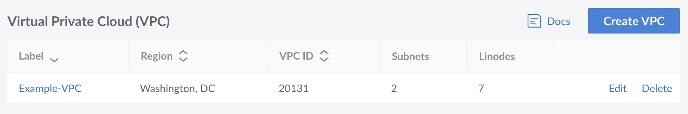
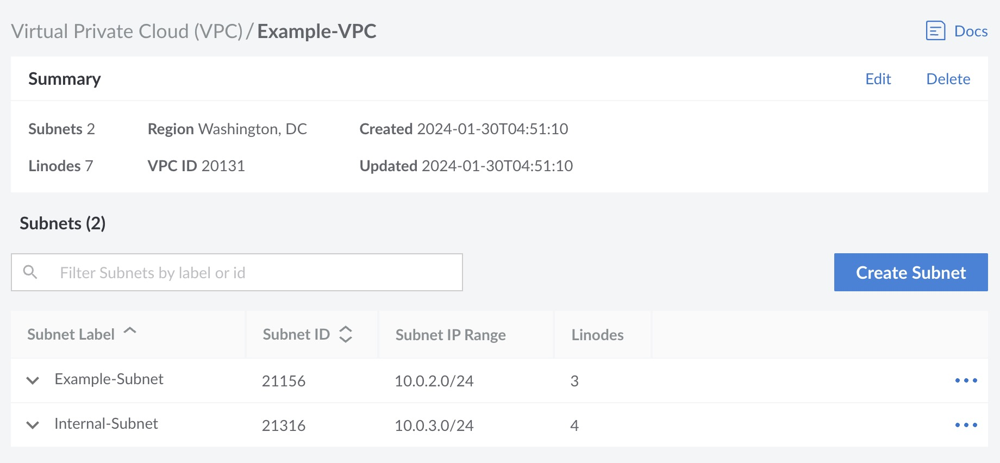

## View VPCs

Log in to [Cloud Manager](https://cloud.linode.com/) and select **VPC** in the sidebar. If any VPCs exist on your account, they are listed on this page.

Each VPC is listed along with the region it is located within, its ID, the number of subnets, and the number of Compute Instances that are assigned.

## Review and Edit a VPC

Navigate to the **VPCs** page in Cloud Manager and locate the VPC you wish to edit. See [View VPCs](#view-vpcs). Click the name of the VPC to be taken to its details page.

This displays the summary of the VPC along with a list of subnets within the VPC. To edit the VPC label or description, click the **Edit** button within the *Summary* section. The data center assignment cannot be changed. Once a VPC has been created, you cannot move it to a different data center.

## Create a VPC

To add a new VPC on your account, follow the [Create a VPC](/docs/products/networking/vpc/guides/create/) instructions.

## Delete a VPC

A VPC can be deleted using the **Delete** button next to the VPC you wish to delete on the main **VPC** page. It can also be deleted when viewing that VPCs details page by clicking the **Delete** button within the _Summary_ section.

Only a VPC without any Compute Instances assigned can be deleted. Review the [Remove Compute Instances from a VPC]() workflow if any Compute Instances are currently assigned.