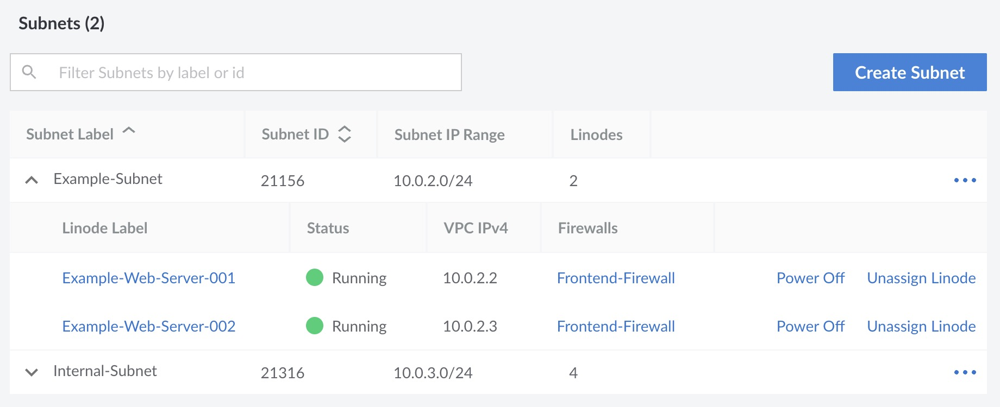
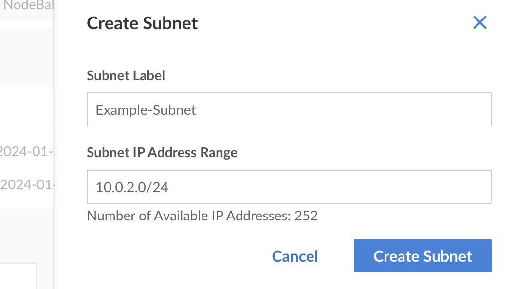

A VPC contains one or more _subnets_, which are networks within the VPC whose services all share the same IPv4 CIDR range. Just like VPCs, subnets are restricted to a single data center. Multiple subnets can be added to isolate services that are used for certain functionality of an application (like frontend and backend services) or can segment a VPC and its attached services into different environments (such as development, staging, and production).

## Subnet Components

- **Subnet Label:** An alphanumeric string (containing only letters, numbers, and hyphens) used to identify the subnet. It should be unique among other subnets in the same VPC and should provide an indication as to its intended usage.

- **Subnet IP Address Range:** VPC subnet ranges must be in the RFC1918 IPv4 address space designated for private networks. That said, it cannot overlap with the `192.168.128.0/17` range set aside for [Private IP addresses](/docs/products/compute/compute-instances/guides/manage-ip-addresses/#types-of-ip-addresses) on Compute Instances.

- **Assigned Services:** Each subnet can have multiple services assigned to it. These services can communicate with others in the same subnet, but are not able to communicate outside the subnet unless they belong to another subnet or have an interface configured for the public internet.

## Considerations

- Up to 10 subnets can be created on a VPC.
- A subnet is located within a single data center.
- Each subnet can have at most one IPv4 CIDR block. Review [Valid IPv4 Ranges](#valid-ipv4-ranges).
- Each service assigned to a subnet must have a unique IPv4 address in the defined range.

## Valid IPv4 Ranges for a Subnet {#valid-ipv4-ranges}

When defining an IPv4 range for a subnet, use a CIDR block within the [RFC1918](https://datatracker.ietf.org/doc/html/rfc1918) specification that can accommodate the number of instances you anticipate being assigned to the subnet. Your subnet must be within the following blocks:

  - 10.0.0.0/8
  - 172.16.0/12
  - 192.168.0.0/16 (excluding 192.168.128.0/17 which is reserved for the [private IP address](/docs/products/compute/compute-instances/guides/manage-ip-addresses/) feature)

## View Subnets

1.  View the [VPCs](https://cloud.linode.com/vpcs) page in the Cloud Manager. See [View VPCs](/docs/products/networking/vpc/guides/manage-vpcs/#view-vpcs).

1.  Locate and click the name of the VPC you wish to inspect. This displays the details page for that VPC.

1.  Review the **Subnets** section to view all of the subnets on the VPC.

Each subnet is listed alongside its defined CIDR block and the number of services assigned. Subnets can be expanded to view all services assigned to that particular subnet. These services are listed alongside their assigned IPv4 address and any firewalls that are applied to that interface.

## Add a Subnet

Up to 10 subnets can be added to each VPC.

1.  Navigate to the **Subnets** section of a VPC. See [View Subnets](#view-subnets).

1. Click the **Create Subnet** button. This opens the **Create Subnet** panel.

    

1. Enter a unique label and IP address range for the subnet.

1. Click the **Creat Subnet** button.

## Edit a Subnet's Label

Once a subnet has been created, only its label can be edited. You cannot modify the CIDR block.

1.  Navigate to the **Subnets** section of a VPC. See [View Subnets](#view-subnets).

1.  Locate the subnet you wish to edit, expand the corresponding ellipsis menu, and click the **Edit** option. This opens the **Edit Subnet** panel.

1.  Modify the label and click **Save**.

## Assign a Service to a Subnet

Review the [Assign a Compute Instance to a VPC](/docs/products/networking/vpc/guides/assign-services/) guide.

## Remove a Service from a Subnet

It is possible to remove a Compute Instance from a subnet, though the instance needs to be powered off to do so. Follow the instructions below to power off and remove a Compute Instance.

1.  Navigate to the **Subnets** section of a VPC. See [View Subnets](/docs/products/networking/vpc/guides/subnets/#view-subnets).

1.  Locate the subnet that the service belongs to.

1.  Within the list of assigned services, locate the Compute Instance you wish to remove.

1.  If the instance is not already powered off, click the corresponding **Power Off** button.

1.  Once the instance is fully powered off, click the corresponding **Unassign Linode** button.

Once the instance has been removed, you can power it back on or delete it. If you wish to continue using the Compute Instance, you should inspect the network interfaces within its [Configuration Profile](/docs/products/compute/compute-instances/guides/configuration-profiles/) to ensure it can operate as expected.