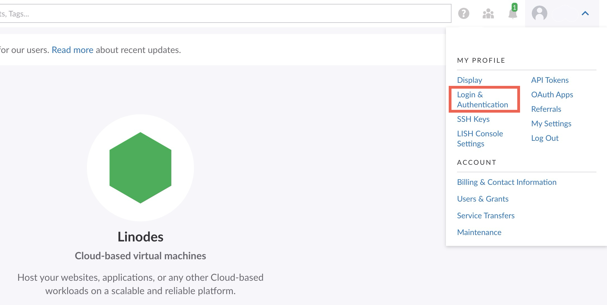
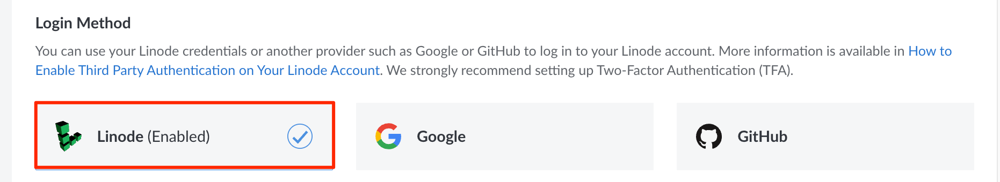
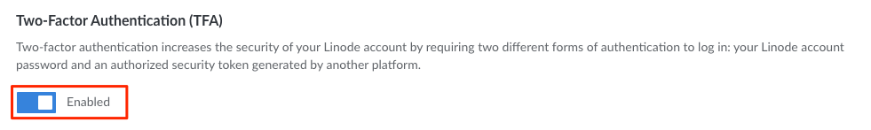
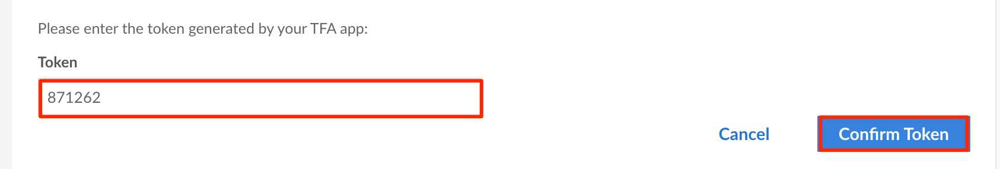
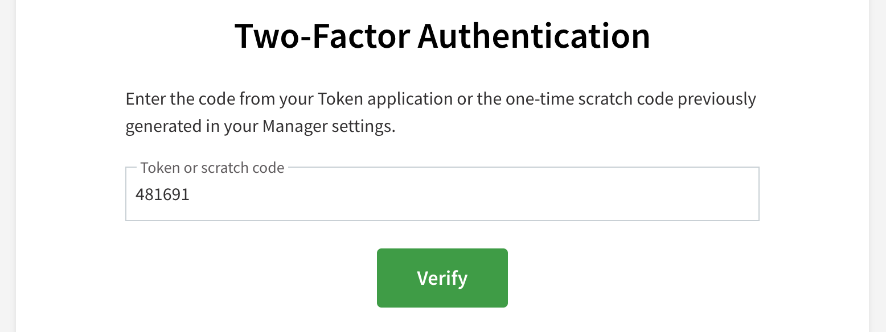
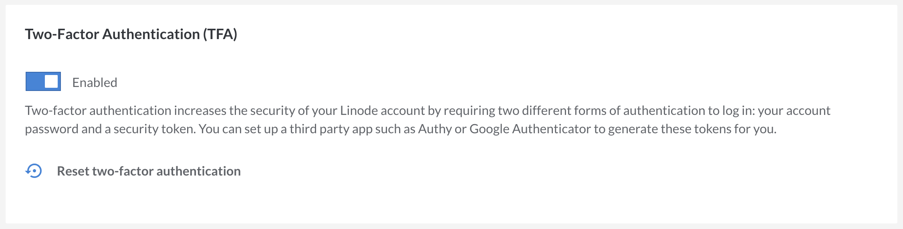

2FA (*two-factor authentication*) increases the security of your Linode account by requiring two forms of authentication: your password and an expiring token, also called an OTP (one-time passcode) or 2FA code. This follows the security principle of authenticating with something you *know* (a password) and something you *have* (the device used to generate the token). This additional layer of security reduces the risk that an unauthorized individual can gain access to your Linode account. **Linode highly recommends enabling 2FA**.


Managing 2FA through Linode is only available if *Linode* is selected as the **Login Method**. If you select a third-party authentication provider (such as Google or GitHub), 2FA is managed directly through that provider and not through Linode.


## Choosing a 2FA Provider

Before enabling 2FA on your user account, you need to determine which application you wish to use for managing your authentication and generating the expiring tokens (OTPs). You may want to consider using your existing password manager or using a dedicated authenticator app.

### Use Your Password Manager

Most password managers offer a built-in OTP feature. If convenience is a large factor for you, using your password manager is typically faster and no extra applications are needed. Once configured, you can copy your OTP token from the same application that stores your usernames and passwords. In many cases, your OTP token can automatically be pasted into the appropriate field on your web browser when logging in. Here are some password managers that support OTP / 2FA tokens:

- [1Password](https://1password.com/)
- [Bitwarden](https://bitwarden.com/)
- [Keeper](https://www.keepersecurity.com/)

The primary downsides of using your password manager as your OTP provider are security and cost. If a malicious actor gains access to your password manager, they also now have access to your OTPs. To prevent this, consider using a dedicated application (see below).

### Use a Dedicated Authenticator App

There are quite a few free (and paid) third-party authenticator applications available. They are typically more secure than using your password manager's OTP functionality as a malicious actor cannot gain access to your Linode account (or any other 2FA protected account) unless they know your password and have access to the particular device on which the authenticator app is installed, typically your smartphone.

- [Authy](https://authy.com/features/setup/)
- [Duo Mobile](http://guide.duosecurity.com/third-party-accounts)
- [Google Authenticator](http://support.google.com/accounts/bin/answer.py?hl=en&answer=1066447)
- [Microsoft Authenticator](https://www.microsoft.com/en-us/security/mobile-authenticator-app)

## Enabling 2FA

Enable two-factor authentication to start using it with your Linode account.

1.  Log in to the [Cloud Manager](https://cloud.linode.com).

1.  Navigate to the Login & Authentication page of your profile by clicking on your **username** in the top right of the screen. Select **Login & Authentication** from the dropdown menu.

    

1. Within the **Login Method** section, select **Linode** as the login provider. If you configure a third-party provider (such as Google or GitHub), you instead can manage 2FA directly through that provider and not through Linode.

    

1. Under **Security Settings**, verify that you have configured all 3 security questions. If not, follow the instructions within the [Security Questions](/docs/products/platform/accounts/guides/user-security-controls/#security-questions) guide.

1. Within the **Two-Factor Authentication** section, click the toggle switch to enable 2FA.

    

    A QR code should appear, along with a secret key and a field to enter your 2FA token.

1.  Open the app for your preferred 2FA provider on your smartphone or desktop. For help choosing a provider, see [Choosing a 2FA Provider](#choosing-a-2fa-provider).

1.  The next step is to configure the app to automatically generate OTP tokens for use with Linode's 2FA feature. The process varies depending on the app you are using. Within most dedicated authenticator apps, you can add an account. For password managers, edit or add a Linode login entry and add a one-time passcode (1Password), two-factor code (Keeper), or the equivalent field within your app. Then either scan the Cloud Manager's 2FA QR code or manually enter the secret key (also called a setup key or code). On mobile devices, you can use your phone's camera to scan the QR code. Desktop applications instead can typically scan the QR through their own custom screen capture tool. If you need further help, you can consult the documentation for your 2FA provider.

1. Once 2FA has been configured in your 2FA provider, a time-sensitive OTP token is generated. This token refreshes every 30 seconds. Copy this token and, within the Cloud Manager, paste it to the **Token** field and click **Confirm Token**.

    

1. Once the token is successfully confirmed, a scratch code appears. Save this code to a secure place, such as a password manager. If you ever lose access to your authenticator app, this scratch code can be used once in place of the OTP token. Two-factor authentication is enabled on your account.

## Logging in When 2FA Is Enabled

If 2FA is enabled on your account, you must enter the OTP generated by your 2FA provider when you log in to the Cloud Manager.

1. Open the [Cloud Manager](https://cloud.linode.com) in your web browser. If you are not already logged in, the Login page appears.

1. Enter your username and password and click **Log in**. If you wish, you can also select *Trust this device for 30 days* to stay logged in for 30 days. If 2FA is enabled on your account, a form appears requesting your OTP token or scratch code.

1. Open the authenticator app you are using to manage your 2FA and OTP tokens. Within this app, open the Linode account or login entry to view the time-sensitive OTP code.

1. Enter your OTP token into the **Token** field in the Cloud Manager and then click the **Verify** button. Provided the token is correct, you are successfully logged in.

    

    
    If you entered your one-time use scratch code instead of an OTP token, a new scratch code is automatically generated and provided to you. Save this code for the next time you do not have access to your authenticator app.
    

## Switching to a New Device or 2FA Provider

If you need to switch your 2FA provider or change the device in use by your two-factor authenticator app, you can do so within the Cloud Manager. To successfully log in to the Cloud Manager, you must have access to your original 2FA provider or device. If you've lost your device or otherwise don't have access, see the [Recovery Procedure](#recovery-procedure) below.

1. Log in to the [Cloud Manager](https://cloud.linode.com).

1. Navigate to the Login & Authentication page of your profile by clicking on your **username** in the top right of the screen. Select **Login & Authentication** from the dropdown menu.

1. In the **Two-Factor Authentication (2FA)** section, click **Reset two-factor authentication**, as shown below.

    

1. A new QR code and secret key is generated for your account and displayed on the screen. Follow the instructions in the [Enabling Two-Factor Authentication](#enabling-2fa) section.

## Disabling 2FA

You can disable two-factor authentication for your Linode account at any time. Here's how:

1.  Log in to the [Cloud Manager](https://cloud.linode.com).

1.  Navigate to the Login & Authentication page of your profile by clicking on your **username** in the top right of the screen. Select **Login & Authentication** from the dropdown menu.

1.  In the **Two-Factor Authentication (2FA)** section, toggle the **Enabled** switch to disable two-factor Authentication.

1.  A confirmation window appears asking if you want to disable two-factor authentication. Click **Disable Two-Factor Authentication**.

You have successfully disabled the two-factor authentication feature for your Linode Cloud Manager account.

## Recovery Procedure

If you lose access to your 2FA provider, you can still log in using the scratch code that was generated when you first enabled 2FA. If you do not have that scratch code, you will be unable to log in to the Cloud Manager and will need to contact the Customer Support team to request 2FA removal. See the instructions below for specific recovery steps.

- [With Scratch Code](#with-scratch-code)
- [With Security Questions](#with-security-questions)
- [Without Security Questions](#without-security-questions)

Please keep in mind that if you cannot provide the information required for the recovery options below, we will be unable to remove 2FA from your account.

### With Scratch Code

You should have received a one-time scratch code when you initially enabled two-factor authentication on your user account. If you have this scratch code, you can provide it in place of a token when prompted during the login process. Once logged in, you can proceed to [disable 2FA](#disabling-2fa) and [enable it again on your preferred device](#enabling-2fa).

It is not possible to generate a new scratch code. If you do not have access to this scratch code and you’re unable to log in to your account, follow the instructions in one of the next sections ([With Security Questions](#with-security-questions) or [Without Security Questions](#without-security-questions)).

### With Security Questions

1. Contact the [Linode Support](https://www.linode.com/support/) team via phone and state that you are locked out of your account and would like to remove 2FA. Be prepared to provide Support with your username and/or email address associated with the account.

    - U.S. toll-free: 855-454-6633
    - Global: +1-609-380-7100

1. A member of the Support team will ask you to provide valid answers to each of your security questions.

1. Your answers and any other details provided will be reviewed. If the information provided is sufficient, the team member will remove 2FA from your account. If additional details are needed, you will be provided with further instructions.

### Without Security Questions

Fill out our [Support Contact Form](https://www.linode.com/support/contact/) after selecting the option “I’ve lost my 2FA device." A member of the Support team will review your submission and respond to your ticket with next steps.


This recovery procedure will soon be deprecated and our team will instead use your security questions to verify your identity to proceed with 2FA removal. Once you’re able to log in to your account, we suggest updating your security questions to ensure you are able to regain access to your account in the event of another login issue.


## FAQs

### What should I do if I have access to my 2FA application, but each code I use is invalid when I try to log in?

This usually occurs if the time on the application or device is inaccurate. Make sure the time on the device you’re using is accurate or within 30 seconds of your timezone - official time can be observed from [https://time.gov](https://time.gov). If you have confirmed that the time on your application is accurate and this doesn’t resolve the issue, follow the steps within the [Recovery Procedure](#recovery-procedure) section.

### What should I do if I no longer have access to the application I use to manage 2FA?

A scratch code was generated and displayed when you enabled 2FA on your user account. Provide this scratch code in place of the OTP token when prompted during the login process. Scratch codes can only be used once.

### I don’t have access to my 2FA application or my scratch code. How can I remove 2FA from my account?

Review all of the alternative recovery options available in the [Recovery Procedure](#recovery-procedure) section. Keep in mind that if you don’t have access to any recovery mechanisms, you may not be able to recover access to your account.

### Do you support Yubikeys?

We hope to have this functionality soon. In the meantime, we have detailed a workaround in a Community Questions Site Post, [Yubikey as a 2FA Option](https://www.linode.com/community/questions/17374/yubikey-as-2fa-option-for-manager#answer-82565).

### I’ve lost my scratch code - how do I generate a new one?

It is not possible to regenerate a new scratch code on an existing 2FA provider. If you have not previously saved your scratch code and wish to do so, you must [disable 2FA](#disabling-2fa) from your account and then enable it again.

### Can I submit answers to my security questions through a ticket or email?

It’s not secure to submit answers via ticket, therefore we ask that you call the Support line to provide your answers.