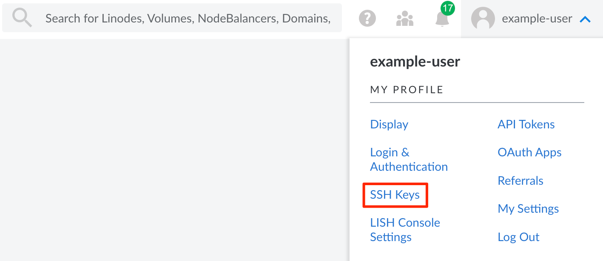
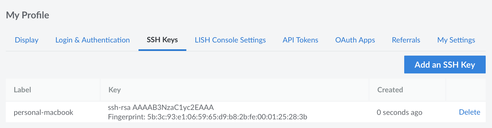
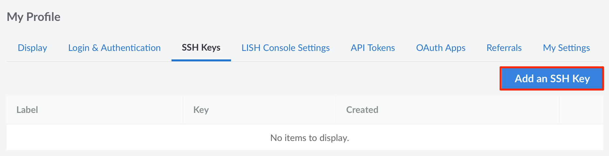

When creating a Compute Instance, you have the opportunity to select one or more SSH keys, which are added to the root user account of the new instance. This allows you to login over SSH using your associated private key instead of the root password.

These SSH keys are stored within your Linode account and can be easily accessed from the Cloud Manager. This guide walks you through how to view, add, and remove your account's SSH keys. For instructions on selecting an SSH key when deploying a Compute Instance see [Creating a Compute Instance > Create a Password and Add SSH Keys](/docs/products/compute/compute-instances/guides/create/#create-a-password-and-add-ssh-keys).

## View SSH Keys

1.  Log in to the [Cloud Manager](https://cloud.linode.com).

1.  Click on your username on the top right and select **SSH Keys** in the dropdown menu that appears:

    

1.  This opens the *SSH Keys* tab within the **My Profile** section. If you have uploaded any public keys, they are displayed on this page, as shown below.

    

## Add a Public Key

Add a public SSH key to your Linode user account so that you can easily install it on *new* Compute Instances (see [Create a Compute Instance](/docs/products/compute/compute-instances/guides/create/#create-a-password-and-add-ssh-keys)).


The following SSH key formats are supported: **ssh-rsa**, **ssh-dss**, **ecdsa-sha2-nistp**, **ssh-ed25519**, and **sk-ecdsa-sha2-nistp256** (an Akamai-specific format).


1.  Access the **SSH Keys** page in the Cloud Manager. See [View SSH Keys](#view-ssh-keys) above.

1.  Click the **Add an SSH Key** button.

    

1.  Within the **Add an SSH Key** panel that appears, enter a descriptive label for your key and paste your public key into the **SSH Pulic Key** field. To find and copy your public key on your local machine, use one of the following methods:

    -   **Windows 11 (or 10), macOS, Linux:** If you created your key pair using most command-line tools, your public key is likely stored in a `.ssh` directory within your home folder and is likely called `id_rsa.pub`. You can view your public key by opening PowerShell (Windows) or the terminal (macOS and Linux) and running the following command:

        ```command
        cat ~/.ssh/id_rsa.pub
        ```

    -   **Windows (through PuTTY):** When using PuTTY to generate your key pair, the public key is stored as a `.ppk` file. Open this file using PuTTY to view your public key.

    If you haven't yet generated a key pair to use with SSH, follow the instructions within the [Creating an SSH Key Pair and Configuring Public Key Authentication on a Server](/docs/guides/use-public-key-authentication-with-ssh/) guide.

1.  Click the **Add Key** button to save your key. You should now see that public key on the **SSH Keys** page.

    

## Remove a Public Key

If you no longer wish to deploy *new* Compute Instances with a certain SSH key, you can remove it from the Cloud Manager. When doing so, the SSH key is *not removed* from any existing Compute Instances that may have used it.

1. Access the **SSH Keys** page in the Cloud Manager. See [View SSH Keys](#view-ssh-keys) above.

1. Within the list that appears, locate the public key you wish to remove. Then, click the corresponding **Delete** link.

1. To confirm removal, click the **Delete** button within the confirmation dialog that appears.