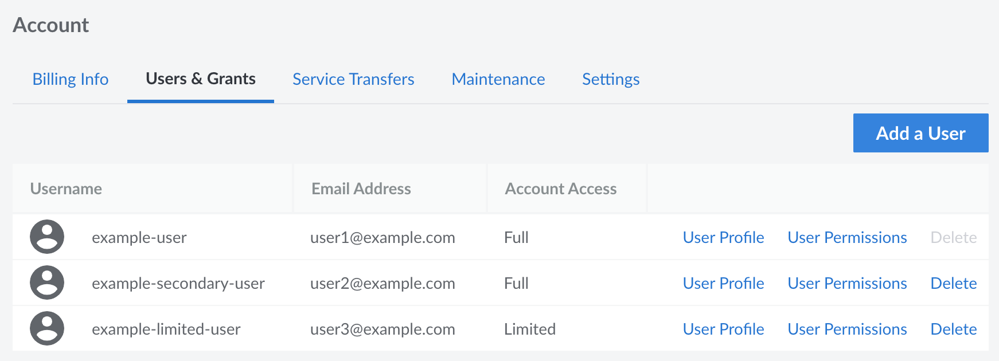

Each Linode account can accommdate multiple user accounts, used for providing other people access to manage the services on an account.

You can grant other people access to your Linode Cloud Manager account by creating *users* and assigning *permissions* to restrict access to certain areas of the control panel. Adding users and configuring permissions is useful for groups that need to grant all team members access to the Linode Cloud Manager, or organizations that just want their billing department to have a separate account to receive invoices and billing information.


A single user was automatically created for your account when you signed up for Linode. If you are the only person accessing the Linode Cloud Manager, you do not need to create any additional users on your account.


## View All Users

1. Log in to the [Cloud Manager](https://cloud.linode.com) and select **Account** from the sidebar menu.

1. Navigate to the **Users & Grants** tab to display all users on the account. *Your user account must have full unrestricted access to view this page.*

Each user is listed in the table along with its username, email address, and the level of account access (*full* or *limited*).

## Add a User

Each person that needs access to a Linode account should be given their own user account. When creating an account, you are 

When adding a user, you give that individual permission to log in to the Linode Cloud Manager and, depending on the access level they are assigned, receive email notifications. Users can have either limited or full access to account features.

Here's how to add a user to your Linode account:

1. Navigate to the **Users & Grants** page in the Cloud Manager. See [View All Users](#view-all-users).

1. Click the **Add a User** button to open the new user panel.

1. Enter the **Username** and **Email** for the user.

1. Toggle the **Account Access** button to give the user full or limited access to account features.

1. Click **Submit**. The user will receive an email with instructions on creating a password and logging in to the account.

If you granted the user full access, the account is created and no further action is required. If you granted the user limited access, continue with [setting user permissions](/docs/products/platform/accounts/guides/user-permissions/).

## Recover a Lost Username

Did you forget your Cloud Manager username? Recover it with the *Forgot Username* webpage. Here's how:

1. Visit the [Forgot Username](https://login.linode.com/forgot/username) webpage.
1. Enter your email address in the **Email** field.
1. Click **Submit**.

In a couple minutes, you'll receive an email message with any Linode Cloud Manager users that correspond to that email. If you do not receive information about any users, then you may have registered your account with a different email.

## Remove a User

You can permanently remove a user account from the Linode Cloud Manager. Here's how:

1. Click the **Account** link in the sidebar.
1. Click the **Users** tab.
1. Click the **Delete** link for the desired user. A warning appears asking you to confirm that you want to delete the user.
1. Click **Delete** in the warning to confirm deletion.

The user is removed and is no longer able to access the Linode Cloud Manager.

## Change a Username

You can update a username, including your own, from the Linode Cloud Manager.

1. Click the **Account** link in the sidebar.
1. Click the **Users & Grants** tab.
1. Locate the user in the list and click on their **User Profile** link.
1. Enter a new username in the **Username** field.

    

1. Click **Save**.