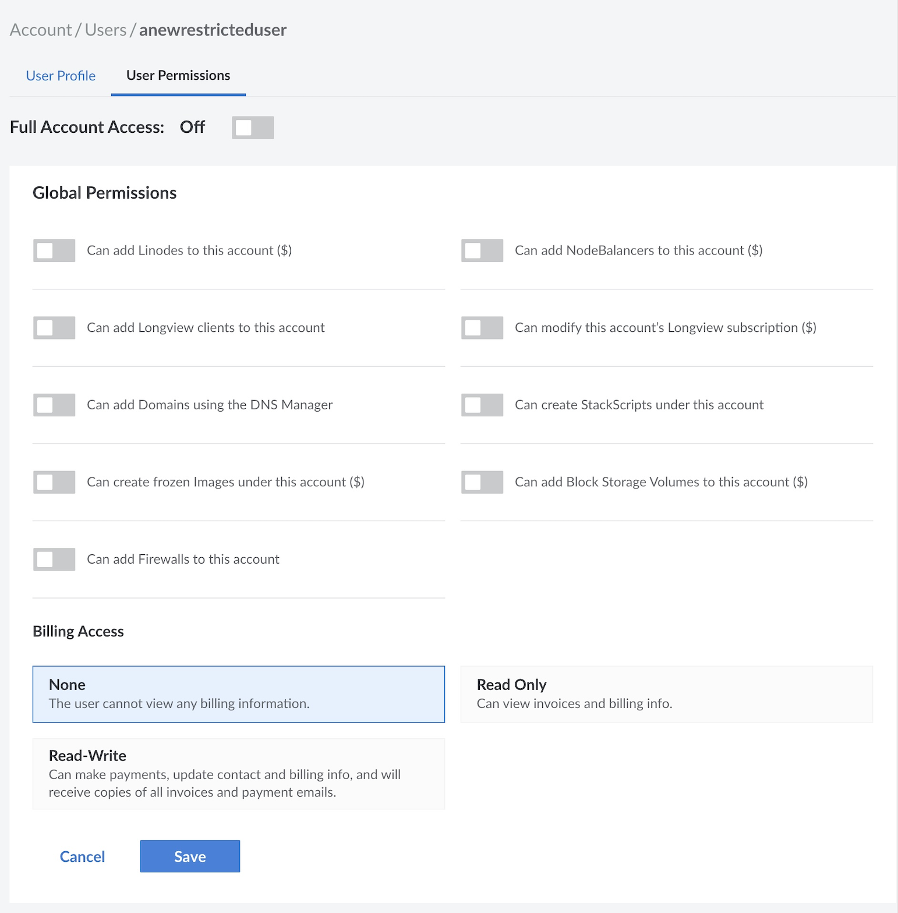

You can grant other people access to your Linode Cloud Manager account by creating *users* and assigning *permissions* to restrict access to certain areas of the control panel. Adding users and configuring permissions is useful for groups that need to grant all team members access to the Linode Cloud Manager, or organizations that just want their billing department to have a separate account to receive invoices and billing information.


A single user was automatically created for your account when you signed up for Linode. If you are the only person accessing the Linode Cloud Manager, you do not need to create any other users on your account.


### Add a User

When you add a user, you give that individual permission to log in to the Linode Cloud Manager and, depending on the access level they are assigned, receive email notifications. Users can have either limited or full access to account features.

Here's how to add a user to your Linode account:

1. Log in to the [Cloud Manager](https://cloud.linode.com).
1. Click the **Account** link in the sidebar.
1. Click the **Users & Grants** tab.
1. Click on **Add a User**. The *Add a User* menu appears.

    

1. Enter a username for the user in the **Username** field.
1. Enter the user's email address in the **Email** field. A password creation link is sent to the new user's email address.
1. Toggle the **Account Access** button to give the user full or limited access to account features.
1. Click **Submit**.

If you granted the user full access, the account is created and no further action is required. If you granted the user limited access, continue with [setting user permissions](/docs/guides/accounts-and-passwords/#setting-user-permissions).

### Set User Permissions

Setting permissions restricts a user's access to certain areas of the Linode Cloud Manager. For example, you could limit a user to a single Linode and prevent them from removing the Linode or adding extra services. Don't worry--these settings aren't permanent. You can add or remove access for a user at any time in the future. User Permissions are divided into three categories. **Global Permissions**, **Billing Access**, and **Specific Permissions**.

Here's how to set a user's access permissions:

1. Click the **Account** link in the sidebar.
1. Click the **Users & Grants** tab.
1. Click the **User Permissions** link for the desired user.
1. Toggle the **Full Account Access** button off to limit the user's account access and show permission categories.

    

1. Toggle the boxes in the **Global Permissions** section to allow the user to add [Linodes](/docs/guides/getting-started/), [NodeBalancers](/docs/products/networking/nodebalancers/get-started/), [Domains](/docs/products/networking/dns-manager/), [Longview](/docs/guides/what-is-longview/) clients, [Block Storage Volumes](/docs/products/storage/block-storage/) to the account, create [StackScripts](/docs/platform/stackscripts/), frozen [Images](/docs/products/tools/images/), access all billing information, and cancel the entire account. These permissions are exactly as described and will not add any additional permissions.

    
Granting access to settings denoted with a dollar sign ($) allows the user to perform actions that incur billing costs, such as adding or resizing a Linode.


1. Select an option for **Billing Access** permissions. These options are as follows:

    - **None**: The user is unable to view any billing information. This does not prevent a user from creating billable resources, which are instead applied as **Global Permissions** in the previous step.
    - **Read Only**: The user can [View Invoices](/docs/products/platform/billing/guides/view-history/) and [Access Billing Info](/docs/products/platform/billing/guides/access-billing/).
    - **Read-Write**: The user has full access to [Billing Information](/docs/products/platform/billing/guides/access-billing/), can make payments, edit billing information, view billing information, receive copies of all invoices, and receive email related to payments.

1. Select the appropriate permissions (None, Read Only, or Read-Write) in the **Specific Permissions** section to allow the user to access individual Linodes, StackSripts, Block Storage Volumes, Images, NodeBalancers, and Domains. Unlike Global Permissions, Specific Permissions can apply to individual resources and not the service as a whole. Specific Permission options are as follows:

    - **None**: The user can not view or otherwise interact with the selected resource.
    - **Read Only**: The user can view the resource and all of its associated information typically visible within the Linode Manager, however they can not otherwise interact with it through Cloud Manager.
    - **Read-Write**: The user has full access to the selected resource, and can make any changes that only an administrator is otherwise able to. This includes resource deletion, cloning, and all other applicable edits.

1. When you have finished configuring the user's permissions, click **Save**. The user's permissions are saved and effective immediately.

### Recover a Lost Username

Did you forget your Cloud Manager username? Recover it with the *Forgot Username* webpage. Here's how:

1. Visit the [Forgot Username](https://login.linode.com/forgot/username) webpage.
1. Enter your email address in the **Email** field.
1. Click **Submit**.

In a couple minutes, you'll receive an email message with any Linode Cloud Manager users that correspond to that email. If you do not receive information about any users, then you may have registered your account with a different email.

### Remove a User

You can permanently remove a user account from the Linode Cloud Manager. Here's how:

1. Click the **Account** link in the sidebar.
1. Click the **Users** tab.
1. Click the **Delete** link for the desired user. A warning appears asking you to confirm that you want to delete the user.
1. Click **Delete** in the warning to confirm deletion.

The user is removed and is no longer able to access the Linode Cloud Manager.

### Change a Username

You can update a username, including your own, from the Linode Cloud Manager.

1. Click the **Account** link in the sidebar.
1. Click the **Users & Grants** tab.
1. Locate the user in the list and click on their **User Profile** link.
1. Enter a new username in the **Username** field.

    

1. Click **Save**.