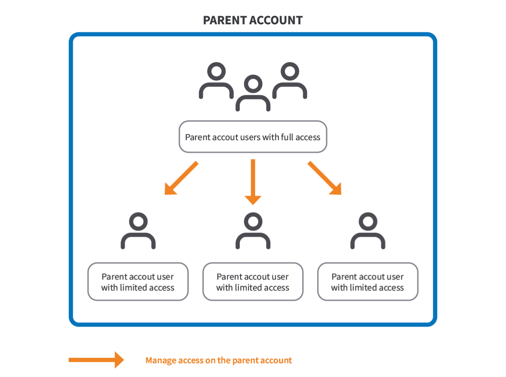
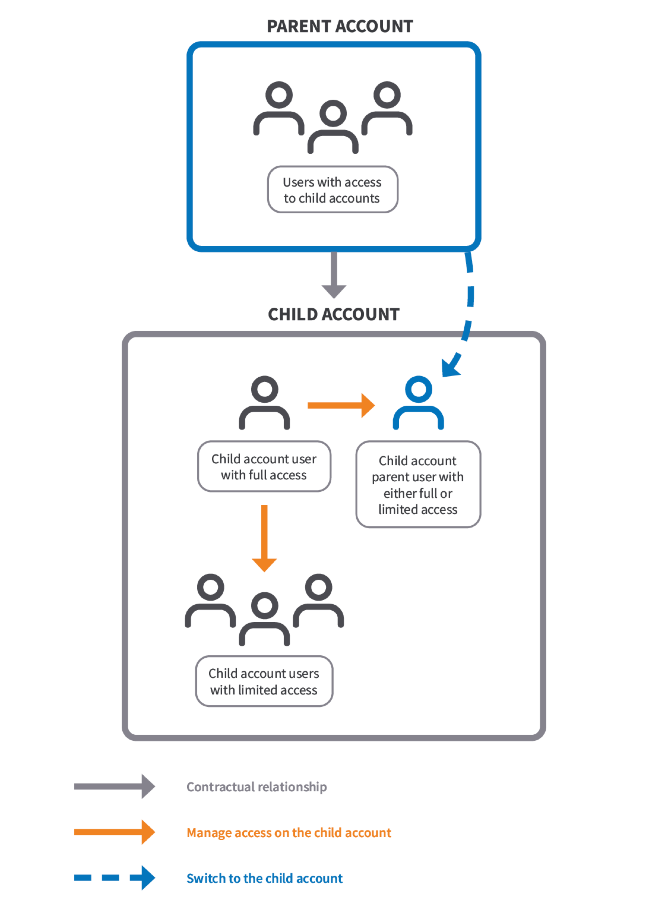
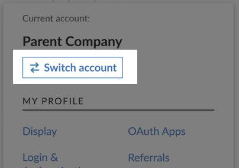
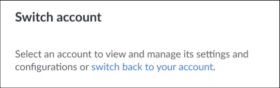

## Overview

The parent and child accounts feature was designed with Akamai partners and their clients in mind. It allows partners to manage multiple end customers’ accounts with a single login to their company’s account.


This feature is only available for Akamai partners and their end customers with an Akamai Cloud Computing contract. To learn more about it, contact your Akamai representative.


Depending on whether you're an Akamai partner or a partner’s end customer, this feature has different implications. Select your role to go to content that applies to you.

- [I’m an Akamai partner](#for-akamai-partners).
- [I’m a partner’s end customer](#for-end-customers).

## For Akamai partners

### About the feature

The parent and child accounts feature allows you, an Akamai partner (parent account holder), to switch between and manage your end customers’ accounts (child accounts) in Cloud Manager.

Child account users can monitor your actions on their account. All actions are logged and can be viewed in Cloud Manager, either through the Events panel or the [Events](https://cloud.linode.com/events) page.

The parent/child relationship doesn’t restrict the child account and its users from creating support tickets or signing up for managed services for their accounts.

### Terminology

#### Parent account

In the context of your account type, you need to be familiar with the following terms.

- **Parent account**. Your, Akamai partner, account.
- **Parent account user with full access** (parent account admin). An Akamai partner account owner who has access to child accounts by default. They manage permissions for other admins and child account users with limited access. They can provide full access to a parent account user with limited access who then also becomes a parent account admin.
- **Parent account users with limited access** Users of a parent account that don’t have access to child accounts by default. Only the parent account admin can grant them access to all child accounts the parent account has a contractual parent/child relationship with. To learn more, see [Enable access to child accounts for parent account users with limited access](#enable-access-to-child-accounts-for-parent-account-users-with-limited-access).

#### Parent/child relationship

In the context of the parent/child relationship, you need to be familiar with the following terms.

- **Parent account**. Your, Akamai partner, account.
- **Child account parent user**. A single user on a given child account that represents all parent account users with access to child accounts. It’s used to manage the child account. Depending on the access level and permissions provided by the child account admin, it can be a child account parent user with either full or limited access. To learn more, see [Switch accounts](#switch-accounts).
- **Child account**. An account belonging to your end customer.
- **Child account users with full access** (child account admins). Users of the child account with full access to it. They manage permissions for all users on the account; other admins, child account users with limited access, and the child account parent user.  The only exception is billing, child account admins have read-only access to it and they can’t modify the child account parent user’s read/write permission to it.
- **Child account users with limited access**. Non-admin users of the child account whose permissions are managed by the child account admin.

One parent account can manage many child accounts.

### Enable access to child accounts for parent account users with limited access

As a parent account admin, you can grant access to the child account for parent account users with limited access.

On the User Permissions page, you have the additional general permission - **Enable child account access**.

- This permission is available only for parent accounts.
- Parent account users with limited access have this option disabled by default. They need to ask a parent account admin to enable this option for them.
- It enables access to **all** child accounts the parent account has a contractual parent/child relationship with.

To enable the access:

1. Log in to [Cloud Manager](https://cloud.linode.com/).
1. In the main menu, go to **Account**.
1. In the **User & Grants** tab, next to the name of a parent account user with limited access, click **...** > **User Permissions**.
1. In the **General Permissions** section, switch the **Enable child account access** option on. Click **Save**.

### Switch accounts

When switching to a child account, you become the child account parent user. By default, you have:

- Read/write permission for billing. This is the only permission that can’t be modified even by a child account admin.
- Read-only permission to all asset instances existing at the time of parent/child relationship creation, such as linodes, load balancers, Longview clients. This allows the child account parent user to see existing child accounts’ assets, but not create, update, or delete them.
- No access to asset instances created after the creation of the parent/child relationship. The child account parent user needs to ask a child account admin to grant them access to new instances if necessary.
- The [global permissions](/docs/products/platform/accounts/guides/user-permissions/) set off.

A child account admin can change the child account parent user’s default permissions and expand or restrict its access to the child account, except for billing. If the child account admin provides the child account parent user with full access to the child account, the child account parent user can fully manage the account, including its users.

To switch accounts:

1.  Log in to [Cloud Manager](https://cloud.linode.com/).
1.  In the top corner, click the name of your account.

    

1.  Click **Switch account**. If you don’t see this button, it means you’re a parent account user with limited access and you need to ask the parent account admin to provide you the access to child accounts or your account is not involved in the parent/child relationship.

    

1.  Select an account from the list you want to switch to.
Now you act as the child account parent user. Note that you can click the **switch back to your account** link to switch back.

    

### Delete a parent account

A parent account can be deleted only if all parent/child relationships are contractually removed from your parent account, meaning you don’t have active contracts with end customers.

Once this condition is met, to close an account:

1. Log in to [Cloud Manager](https://cloud.linode.com/).
1. In the main menu, go to **Account**.
1. In the **Settings** tab, go to the **Close Account** section, and click the **Close Account** button.
1. Follow the on-screen instructions and click **Close Account**.

## For end customers

### About the feature

The parent and child accounts feature allows an Akamai partner (Parent account holder) to manage your account (Child account) in Cloud Manager.

You can monitor Akamai partner’s actions on your account. All actions are logged and can be viewed in Cloud Manager, either through the Events panel or the [Events](https://cloud.linode.com/events) page.

The parent/child relationship doesn’t restrict your account and its users from creating support tickets or signing up for managed services.

### Terminology

In the context of the parent/child relationship, you need to be familiar with the following terms.

- **Parent account**. A company account of your Akamai partner.
- **Child account**. Your, end customer’s, account.
- **Child account users with full access** (child account admins). Users of your account with full access to it. They manage permissions for all users on the account; other admins, child account users with limited access, and the child account parent user.  The only exception is billing, they have read-only access to it and they can’t modify the child account parent user’s read/write permission to it.
- **Child account users with limited access**. Non-admin users of your account whose permissions are managed by the child account admin.
- **Child account parent user**. A single user representing all Akamai partner users who have access to this child account. It’s used to manage your child account. Depending on the access level and permissions provided by the child account admin, it can be a child account parent user with either full or limited access. To learn more, see [Manage account access and permissions for the child account parent user](#manage-account-access-and-permissions-for-the-child-account-parent-user). The child account parent user is created automatically based on your contract with an Akamai partner. The user exists on your account as long as you have a contractual relationship with your Akamai partner.

### Manage account access and permissions for the child account parent user

By default, a child account parent user has:
- Read/write permission for billing. This is the only permission that can’t be modified even by a child account admin.
- Read-only permission to all asset instances existing at the time of parent/child relationship creation, such as linodes, load balancers, Longview clients. This allows the child account parent user to see existing child accounts’ assets, but not create, update, or delete them.
- No access to asset instances created after the creation of the parent/child relationship. The child account parent user needs to ask a child account admin to grant them access to new instances if necessary.
- The [global permissions](/docs/products/platform/accounts/guides/user-permissions/) set off.

As a child account admin you can change the default permissions of the child account parent user to expand or restrict access as you see fit, except for billing. If you provide the child account parent user with full access to the child account, it becomes the child account parent user with full access and can fully manage your child account, including its users.

To manage access settings:

1.  Log in to [Cloud Manager](https://cloud.linode.com/).
1.  In the main menu, go to **Account**.
1.  In the **User & Grants** tab, in the **Parent User Settings** table, next to the name of the child account parent user, click **Manage Access**.
1.  In the **General Permissions** section:
    1. Select the permissions you want to grant. Remember that permissions with the $ symbol next to them, can incur additional charges. Note also the **Full Account Access** switch that gives the child account parent user full access to your account.
    1. Click **Save**.
1.  In the **Specific Permissions** section, select the access level for each feature or use the **Set all permissions to** dropdown. Click **Save**.

### Delete a child account

A child account admin can delete a child account only if the parent/child relationship is contractually removed, meaning you don’t have an active contract with an Akamai partner.

Once this condition is met, to close an account:

1. Log in to [Cloud Manager](https://cloud.linode.com/).
1. In the main menu, go to **Account**.
1. In the **Settings** tab, go to the **Close Account** section, and click the **Close Account** button.
1. Follow the on-screen instructions and click **Close Account**.