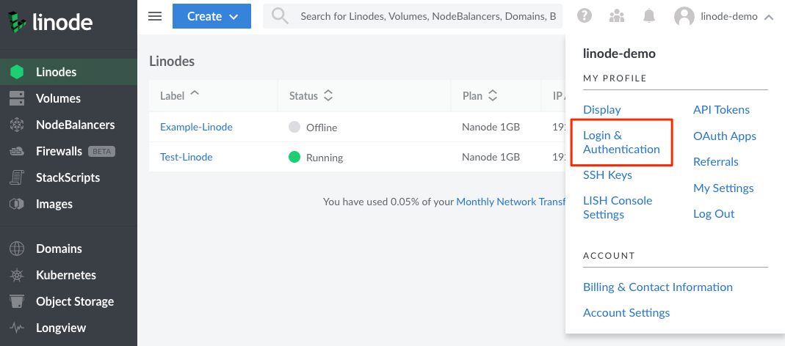
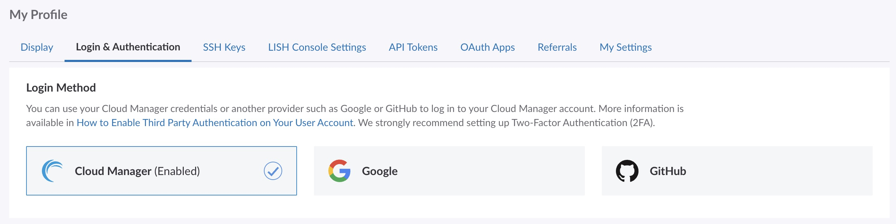
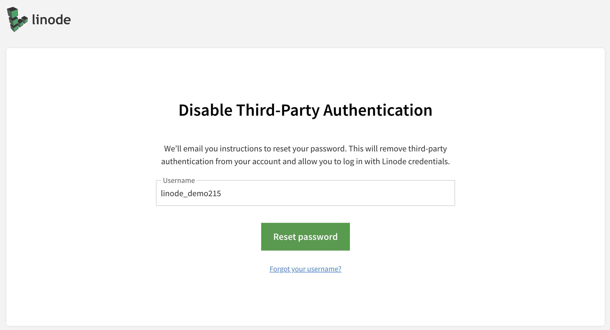

Cloud Manager supports third-party authentication (TPA). This allows you to log in to Cloud Manager with another provider's login credentials.


Enabling TPA disables two-factor authentication (2FA) on your user account. You should enable 2FA with the TPA provider with which you choose to authenticate to Cloud Manager.

Additionally, enabling TPA disables password authentication in the Lish console. You can still authenticate to Lish with an SSH key. For more information on SSH key authentication with Lish, visit our [Using the Lish Console](/docs/products/compute/compute-instances/guides/lish/#add-your-public-key) guide.



Separate from your selected login provider, you can also log in to Cloud Manager using your [Akamai Control Center](https://control.akamai.com/) account credentials. To learn more about this feature, see [Single sign-on (SSO) with Akamai Control Center](/docs/products/platform/accounts/guides/user-security-controls/#single-sign-on-sso-with-akamai-control-center).


## Enabling Third-Party Authentication

1.  To get started with TPA, log in to [Cloud Manager](https://cloud.linode.com) using your existing username and password.

1.  Click your username in the top right of the screen and select **Login & Authentication**.

    

1.  Within the **Login Method** section, select the *Login Provider* you'd like to use for authentication. You can chose to use your own Cloud Manager credentials or chose from several third-party authentication (TPA) providers, such as Google and GitHub. Only one login provider can be active at a time. Once selected, you will be asked to confirm that you'd like to enable TPA with this provider.

    

    
    Enabling third-party authentication disables your current Cloud Manager password and 2FA settings. If you would like to continue using 2FA, make sure it is handled by your chosen TPA provider.
    

1.  Once a TPA provider is selected, you are taken to that provider's website and are prompted to give access to your Linode user account. Review the list of permissions and confirm.

1.  After granting permissions, you will see a confirmation screen. You can now log in to your user account through the selected TPA provider.

## Disabling Third-Party Authentication

1.  Log in to the [Cloud Manager](https://cloud.linode.com) using your TPA credentials.

1.  Navigate to the Login & Authentication page of your profile by clicking on your **username** in the top right of the screen. Select **Login & Authentication** from the dropdown menu.

    

1.  Within the **Login Method** section, select **Cloud Manager** as the login provider.

    

1.  A prompt will appear confirming your intent to disable third-party authentication. You will need to click on the **Reset Password** button to send a password reset link to your email. This will be delivered to the email address associated with your user account, and not the email associated with the TPA provider. You will need to follow the link in that email to reset your user's password.

    

1.  Once reset, you can use your new password to log in to Cloud Manager.