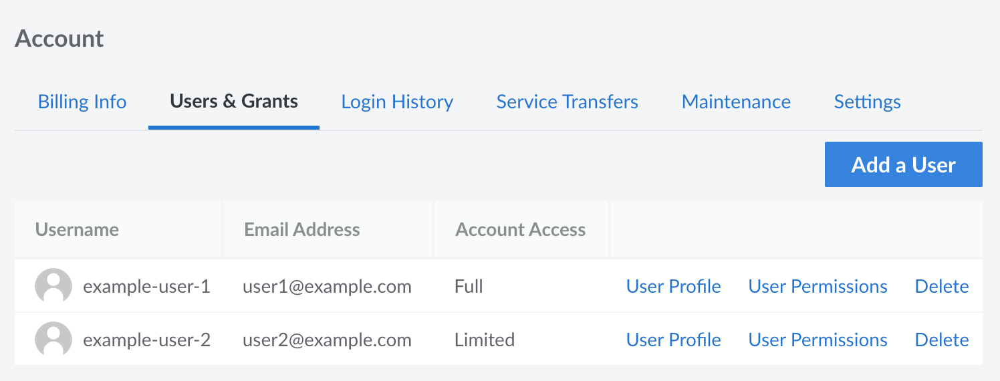
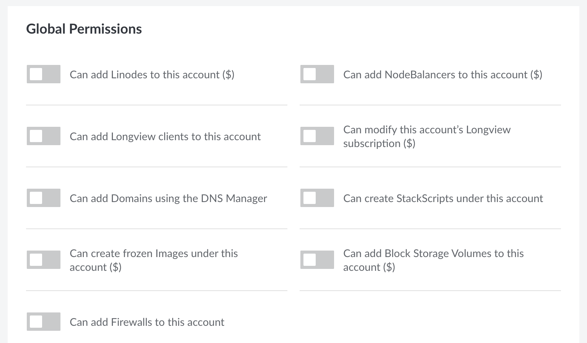
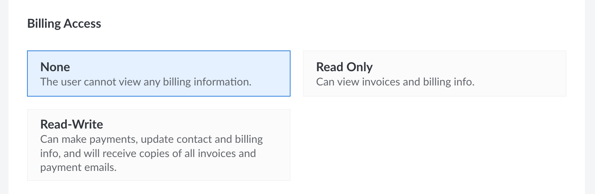
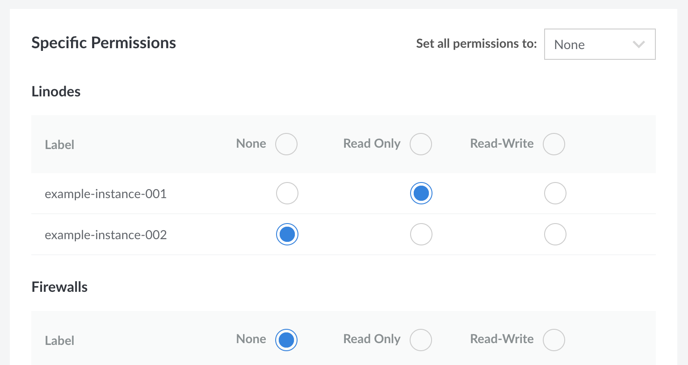

Each user on an account can be given individualized permissions that provides unrestricted access to an account or limits their access to specific information or services. For example, you could give your core team members full unrestricted access, grant your accounts payable team access only to view and modify billing details, and limit an outside developer to only access specific Compute Instances or other services.


The permissions discussed within this guide apply to accessing the Linode platform through the Cloud Manager, Linode API, and Linode CLI. If you wish to only provide someone with direct access to the internal system of a Compute Instance (or revoke their access), that can be accomplished through limited user accounts within your operating system. See [Create an Account for a Developer to Work on Your Compute Instance](/docs/products/platform/get-started/guides/developer-access/).


## View and Set Permissions for a User

You can view and edit permissions for a user directly in the Cloud Manager by following the instructions below.

1. Log in to the [Cloud Manager](https://cloud.linode.com) and click the **Account** link in the sidebar.

1. Navigate to the **Users & Grants** tab, which displays a list of existing users for the account.

    

1. Locate the user for which you wish to view or modify permissions and click the corresponding **User Permissions** link.

    

1. Modify the settings as needed. Reference the [Permission Settings](#permission-settings) section below for more information on user permission settings.

1. When you have finished configuring the user's permissions, click **Save**. The user's permissions are saved and become effective immediately.

## Permission Settings

### Full Account Access

A user can either be given unrestricted (full) access to an account or they can be restricted by default. If **Full Account Access** is set to *ON*, the user has full access to the account and no further permission settings are available. When set to *OFF*, the user has no access and individual permissions can be granted using the other settings (covered below).

### Create Services (Global Permissions)

The **Global Permissions** settings enable users to add various types of services. There is a setting that corresponds to each type of service. For instance, to allow the user to add NodeBalancers, enable the *Can add NodeBalancers to this account* setting.


Granting access to settings denoted with a dollar sign ($) allows the user to perform actions that incur billing costs, such as adding or resizing a Linode Compute Instance.


### Billing Access

This section provides various levels of access to view or modify billing information:

- **None**: The user is unable to view any billing information. This does not prevent a user from creating billable resources, which are instead applied as **Global Permissions** in the previous section.
- **Read Only**: The user can [View Invoices](/docs/products/platform/billing/guides/view-history/) and [Access Billing Info](/docs/products/platform/billing/guides/access-billing/).
- **Read-Write**: The user has full access to [Billing Information](/docs/products/platform/billing/guides/access-billing/), can make payments, edit billing information, view billing information, receive copies of all invoices, and receive email related to payments.

### Specific Services

A user can be granted individual permissions to each instance of a service, such as Linode Compute Instances, Block Storage Volumes, NodeBalancers, and more. Unlike **Global Permissions**, **Specific Permissions** apply to individual resources -- not the service as a whole.

- **None**: The user cannot view or otherwise interact with the selected resource.
- **Read Only**: The user can view the resource and all of its associated information typically visible within the Cloud Manager, however they cannot otherwise interact with it.
- **Read-Write**: The user has full access to the selected resource and can make any changes that only an administrator is otherwise able to. This includes resource deletion, cloning, and all other applicable edits. The user also receives an email notification when a ticket is created or updated for this resource.