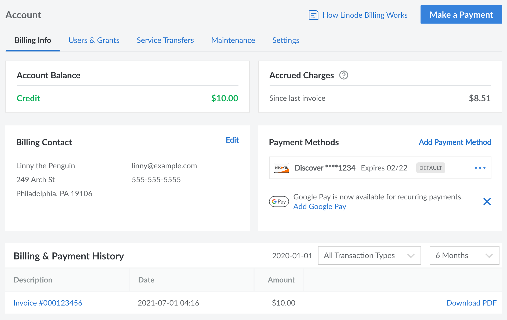

Most information and settings pertaining to billing are located within the [Billing Info](https://cloud.linode.com/account/billing) page of the Cloud Manager. Follow the instructions below to access this page:

1. Log in to the [Cloud Manager](https://cloud.linode.com) on a user account with one of the following permissions. See [Setting User Permissions](/docs/products/platform/accounts/guides/user-permissions/) for more details.

    - **Full account access** (unrestricted).
    - Restricted user with *Read-Write* permissions under **Billing Access**. Users with *Read Only* permissions are able to see most billing information but they are not able to make changes.

1. Click on the **Account** link on the left menu, which displays the [Billing Info](https://cloud.linode.com/account/billing) page.

This page contains several sections:

- **Account Balance:** The current balance on the account. This includes any past due amounts from unpaid invoices as well as any positive balance remaining from credits or promo codes. In the screenshot above, the account has a positive balance of $10.

- **Promotions:** If there is an active promo/coupon applied to the account, it will be displayed here along with the remaining balance and any expiration date. If there are no active promotions, this section is hidden.

- **Accrued Charges:** The charges that have accrued since your last invoice. This updates frequently to include the hourly charges (up to the monthly cap) for all paid services on the account, as well as any other charges. In the screenshot above, the account has accrued $8.51 of charges since the last invoice. See the [Billing Overview](/docs/products/platform/billing/) guide for help understanding these charges.

- **Billing Contact:** The name, address, phone number, and email address for the primary billing contact on the account. See [Update Billing Contact Information](/docs/products/platform/billing/guides/update-billing-contact-info/).

- **Payment Methods:** The payment methods that have been added to the account.

- **Billing & Payment History:** Displays a list of previous invoices and payments, along with links to view or download each entry. See [View Invoices and Payment History](/docs/products/platform/billing/guides/view-history/)