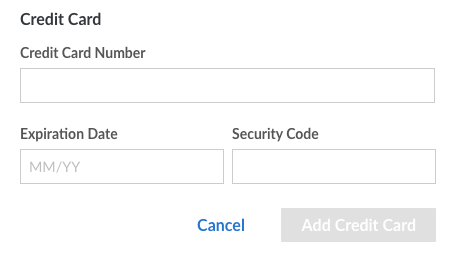
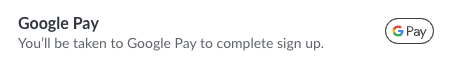
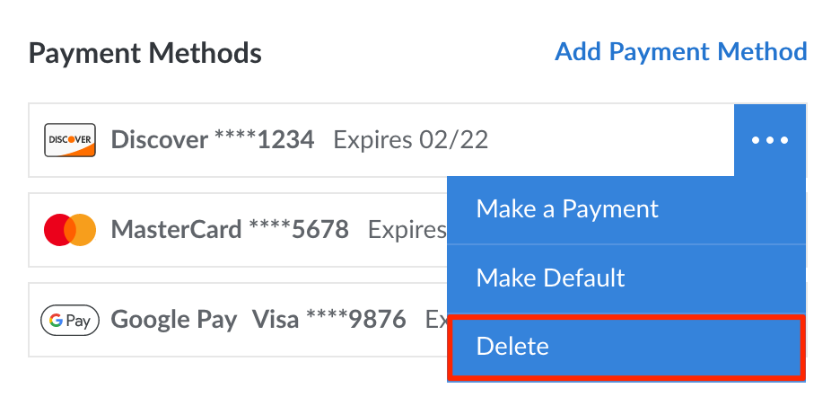
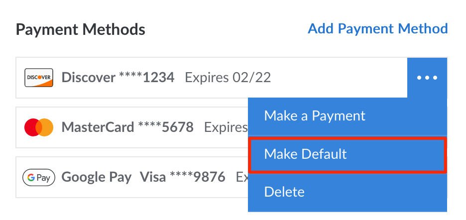

## Payment Methods

- **Credit card:** Pay using all popular credit (and debit) cards, including those issued by Visa, MasterCard, Discover, American Express, and UnionPay.

- **Google Pay:** Pay using a credit card, debit card, or PayPal through your Google Pay account. Paying with your Google Pay balance or any associated bank accounts are not supported at this time.

    
    To add a PayPal account to your Google Pay account, you currently must do so through the [Google Play Store](https://play.google.com/store/paymentmethods). PayPal cannot currently be added through the Google Pay website or mobile apps. When adding PayPal through Google Pay, it appears as a Discover Card within the Cloud Manager and the Linode API.
    

- **PayPal:** Pay using your PayPal balance, a credit (or debit) card, or bank account through your PayPal account.

- **Check, ACH, or wire transfer:** Please [contact Support](https://www.linode.com/support/) if you wish to pay through one of these methods.

See [Adding a New Payment Method](/docs/products/platform/billing/guides/payment-methods/#add-a-new-payment-method) for instructions on adding a new payment method to your account.

## Add a New Payment Method

New payment methods can be added to an account through the Cloud Manager. Up to **6 payment methods** can be active on an account at any given time, including multiple credit cards, Google Pay methods, and PayPal methods.

1.  Navigate to the **Billing Info** page in the [Cloud Manager](https://cloud.linode.com/account/billing) (see [Accessing Billing Information](/docs/products/platform/billing/guides/access-billing/)).

1.  If adding a credit card directly (not through Google Pay or PayPal), it must match the account's billing contact information and address. Review the **Billing Contact** section and edit it as necessary (see [Update Billing Contact Information](/docs/products/platform/billing/guides/update-billing-contact-info/)).

1.  In the **Payment Method** section, click the *Add Payment Method* link. This opens the **Add Payment Method** panel.

1.  Complete the form according to the payment method you wish to add.

    **To pay with a credit card:** Enter the credit card number, expiration date, and the security code (CVV) of the new card. Then click **Add Credit Card**.

    

    
    A $1.00 authorization hold may be placed on your credit card by your banking institution when our payment processor tests the validity of the card. This is normal behavior and does not result in a charge on your card.
    

    **To pay with Google Pay:** Click the **Google Pay** icon/button to open Google's own Google Pay form. Log in to your Google account and select the payment method you wish to use. Press **continue** (or otherwise complete the form) to be taken back to the Cloud Manager.

    

    **To pay with PayPal:** Click the **PayPal** icon/button to open PayPal's own form. Log in to your PayPal account and select the credit card or bank account you wish to use. Optionally check or uncheck the **Use balance first** option to use any PayPal balance before the selected credit card or bank account. Press **Save and Continue** (or otherwise complete the form) to be taken back to the Cloud Manager.

    

1.  After the payment method is added, it will be assigned as the *default* payment method and will be used for future recurring payments. This can be changed by following the instructions within the [Viewing and Changing the Default Payment Method](#viewing-and-changing-the-default-payment-method) section.


This process does not immediately charge any past due balance on the account to the new card. If you have an outstanding balance, you need to make a manual payment to bring your account up to date. See the [Making a One-Time Payment](#making-a-one-time-payment) section for more information.


## Remove a Payment Method

To delete a payment method from your account, follow the instructions below.

1.  Navigate to the **Billing Info** page in the [Cloud Manager](https://cloud.linode.com/account/billing) (see [Accessing Billing Information](/docs/products/platform/billing/guides/access-billing/)).
1.  Under the **Payment Methods** section, locate the payment method you wish to remove.
1.  Click the corresponding ellipsis menu and select **Delete** from the dropdown menu. If the payment method is the default payment method on the account, the **Delete** button will be disabled and you will first need to change the default method.

## View and Change the Default Payment Method

When an invoice is generated, the amount of that invoice (as well as any past due balance) will be charged to the *default* payment method on the account. The default payment method can be viewed and changed by following the instructions below.

1.  Navigate to the **Billing Info** page in the [Cloud Manager](https://cloud.linode.com/account/billing) (see [Accessing Billing Information](/docs/products/platform/billing/guides/access-billing/)).
1.  Under the **Payment Methods** section, the payment method currently used by default has a label of *default* (located to the right of the last 4 digits and expiration date).
1.  To change the default payment method, click the ellipsis menu next to the payment method you wish to use and select **Make Default** from the dropdown menu.

