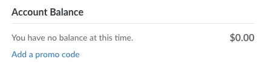

A *promo code* adds a positive credit to an account, allowing you to pay for services using that credit. You're able to add a promo code when signing up for an account. If you already signed up but haven't entered a promo code, you may be able to do so from the Cloud Manager. To add a promo code to an existing account, certain conditions must be met:

- The account must be less than 90 days old.
- There must not be a negative balance on the account.
- No other promo codes can already be applied to the account.
- The user that's logged in must have unrestricted permissions.

If those conditions are met, you can add a promo code by following these instructions:

1.  Navigate to the **Billing Info** page in the [Cloud Manager](https://cloud.linode.com/account/billing) (see [Accessing Billing Information](/docs/products/platform/billing/guides/access-billing/)).

1.  Under the **Account Balance** section, click the *Add a promo code* link.

    

1.  In the **Add promo code** dialog box that is displayed, enter the promo code and click the **Apply Promo Code** button. You should now see the promotional credit amount reflected in your account balance.