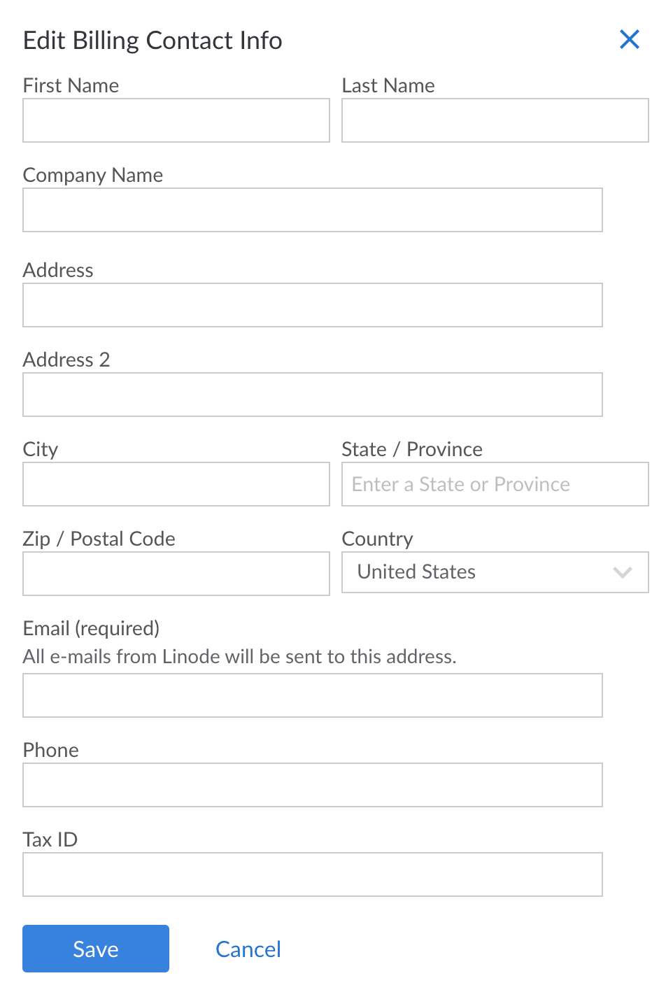

Use the **Billing Info** page to update the contact information for the Linode account. The email address saved on this webpage receives invoices, receipts, and credit card expiration warnings.


Linode Support tickets are *not* sent to your Billing Contact email address, but to the email address for the relevant user.


Here's how to update the contact information and the email address on the *Account* page:

1.  Click the **Account** link in the sidebar.
1.  Under the **Billing Contact** section, click **Edit** to show the **Edit Billing Contact Info** menu.

    

1.  Update the contact information and the email address for the account.
1.  Click **Save**.

The account's billing contact information is now updated.