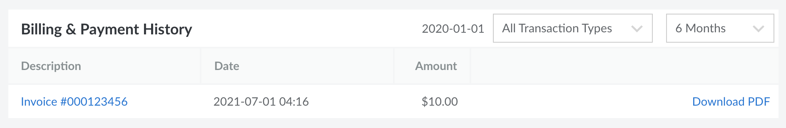
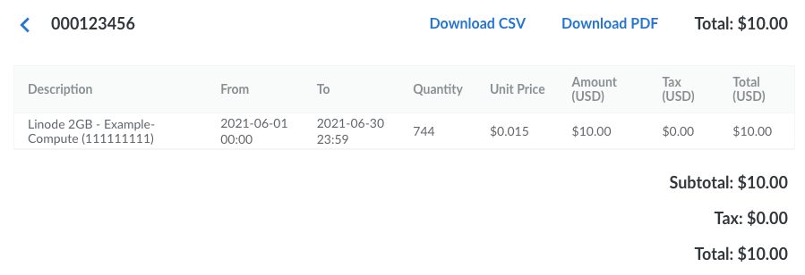

All of your billing history, including previous invoices and payments, is accessible within the [Cloud Manager](https://cloud.linode.com/account/billing) on the **Billing & Payment History** section within the **Billing Info** page (see [Accessing Billing Information](/docs/products/platform/billing/guides/access-billing/)). By default, all transactions (both invoices and payments) from the last *6 months* are displayed. To customize this, use the dropdown menus on the top right of this section.

**To view an itemized invoice,** find the invoice row on the list and click the corresponding invoice number. This opens up a new page that displays each service that was active during the billing period, along with the additional details listed below:

- **Description:** The type of service and the unique label you've given it.
- **From:** The date the service started billing during this billing cycle. This could either be the date and time this billing cycle started *or* the date and time the service was added to the account.
- **To:** The date the service ended billing during this billing cycle. This could either be the date and time this billing cycle ended *or* the date and time the service was removed from the account.
- **Quantity:** The number of hours the service is being billed.
- **Unit Price:** The hourly rate for this service.
- **Amount:** The cost for this service excluding taxes.
- **Taxes:** The taxes that are charged for this service.
- **Total:** The cost for this service including taxes.

## Downloading Invoices (PDF and CSV)

An invoice or payment can be downloaded as either a PDF or a CSV file. To do this, open the invoice within the Cloud Manager and select either the **Download CSV** or **Download PDF** button.