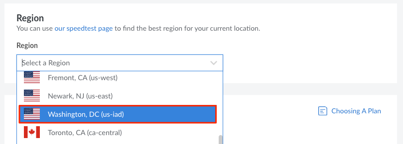

Akamai Cloud's newest data centers in Washington, DC (USA) and Paris (France) are now available in a limited closed beta. Most of our products and services are fully operational in these data centers, including [Premium Plans](#premium-plans), the newest Compute Instance tier (only available as part of this beta). As a beta participants, please review this guide for additional specifications and details you may need when configuring your workloads in the one of these data centers.


These data centers are in beta. As such, capacity may be limited as we continue to scale up resources. Additionally, this beta environment is subject to change. We strongly suggest that participants do not run production workloads during the beta.


## Pricing

Resources deployed during the beta will be free to users. You will be notified 30 days in advance of billing as we transition to general availability. Select services will not be available at the time of this message but could become available during the beta period.

## Product Availability

All products and services are available in the new data centers. In addition, we are launching a new Premium Plan tier and have made improvements to our Object Storage service.


You must be a part of the limited closed beta in order to select the new data centers when deploying services.


### Object Storage

The new data centers feature consistent and reliable S3-compatiable Object Storage backed by a 100% SSD-based cluster capable of 750 requests per second per bucket. Object Storage includes 250 GB of storage for a pro-rated $5/month. For more information on pricing, consult our [Object Storage features and limitations](/docs/products/storage/object-storage/#pricing).

For the IDs and URLs of the new Object Storage clusters, see below:

| Data Center | Cluster ID | Cluster URL |
| --| -- | -- |
| Paris, France | `fr-par-1` | `https://fr-par-1.linodeobjects.com` |
| Washington, DC, USA | `us-iad-1` | `https://us-iad-1.linodeobjects.com` |

### Premium Plans

A new Premium tier Dedicated CPU plan type for Compute Instances is available only in the new data centers. This is in addition to our standard tier Dedicated CPU, Shared CPU, and High Memory instance types. These Premium tier instances guarantee a baseline hardware class that includes new AMD EPYC CPUs™. These Premium offerings are built for applications with critical performance needs such as enterprise video encoding, AI, CI/CD, build servers, and data analysis. Below are the pricing and hardware specifications for Premium tier Dedicated CPU Instances:

| Plan | $/Mo | RAM (GB) | CPU Cores | Storage (GB) | Transfer (TB) | Network In/Out (Gbps)
| --- | --- | --- | --- | --- | --- | --- | --- |
| Premium 4 GB   | $43    | 4   | 2  | 80    | 4  | 40/4  |
| Premium 8 GB   | $86    | 8   | 4  | 160   | 5  | 40/5  |
| Premium 16 GB  | $173   | 16  | 8  | 320   | 6  | 40/6  |
| Premium 32 GB  | $346   | 32  | 16 | 640   | 7  | 40/7  |
| Premium 64 GB  | $892   | 64  | 32 | 1,280 | 8  | 40/8  |
| Premium 96 GB  | $1,037 | 96  | 48 | 1,920 | 9  | 40/9  |
| Premium 128 GB | $1,383 | 128 | 50 | 2,500 | 10 | 40/10 |
| Premium 256 GB | $2,765 | 256 | 56 | 5,000 | 11 | 40/11 |
| Premium 512 GB | $5,530 | 512 | 64 | 7,200 | 12 | 40/12 |

The pricing for Premium Compute Instance [Backups](/docs/products/storage/backups/) is as follows:

| Plan | $/Mo |
| --- | --- |
| Premium 4 GB  | $5    |
| Premium 8 GB  | $10   |
| Premium 16 GB | $20   |
| Premium 32 GB | $40   |
| Premium 64 GB | $80   |
| Premium 96 GB | $120  |
| Premium 128 GB | $160 |
| Premium 256 GB | $200 |
| Premium 512 GB | $240 |

The new Premium plans can also be deployed as worker nodes in Linode Kubernetes Engine (LKE) clusters. There is no additional cost for Premium plan LKE worker nodes beyond the price listed in the Premium pricing table above.

## Deploy Services in a Beta Data Center

Follow the instructions below to target one of the new data centers when deploying a service.

- **Cloud Manager:** Select the name of the data center you wish to use in the region dropdown menu.

    

- **Linode CLI and Linode API:** Use one of the following data center region IDs:

    | Data Center | Region ID |
    | -- | -- |
    | Paris, France | `fr-par` |
    | Washington, DC, USA | `us-iad` |


If you are a beta participant but are not able to target one of the new data centers, please contact the [Support team](https://www.linode.com/support/) for assistance.


## Additional Specifications

### IP Sharing and Failover

All new data centers support IP sharing and BGP-based failover, which can be configured on IPv4 addresses (public and private) and addresses from IPv6 routed ranges (/64 and /56). To configure failover, you can use [lelastic](https://github.com/linode/lelastic), Linode's own software, or software like FRR, BIRD, or GoBGP. For more information on failover, consult our [failover documentation](/docs/products/compute/compute-instances/guides/failover/).

| Data Center | IP Sharing Support | Failover Method | Software | ID |
| --- | --- | --- | --- | --- |
| Paris, France | Supported | BGP-based (new) | [lelastic](/docs/products/compute/compute-instances/guides/failover/#configure-failover) / [FRR](/docs/products/compute/compute-instances/guides/failover-bgp-frr/) | 19 |
| Washington, DC, USA | Supported | BGP-based (new) | [lelastic](/docs/products/compute/compute-instances/guides/failover/#configure-failover) / [FRR](/docs/products/compute/compute-instances/guides/failover-bgp-frr/) | 17 |

### Lish Gateways

Lish and Glish provide direct access to your Compute Instances, bypassing the need for SSH or a VNC. For more information on Lish, consult our guide on how to [Access Your System Console Using Lish](/docs/products/compute/compute-instances/guides/lish/).

#### **Paris, France**

-   **Lish SSH Gateway:** `lish-fr-par.linode.com`

    
    ```command
    RSA 3072 SHA256:qTliFB86axo9n07H0hUP/z5nm7Fbkzlf8eKnmtXBhZU lish-fr-par.linode.com
    ECDSA 256 SHA256:NU4UctBefhWIR3mpCrh+r2p5lNmtwFFoeelZspjMNYM lish-fr-par.linode.com
    ED25519 256 SHA256:GYNvVuHJqGIdCiU6yTPbkJmMgj+ZYBGRVGDqnrtJoQc lish-fr-par.linode.com
    ```
    

-   **Weblish Gateway:** `fr-par.webconsole.linode.com`
-   **Glish Gateway:** `par3.glish.linode.com`

#### **Washington, DC, USA**

-   **Lish SSH Gateway:** `lish-us-iad.linode.com`

    
    ```command
    RSA 3072 SHA256:mzFtMaMVX6CsLXsYWn6c8BXnXk0XHfoOXGExDUEH2OI lish-us-iad.linode.com
    ECDSA 256 SHA256:of9osuoFwh7g5ZiO0G3ZGYi/8JcCw3BA/ZdkpaKQlT0 lish-us-iad.linode.com
    ED25519 256 SHA256:oFoUJn/xXV/+b7EJIcIt6G6hV5jXzjM/pOsoceDDOaA lish-us-iad.linode.com
    ```
    

-   **Weblish Gateway:** `us-iad.webconsole.linode.com`
-   **Glish Gateway:** `iad3.glish.linode.com`