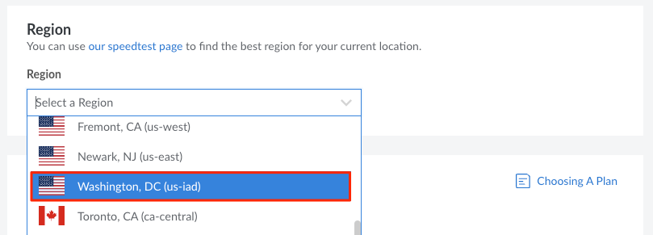

Akamai Cloud's newest data center located in Washington, DC is now available in a limited closed beta. The full range of Akamai Cloud Computing (Linode) services are available in Washington, DC, including [Premium Plans](#premium-plans), the newest Compute Instance tier. As a beta participants, please review this guide for additional specifications and details you may need when configuring your workloads in the Washington, DC data center.


This program is in beta. As such, capacity may be limited as we continue to scale up resources. Additionally, this beta environment is subject to change. We strongly recommend participants do not run production workloads during the beta.



## Pricing

Resources deployed during the beta will be free to users. You will be notified 30 days in advance of billing as we transition to general availability. Select services will not be available at the time of this message but could become available during the beta period.

## Product Availability

All products and services are available in the Washington, DC data center. In addition, we are launching a new Premium Plan tier and have made improvements to our Object Storage service.


You must be a part of the limited closed beta in order to select the new data center when deploying services.


### Object Storage

The Washington, DC data center features consistent and reliable S3-compatiable Object Storage backed by a 100% SSD-based cluster capable of 750 requests per second per bucket. Object Storage includes 250 GB of storage for a pro-rated $5/month. For more information on pricing, consult our [Object Storage features and limitations](/docs/products/storage/object-storage/#pricing).

For the ID and URL of the Object Storage cluster in this new data center, see below:

- **Cluster ID:** `us-iad-1`
- **Cluster URL:** `https://us-iad-1.linodeobjects.com`

### Premium Plans

A new Premium tier Dedicated CPU plan type for Compute Instances is available in our Washington, DC data center. This is in addition to our standard tier Dedicated CPU, Shared CPU, and High Memory instance types. These Premium tier instances guarantee a baseline hardware class that includes new AMD EPYC CPUs™. These Premium offerings are built for applications with critical performance needs such as enterprise video encoding, AI, CI/CD, build servers, and data analysis. Below are the pricing and hardware specifications for Premium tier Dedicated CPU Instances:

| Plan | $/Mo | RAM (GB) | CPU Cores | Storage (GB) | Transfer (TB) | Network In/Out (Gbps)
| --- | --- | --- | --- | --- | --- | --- | --- |
| Premium 4 GB   | $44.00    | 4   | 2  | 80    | 4  | 40/4  |
| Premium 8 GB   | $87.00    | 8   | 4  | 160   | 5  | 40/5  |
| Premium 16 GB  | $173.00   | 16  | 8  | 320   | 6  | 40/6  |
| Premium 32 GB  | $346.00   | 32  | 16 | 640   | 7  | 40/7  |
| Premium 64 GB  | $892.00   | 64  | 32 | 1,280 | 8  | 40/8  |
| Premium 96 GB  | $1,037.00 | 96  | 48 | 1,920 | 9  | 40/9  |
| Premium 128 GB | $1,383.00 | 128 | 50 | 2,500 | 10 | 40/10 |
| Premium 256 GB | $2,765.00 | 256 | 56 | 5,000 | 11 | 40/11 |
| Premium 512 GB | $5,530.00 | 512 | 64 | 7,200 | 12 | 40/12 |

## Deploy Services in Washington, DC

Follow the instructions below to target the Washington, DC data center when deploying a service.

- **Cloud Manager:** Select **Washington, DC (us-iad)** in the region dropdown menu.

    

- **Linode CLI and Linode API:** Use the `us-iad` data center region ID.


If you are a beta participant but are not able to target the Washington, DC data center, please contact the [Support team](https://www.linode.com/support/) for assistance.


## Additional Specifications

### Lish Gateways

The Lish Gateways for the Washington, DC data center are as follows:

- **Lish SSH Gateway:** `lish-us-iad.linode.com/`
- **Weblish Gateway:** `us-iad.webconsole.linode.com`
- **Glish Gateway:** `iad3.glish.linode.com`

For more information on Lish, consult our guide on how to [Access Your System Console Using Lish](/docs/products/compute/compute-instances/guides/lish/).

### Lish SSH Gateway Fingerprints

The valid fingerprints for the Lish gateway boxes in Washington, DC are as follows:

```code
RSA 3072 SHA256:mzFtMaMVX6CsLXsYWn6c8BXnXk0XHfoOXGExDUEH2OI lish-us-iad.linode.com
ECDSA 256 SHA256:of9osuoFwh7g5ZiO0G3ZGYi/8JcCw3BA/ZdkpaKQlT0 lish-us-iad.linode.com
ED25519 256 SHA256:oFoUJn/xXV/+b7EJIcIt6G6hV5jXzjM/pOsoceDDOaA lish-us-iad.linode.com
```

### IP Sharing and Failover

The Washington, DC data center supports IP sharing and BGP-based failover, which can be configured on IPv4 addresses (public and private) and addresses from IPv6 routed ranges (/64 and /56). To configure failover, you can use [lelastic](https://github.com/linode/lelastic), Linode's own software, or software like FRR, BIRD, or GoBGP. For more information on failover, consult our [failover documentation](/docs/products/compute/compute-instances/guides/failover/).

| Data center | IP Sharing support | Failover method | Software | ID |
| --- | --- | --- | --- | --- |
| Washington, DC (USA) | Supported | BGP-based (new) | [lelastic](/docs/products/compute/compute-instances/guides/failover/#configure-failover) / [FRR](m/docs/products/compute/compute-instances/guides/failover-bgp-frr/) | 17 |