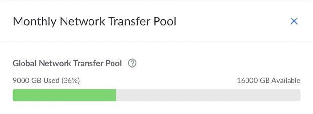
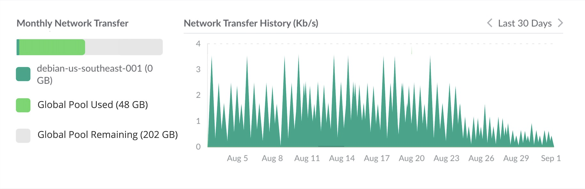

## Overview

**Network transfer** is the exchange of data between two computers over the public internet or a private network. Other providers and publications may also refer to this as data transfer, ingress/egress, and bandwidth.

This traffic is broken down into inbound (ingress) and outbound (egress) network transfer. *Inbound network transfer* is data sent *to* your service, such as a file upload. *Outbound network transfer* is data sent *from* your service, such as a web page and its images, stylesheets, and JavaScript files.

## Transfer Allowance

The following Linode services consume network transfer and, in most cases, include a set amount of outbound network transfer allowance per month. The amount of transfer is displayed along with the pricing and plan details for each service. See Linode's [pricing page](https://www.linode.com/pricing) for exact amounts.

- **Compute Instances:** Consume network transfer and include 1-20 TB of transfer allowance per month, depending on plan size.

- **NodeBalancers:** Consume network transfer but do not include a monthly transfer allowance.

- **Object Storage:** Consumes network transfer and adds 1 TB of transfer allowance per month to your global network transfer pool.

- **Managed Databases:** Does not consume network transfer or include a monthly transfer allowance.

Most data centers have their transfer allowance and usage tracked in a **global network transfer pool**. Some newer data centers may have their network transfer usage tracked separately in a *specific network transfer pool for that region*. Your global and region-specific pools can be viewed and [monitored](#monitoring-network-transfer-usage) from your account's **Monthly Network Transfer Pool**.

When a service is deployed on an account, that service’s prorated transfer allowance is added to its corresponding network transfer pool. Whenever a service consumes network transfer, it is counted towards that pool (not the individual transfer allowance for the service). In most cases, this is the global pool. However, if the service is deployed in a region that has its own specific transfer pool, the network allowances and usage is tracked in that pool (not the global pool).


If a service is not active for the entire month, the amount of network transfer allowance is prorated based on the number of hours the service is active.


## Usage Costs

Costs associated with network transfer can often be unexpected or confusing in a cloud hosting environment. Linode keeps these costs simple and transparent so that you can easily anticipate your monthly charges.

**Free unmetered network transfer:**

- All inbound network transfer

- Outbound network transfer sent from Compute Instances and NodeBalancers to any Linode service within the same data center, provided the traffic occurs over an IPv6 address, a private VLAN network, or on the private IPv4 address of those services. Public IPv4 addresses, due to the way traffic is routed, is not included in this.

**Metered network transfer:**

- Outbound transfer sent from Compute Instances and NodeBalancers to destinations outside of the origin data center (over both IPv6 and IPv4) and within the same data center if a public IPv4 address is used.

- Outbound transfer from Object Storage (over both public IPv6 and public IPv4), even to other Linode services within the same data center.

All metered network transfer consumed by a service is counted toward either the global network transfer pool or its data center-specific pool (if that region tracks network transfer separately from the global pool). Any additional transfer usage that exceeds this monthly allotment starts at $0.005/GB (or $5/TB) depending on the service’s region (see the table below). Additional transfer usage is charged at the end of the billing period.


| Data Center | Network Transfer overage cost per GB |
| :-- | -- |
| All data centers (except those listed below) | $0.005/GB |
| Jakarta, Indonesia | $0.015/GB |
| São Paulo, Brazil | $ 0.007/GB |



The combined monthly network transfer pools are typically enough to cover *most* common use cases for our services. You are only billed for additional network transfer if your usage exceeds the global or data center-specific pools during a billing period.

If traffic for an individual service exceeds the network transfer amount specified by its plan, but the total transfer used between the rest of your services is still less than your monthly global or region-specific pools, then you are *not* charged additional fees.


## Monitoring Network Transfer Usage

We recommend that you monitor your network transfer usage throughout the month to ensure that your services aren't consuming more network transfer than expected. You can check your network usage for your current billing cycle via the Cloud Manager or the Linode CLI.

### Cloud Manager

1. Log in to the [Cloud Manager](https://cloud.linode.com).

1. Under the list of the Linode Compute Instances, NodeBalancers, or Object Storage Buckets, a short notice is displayed with the percentage of monthly network transfer pool that has been used.

    

1. Click the *Monthly Network Transfer Pool* link to display a modal pop-up with more details, including: your active pools, the amount of transfer used, the size of your pools, and when the network transfer usage will reset.

    

    
    Unless you have services deployed in a region that tracks data center-specific network transfer separately, you will only see the global network transfer pool displayed.
    

1. Lastly, you can view more details regarding a Compute Instance's network transfer usage (including historical charts) directly on the instance's page in Cloud Manager. To do so, click **Linodes** on the left navigation menu, select your Compute Instance from the list, and navigate to the **Network** tab.

    

    The **Monthly Network Transfer** section includes usage details for the current billing period. The **Network Transfer History** section shows a chart with usage details over the selected period.

### Linode CLI

To view your network utilization (in GB) for the current month, issue the following command:

```command
linode-cli account transfer
```


You need to generate a Personal Access Token and install the Linode CLI before being able to use the CLI. See the [Linode CLI](/docs/products/tools/cli/get-started/) guide for more information.


### Email Alerts

Linode automatically sends an email notification to [your account's email address](/docs/products/platform/accounts/guides/change-user-email/) when you have used 80%, 90%, and 100% of your transfer pool size.

## More Information

Read the [Billing and Payments](/docs/products/platform/billing/) guide for an overview of Linode billing.