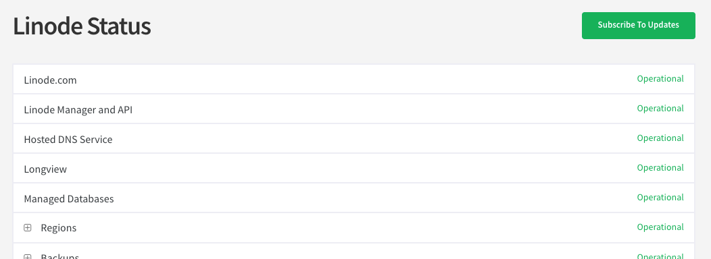

The [Status Page](https://status.linode.com/) provides real-time system status and maintenance updates via email. All customers are encouraged to subscribe to status notifications to stay up-to-date with any events that may impact our services. When you sign up for status updates, you can fine-tune which service updates you receive. These different topic areas are referred to as *components*. If, for example, all your services are restricted to the Newark data center, you may only wish to subscribe to the Newark component.

You can also subscribe to individual incident notifications. In this case, you can be notified of new updates to an incident via email or SMS.

## Subscribe to Email Updates

To subscribe to system status and maintenance updates, follow the instructions below.

1. Navigate to the [Linode Status Page](https://status.linode.com/).

1. Click on the **Subscribe to Updates** button.

    

1. In the form that appears, enter your email address and click the **Subscribe via email** button.

1. You are brought to another web page with a list of components. Select which components you'd like to receive status updates for and then click the **Save** button.

1. You will receive a confirmation email shortly. In that email, click the **Confirm subscription** button.

## Subscribe to RSS Updates

Within your RSS aggregator, go through the process of adding a new RSS feed. When prompted, use the following URL for a raw XML list of recent incidents: `https://status.linode.com/history.rss`.

## Subscribe to an Incident

To subscribe to updates for a specific incident:

1. Navigate to the [Linode Status Page](https://status.linode.com/).

1. Find the incident you would like to follow and click on its heading. You are brought to that incident's page.

1. Click on the **Subscribe to Updates** button and provide your Email and/or telephone number.

## Update Notification Preferences or Unsubscribe

You can update your component preferences or cancel your subscription to Linode status and maintenance updates at any time. To update your preferences or to unsubscribe:

1. Navigate to the [Linode Status Page](https://status.linode.com/).

1. Click on the **Subscribe to Updates** button and enter your email address.

1. You are brought to your Notification Subscription page. Update your preferences, as needed, and click on the **Update Preferences** button.

1. If you would like to unsubscribe, click on the **Cancel Subscription** link in the Subscriber section of the page and follow the prompt.


You can unsubscribe from SMS notifications by replying to any text message notification with the word "STOP".
