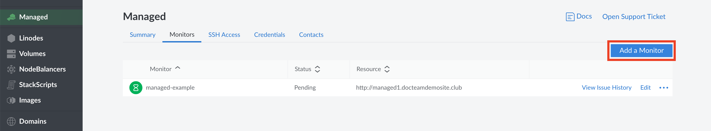

To add a new monitored service to Linode Managed:

1.  Log into the [Linode Cloud Manager](https://cloud.linode.com).

1.  Click the **Managed** link in the sidebar.

1.  Select the **Monitors** tab, then click on the **Add a Monitor** link under this tab.

    

1.  A form for your new monitored service will appear with these fields:

    | Field Name | Description |
    |------------|-------------|
    | Monitor Label | A descriptive label for the service that will help the support team quickly identify and fix the service if it needs troubleshooting. |
    | Contact Group (optional) | One of the contact groups that you've registered with Linode Managed. Linode will contact the members of this group if they need help fixing the service. |
    | Monitor Type | Select **URL** to monitor a website or **TCP Connection** to monitor any other service running on your Linode. |
    | Response Timeout | The time (in seconds) for Linode Managed's requests to timeout if they do not receive a response. |
    | URL | If you selected **URL** for the **Monitor Type** field, enter a URL for a webpage that you'd like to monitor. If you selected **TCP Connection**, enter the domain or IP address and, optionally, a port number (separated by a colon) in the **TCP** field. |
    | Response Body Match (optional) | A string that Linode Managed will check for in the URL or TCP response. If not present, then an alert will be generated for the service. |
    | Instructions/Notes | Any notes or additional information about this service. The more information Linode Support has about the service and how it's configured, the more quickly they will be able to resolve any issues that may arise. |
    | Credentials (optional) | Any [credentials](/docs/platform/linode-managed/#adding-service-credentials) that may need to be used to troubleshoot the service. You can select and save more than one credential for a service. |

1.  Fill out the form and click the **Add** button.

1.  Once added, the monitored service will initially appear as *Pending*. Linode Support will start monitoring the service in a few minutes--if the service is available, the dashboard will then indicate that the service's status is **Verified**.
