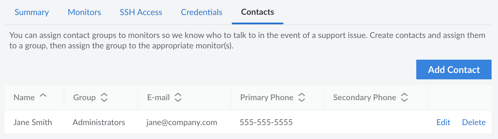

Service Monitors can be configured to email your team members in the event of an issue with your system. Team member contact information is stored as a *Contact* in Managed Services. Each Service Monitor can be attached to a *Contact Group*, each of which can contain one or more individual *Contacts*. Separate groups can be created for each different system or service.

For example, you might add all of your database administrators to a group named *DBAs* and then link that group to a Service Monitor monitoring the state of your MySQL server. When an issue is detected, all of your database administrators are notified at the same time.

You can optionally attach up to two phone numbers to your contacts, a primary number and a secondary number. These are used by our Support team to call a point of contact on your side to obtain more information when troubleshooting an issue.

## Add or Edit a Contact

1. Log in to the [Cloud Manager](https://cloud.linode.com) and click the **Managed** link in the sidebar.

1. Navigate to the **Contacts** tab. Click on the **Add a Contact** link to add a new contact. If you wish to edit an existing contact instead, locate that contact in the list and click the corresponding **Edit** button.

    

1. In the form that appears, enter the details for this contact.

    - **Name** (required): The name of the contact. This is likely the first and last name of the associated person.

    - **Email** (required): The email address to use for this contact. This email is sent an email notification if any attached Service Monitor detects an issue.

    - **Primary Phone** and **Secondary Phone**: The first and second phone number that the Support team should call if more information is needed during an investigation.

    - **Group:** The name of the group that this contact belongs to. Select an existing group from the dropdown menu or type in a name to create a new group.

    
    A Managed service can only be linked to a contact group and not to individual contacts, so you should create at least one group, even if it only contains one contact.
    

1.  Once the contact details have been entered, click the **Add Contact** or **Save Contact** button to save the changes.

## Attach a Contact Group to a Service Monitor

A contact group needs to be assigned to a Service Monitor so that members of that group can be alerted when an issue is detected. To do this, follow the instructions for editing a service monitor and select the desired group under the **Contact Group** field. See [Edit a Service Monitor](/docs/products/services/managed/guides/service-monitors/#edit-a-service-monitor).