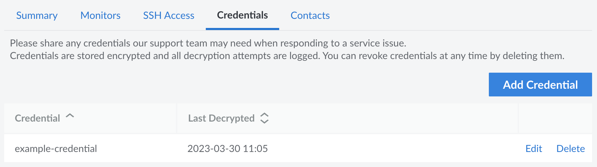

Many of the applications running on your servers can only be accessed with the appropriate username and password combination. To provide Linode's staff with access to those applications, you should upload *credentials* for them to the Linode Cloud Manager. Once uploaded, you can also link credentials to specific Managed services to communicate which ones Linode Support should use when troubleshooting the service.


All credentials are securely stored in our encrypted database.


## View Credentials

1. Log in to the [Cloud Manager](https://cloud.linode.com) and click the **Managed** link in the sidebar.

1. Navigate to the **Credentials** tab. A list of all your current credentials is displayed. From here, you can add new credentials or edit existing credentials.

    

    Alongside each credential is a *Last Decrypted* field. This displays the timestamp for when the credential was last decrypted by our Support team.

## Add a Credential

1. Navigate to the **Credentials** tab for Managed Services in the Cloud Manager. See [View Credentials](#view-credentials).

1. Click the **Add Credentials** button.

1. In the form that appears, enter the details for your credential. The following fields are available:

    - **Label** (required): A descriptive name for the credential that explains to the Linode Support Team how the credential should be used. For example, if you are entering the MySQL `root` password, you might label it as `MySQL Root`.

    - **Username:** The username to supply when authenticating with the application.

    - **Password** (required): The password or passphrase to supply when authenticating with the application.

1. Once the form is complete, click the **Add Credential** button.

## Edit a Credential

1. Navigate to the **Credentials** tab for Managed Services in the Cloud Manager. See [View Credentials](#view-credentials).

1. Locate the credential you wish to edit and click the corresponding **Edit** button.

1. To update the label, enter the new label and click the **Update Label** button.

1. To modify the credentials, enter the new username or password and click the **Update Credentials** button.