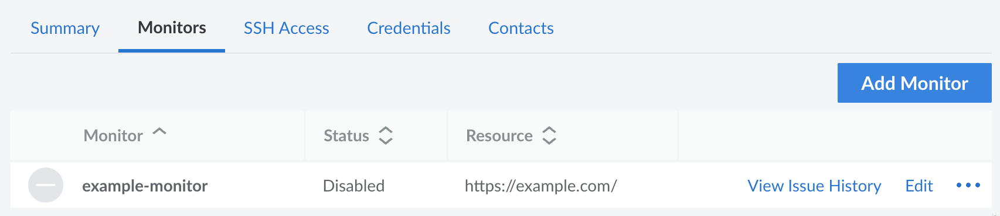

Managed Services monitors the *services* running on your Compute Instances. Setting up services is an essential step in the configuration process.

## View Service Monitors

1. Log in to the [Cloud Manager](https://cloud.linode.com) and click the **Managed** link in the sidebar.

1. Navigate to the **Monitors** tab. A list of all your current monitors is displayed. From here, you can add new monitors or edit existing ones.

    

    Each monitor is listed along side its status and the resource it is checking.

## Configuration Options

Each monitor can be configured with the following settings, which are available when creating a new service monitor or editing an existing monitor.

- **Monitor Label** (required): A label for the service that's being monitored. If an issue arises, a clear and descriptive label helps the Support team quickly identify the service that may need troubleshooting.

- **Contact Group:** Select a contact group, which contains one or more contacts on your team. This is the group that is notified of any failed checks. It is also the group that the Support team may contact if more information is needed when investigating an issue with the service. To add or modify contacts, see [Manage Contacts](/docs/products/services/managed/guides/contacts/).

- **Monitor Type** (required): Select **URL** to monitor a website or **TCP Connection** to monitor any other service running on your Compute Instance.

- **Response Timeout** (required): The time (in seconds) for a montitor's requests to timeout if a response is not received.

- **URL** (required): If you selected **URL** for the **Monitor Type** field, enter a URL for a web page that you'd like to monitor. If you selected **TCP Connection**, enter the domain or IP address and, optionally, a port number (separated by a colon) in the **TCP** field.

- **Response Body Match:** A string that should appear in the HTTP or TCP response body. If not present, then an alert is generated for the service.

- **Instructions / Notes:** Any notes or additional information about this service. This information is used by the Support team to learn more about the service, it's configuration, and the way it should respond to failed checks.

- **Credentials:** Any credentials that may need to be used to troubleshoot the service. You can select and save more than one credential for a service. To add or modify credentials, see [Manage Credentials](/docs/products/services/managed/guides/credentials/).

## Add a Service Monitor

1. Navigate to the **Monitors** tab for Managed Services in the Cloud Manager. See [View Service Monitors](#view-service-monitors).

1. Click the **Add Monitor** button.

1. In the form that appears, enter your desired settings. For an explanation of each field, see [Configuration Options](#configuration-options).

1. Once you're ready, click the **Add Monitor** button to create the new service monitor.

## Edit a Service Monitor

1. Navigate to the **Monitors** tab for Managed Services in the Cloud Manager. See [View Service Monitors](#view-service-monitors).

1. Locate the service monitor you wish to modify and click the corresponding **Edit** button.

1. The form that appears is similar to the *Add Monitor* form. Modify any field that you wish and click the **Save Changes** button once you are finished.

## Enable or Disable a Service Monitor

When a service monitor is created, it is automatically enabled. However, you may need to temporarily disable the monitor. For instance, when you are performing maintenance on the monitored resource or on the entire Compute Instance, you likely do not want the service monitor performing checks as it will alert your team (and the Support team) when the check fails. In this event, follow the instructions below to disable the monitor and then re-enable it once the maintenance is complete.

1. Navigate to the **Monitors** tab for Managed Services in the Cloud Manager. See [View Service Monitors](#view-service-monitors).

1. Locate the service monitor you wish to modify and click the corresponding **Enable** or **Disable** button. This button may be within the expandable **more options ellipsis menu**.

1. Once the change takes effect, the new status should appear under the **Status** column of the service monitor.

## Remove a Service Monitor

If you decide to remove or stop using a monitored service on your Compute Instance, you should also remove the service monitor from your account. If you do not, you will continue to receive notifications when the service fails to contact the specified resource.

1. Navigate to the **Monitors** tab for Managed Services in the Cloud Manager. See [View Service Monitors](#view-service-monitors).

1. Locate the service monitor you wish to modify and click the corresponding **Delete** button. This button may be within the expandable **more options ellipsis menu**.

1. A confirmation dialog appears. Follow the instructions and click the **Delete Monitor** button to remove the monitor from your account.